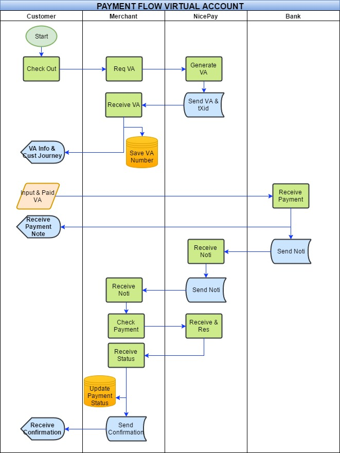
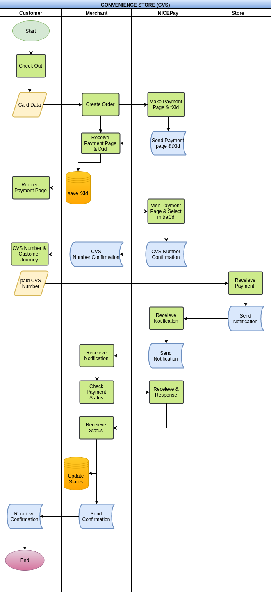
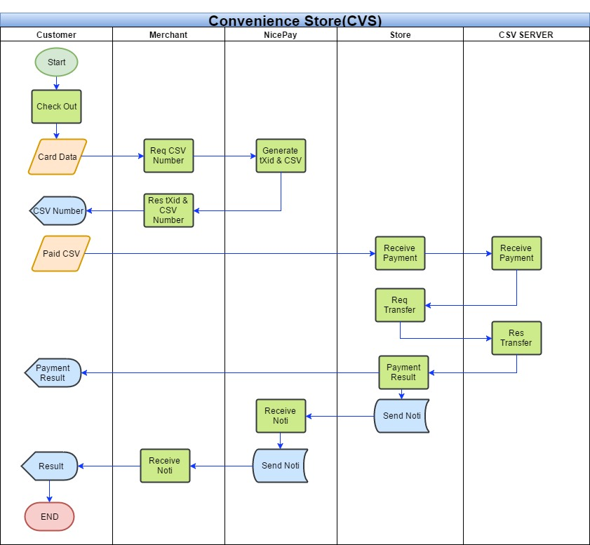
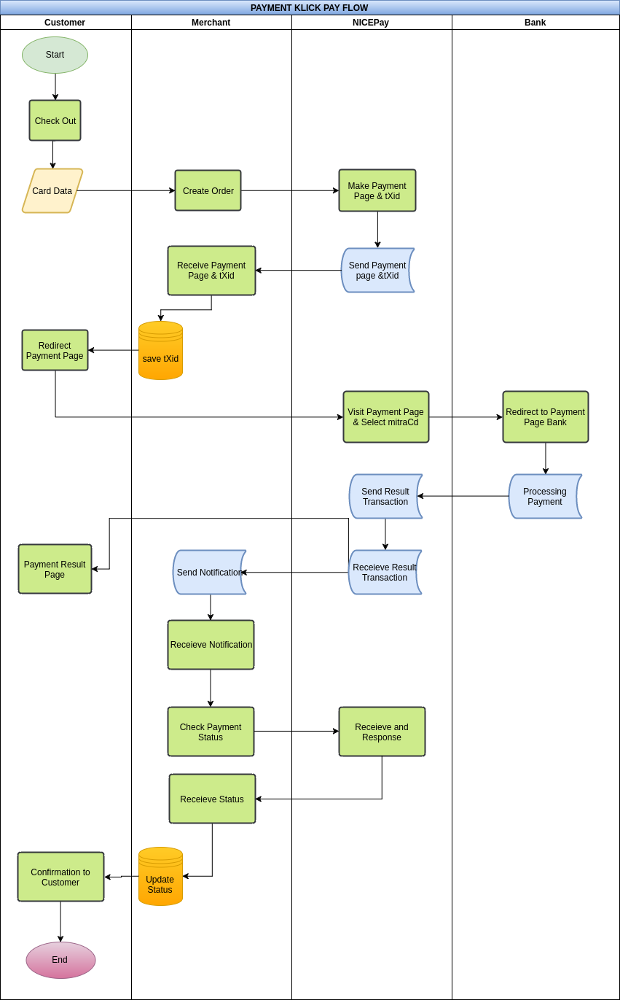
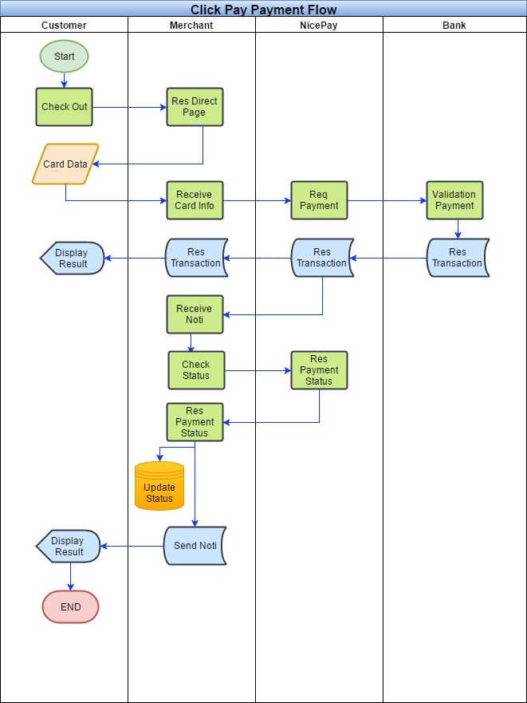

# Gambaran Produk dan Fitur

## Gambaran Produk
NICEPAY Payment Solution adalah product dari PT IONPAY NETWORKS yang menyediakan berbagai pembayaran elektronik melalui internet yang aman tanpa perangkat keamanan yang terpisah. NICEPAY telah terintegrasi dengan banyak bank melalui host to host untuk performa yang lebih baik dan lebih cepat. Menggunakan teknologi terbaru, NICEPAY percaya bahwa dapat mengembangkan bisnis Anda bersama-sama.

## Proses Integrasi
<ol type="1">
  <li>Memahami SDK, Parameter dan Alur pembayaran
  <li>Mencoba Operasi Penggunaan API
  <li>Integrasi
  <li>Uji Implementasi (Development Environment)
  <li>Permintaan MID dan Merchant Key Production
  <li>Go Live
</ol>

## Prasyarat
<ol type="1">
  <li>Test MID
  <li>Test API Key
  <li>NICEPAY Bahasa Pemprograman SDK (Java,PHP,and other)
</ol>

## Pertanyaan
Apakah ada pertanyaan? Silahkan hubungi kami di : it@nicepay.co.id

# Professional Credit Card

## Alur Pembayaran
Berikut adalah diagram alur pembayaran Professional Credit Card dari NICEPAY.


## Parameters Payment
>Contoh Cart Data

```json
"cartData": {
  "count": "2",
  "item": [
    {
      "img_url": "http://img.aa.com/ima1.jpg",
      "goods_name": "Item 1 Name",
      "goods_detail": "Item 1 Detail",
      "goods_amt": "700"
    },
    {
      "img_url": "http://img.aa.com/ima2.jpg",
      "goods_name": "Item 2 Name",
      "goods_detail": "Item 2 Detail",
      "goods_amt": "1000"
    }
  ]
}
```
NOTE:
<ol type="1">
  <li>`payMethod`:
    <ul style="list-style-type:circle">
      <li>`01` : `Untuk Credit Card`
      <li>`02` : `Untuk Virtual Account`
      <li>`03` : `Untuk Convenience Store`
      <li>`04` : `Untuk Click Pay`
      <li>`05` : `Untuk E-Wallet`
    </ul>
  <li>`recurrOpt`:
    <ul style="list-style-type:circle">
      <li>`0` : `Automatic Cancel`
      <li>`1` : `Not Cancel`
    </ul>
  <li>Data Type:
    <ul style="list-style-type:circle">
      <li>A  : Alphabet
      <li>AN : Alphabet & Numeric
      <li>N  : Numeric
      <li>ANS : Alphabet, Numeric & Simbolic
    </ul>
</ol>
<br>

API url | https://www.nicepay.co.id/nicepay/api/orderRegist.do
-------- | -----------
Method | POST
Merchant Token | SHA256(Merchant ID + Reference No + Amount + Merchant Key)

### Mandatory
Attribute | Data Type | Length(Byte) |  Description
--------- | ------- | ----------- | ---------
iMid | AN | 10 | Merchant ID
`payMethod` | AN | 2 | Pay Method
currency | AN | 3 | Currency
amt | N | 12 | Goods Amount
instmntType | N | 2 | Installment Type
instmntMon | N | 2 | Installment Month
referenceNo | ANS | 40 | Merchant Order No
goodsNm | AN | 100 | Goods Name
billingNm | A | 30 | Billing Name
billingPhone | N | 15 | Billing Phone Number
billingEmail | AN | 40 | Billing Email
billingCity | A | 50 | Billing City
billingState | A | 50 | Billing State
billingPostCd | N | 10 | Billing Post Number
billingCountry | A | 10 | Billing Country
callBackUrl | AN | 255 | Payment Result Forward Url (On Browser)
dbProcessUrl | AN | 255 | Payment Result Receive Url (Server Side)
description | AN | 100 | Description
merchantToken | AN | 255 | Merchant Token
userIP | AN | 15 | User IP (Customer)
cartData | AN | 4000 | Cart Data  (Json Format)
`recurrOpt` | N | 2 | Hanya untuk CC Recurring

### Optional
Attribute | Data Type | Length |  Description
--------- | ------- | ----------- | ---------
billingAddr | AN | 100 | Billing Address
deliveryNm | A | 30 | Delivery Name
deliveryPhone | N | 15 | Delivery Phone
deliveryAddr | AN | 100 | Delivery Address
deliveryEmail | AN | 40 | Delivery Email
deliveryCity | A | 50 | Delivery City
deliveryState | A | 50 | Delivery State
deliveryPostCd | N | 10 | Delivery Post Number
deliveryCountry | A | 10 | Delivery Country
vat | N | 12 | Vat
fee | N | 12 | Service Tax
notaxAmt | N | 12 | Tax Free Amount
reqDt | N | 8 | Request Date(YYYYMMDD)
reqTm | N | 6 | Request Time(HH24MISS)
reqDomain | AN | 100 | Request Domain
reqServerIP | AN | 15 | Request Server IP
reqClientVer | AN | 50 | Request Client Version
userSessionID | AN | 100 | User Session ID
userAgent | AN | 100 | User Agent Information
userLanguage | AN | 2 | User Language

## Contoh Source Code

```php
<?php
$nicepay = new NicepayLib();

//Ignore this function if you have invoice number.
function generateReference()
{
  $micro_date = microtime();
  $date_array = explode(" ",$microdate);
  $date = date("YmdHis",$date_array[1]);
  $date_array[0] = preg_replace('/[^\p{L}\p{N}\s]/u', '', $date_array[0]);
  return "Ref".$date.$date_array[0].rand(100,999);
}

if(isset($_POST['payMethod']) && $_POST['payMethod'] == '01'){
  //Populate Mandatory parameters to send
  $nicepay->set('payMethod', '01');
  $nicepay->set('currency', 'IDR');
  $nicepay->set('amt', 100); //Total Gross Amount
  $nicepay->set('referenceNo',generateReference()); //Invoice Number or Reference Number Generated by Merchant
  $nicepay->set('description', 'Payment of Invoice No '.$nicepay->get('referenceNo'));//Transaction Description

  $nicepay->set('billingNm', 'John Doe'); //Customer name
  $nicepay->set('billingPhone', '02112345678'); //Customer phone number
  $nicepay->set('billingEmail', 'john@example.com');
  $nicepay->set('billingAddr', 'Jl. Jendral Sudirman No.28');
  $nicepay->set('billingCity', 'Jakarta Pusat');
  $nicepay->set('billingState', 'DKI Jakarta');
  $nicepay->set('billingPostCd', '10210');
  $nicepay->set('billingCountry', 'Indonesia');

  $nicepay->set('deliveryNm', 'John Doe'); //Delivery name
  $nicepay->set('deliveryPhone', '02112345678');
  $nicepay->set('deliveryEmail', 'john@example.com');
  $nicepay->set('deliveryAddr', 'Jl. Jendral Sudirman No.28');
  $nicepay->set('deliveryCity', 'Jakarta Pusat');
  $nicepay->set('deliveryState', 'DKI Jakarta');
  $nicepay->set('deliveryPostCd', '10210');
  $nicepay->set('deliveryCountry', 'Indonesia');

  //Send Data
  $response = $nicepay->chargeCard();

  //Process response from NICEPAY
  if(isset($response->data->resultCd) && $response->data->resultCd == "0000"){
    header("Location: ".$response->data->requestURL."?tXid=".$response->tXid);
    //Please save your tXid in your database
  }elseif (isset($response->resultCd)) {
    // In this sample, we echo error message
    echo "<pre>";
    echo "result code    : ".$response->resultCd."\n";
    echo "result message : ".$response->resultMsg."\n";
    echo "</pre>";
  }else {
    // In this sample, we echo error message
    echo "<pre>Connection Timeout. Please Try Again.</pre>";
  }
}
?>
```

```java
// Payment Mandatory Field
nicePay.setPayMethod("01");
nicePay.setCurrency("IDR");
nicePay.setAmt("1000");
nicePay.setInstmntMon("1");
nicePay.setReferenceNo("MerchantReferenceNumber001");
nicePay.setGoodsNm("Merchant Goods 1");
nicePay.setBillingNm("Buyer Name");
nicePay.setBillingEmail("buyer@merchant.com");
nicePay.setBillingPhone("02112345678");
nicePay.setBillingAddr("Billing Address");
nicePay.setBillingCity("Jakarta");
nicePay.setBillingState("Jakarta");
nicePay.setBillingPostCd("12345");
nicePay.setBillingCountry("Indonesia");
nicePay.setDeliveryNm("Buyer Name");
nicePay.setDeliveryPhone("02112345678");
nicePay.setDeliveryAddr("Billing Address ");
nicePay.setDeliveryCity("Jakarta");
nicePay.setDeliveryState("Jakarta");
nicePay.setDeliveryPostCd("12345");
nicePay.setDeliveryCountry("Indonesia");
nicePay.setCallBackUrl("www.merchant.com/callback");
nicePay.setDbProcessUrl("www.merchant.com/dbprocess");
nicePay.setVat("0");
nicePay.setFee("0");
nicePay.setNotaxAmt("0");
nicePay.setDescription("Description");
nicePay.setUserIP("127.0.0.1");
nicePay.setMerchantToken(nicePay.makeToken(nicePay.getAmt(), nicePay.getReferenceNo()));
nicePay.setCartData("{}");
nicePay.setInstmntMon("1");
nicePay.setInstmntType("1");
nicePay.setReccurOpt("0");

// Payment Optional Field
nicePay.setReqDt("20160301");
nicePay.setReqTm("135959");
nicePay.setReqDomain("www.merchant.com");
nicePay.setReqServerIP("127.0.0.1");
nicePay.setReqClientVer("1.0");
nicePay.setUserSessionID("userSessionID");
nicePay.setUserAgent("Mozilla");
nicePay.setUserLanguage("en-US");
nicePay.setMerFixAcctId("9999000000000001");
nicePay.setVacctValidDt("20160303");
nicePay.setVacctValidTm("135959");
nicePay.setPaymentExpiryDt("20160303");
nicePay.setPaymentExpiryTm("135959");

// Payment Request
nicePay.payPage();

// Payment Response
System.out.println("Response String : " + nicePay.getResponseString()); // JSON in String format

String resultCd = nicePay.Get("resultCd");
String resultMsg = nicePay.Get("resultMsg");
String tXid= nicePay.Get("tXid");
String requestURL= nicePay.Get("requestURL");
```

```csharp
public JsonResult ChargeCard(Nicepay Nicepay)
{
    string RequestType = "CreditCard";
    Nicepay.iMid = NicepayConfig.NICEPAY_IMID;
    Nicepay.merchantToken = merchantToken(Nicepay, RequestType);
    Nicepay.dbProcessUrl = NicepayConfig.NICEPAY_DBPROCESS_URL;
    Nicepay.callBackUrl = NicepayConfig.NICEPAY_CALLBACK_URL;
    Nicepay.instmntMon = "1";
    Nicepay.instmntType = "1";
    Nicepay.userIP = GetUserIP();
    Nicepay.goodsNm = Nicepay.description;
    Nicepay.vat = "0";
    Nicepay.fee = "0";
    Nicepay.notaxAmt = "0";
    if (Nicepay.cartData == null)
    {
        Nicepay.cartData = "{}";
    }

    CheckParam(Nicepay.iMid, "01");
    CheckParam(Nicepay.PayMethod, "02");
    CheckParam(Nicepay.currency, "03");
    CheckParam(Nicepay.amt, "04");
    CheckParam(Nicepay.instmntMon, "05");
    CheckParam(Nicepay.referenceNo, "06");
    CheckParam(Nicepay.goodsNm, "07");
    CheckParam(Nicepay.billingNm, "08");
    CheckParam(Nicepay.billingPhone, "09");
    CheckParam(Nicepay.billingEmail, "10");
    CheckParam(Nicepay.billingAddr, "11");
    CheckParam(Nicepay.billingCity, "12");
    CheckParam(Nicepay.billingState, "13");
    CheckParam(Nicepay.billingCountry, "14");
    CheckParam(Nicepay.deliveryNm, "15");
    CheckParam(Nicepay.deliveryPhone, "16");
    CheckParam(Nicepay.deliveryAddr, "17");
    CheckParam(Nicepay.deliveryCity, "18");
    CheckParam(Nicepay.deliveryState, "19");
    CheckParam(Nicepay.deliveryPostCd, "20");
    CheckParam(Nicepay.deliveryCountry, "21");
    CheckParam(Nicepay.callBackUrl, "22");
    CheckParam(Nicepay.dbProcessUrl, "23");
    CheckParam(Nicepay.vat, "24");
    CheckParam(Nicepay.fee, "25");
    CheckParam(Nicepay.notaxAmt, "26");
    CheckParam(Nicepay.description, "27");
    CheckParam(Nicepay.merchantToken, "28");

    string API_Url = GetApiRequest(RequestType);

    string SingleString = BuildString(Nicepay);

    string ResultString = WebRequestPostHttp.Post_Http(SingleString, API_Url);
    ResultString = ResultString.Remove(0, 4);
    JavaScriptSerializer JsonSerializer = new JavaScriptSerializer();

    return JsonSerializer.Deserialize<JsonResult>(ResultString);
}
```

```python
#Set Mandatory Value
NICEPay.payMethod = "01" #Set Payment Method
NICEPay.amt = "1000" #Total Gross Amount
NICEPay.referenceNo = str(random.randrange(111111, 999999)) #Invoice Number By Merchant
NICEPay.goodsNm = NICEPay.referenceNo #Goods Name
NICEPay.billingNm = "John Doe"
NICEPay.billingPhone = "02112345678"
NICEPay.billingEmail = "john@example.com"
NICEPay.billingAddr = "Jl. Jend. Sudirman No. 28"
NICEPay.billingCity = "Jakarta Pusat"
NICEPay.billingState = "DKI Jakarta"
NICEPay.billingPostCd = "10210"
NICEPay.billingCountry = "Indonesia"
NICEPay.callBackUrl = "http://www.merchant.com/callback"
NICEPay.dbProcessUrl = "https://www.merchant.com/notification"
NICEPay.description = "Payment Of Ref No." + NICEPay.referenceNo
NICEPay.merchantToken = NICEPay.getMerchantToken()
NICEPay.userIP = NICEPay.getUserIp()
NICEPay.cartData = "{}" #Json Array Value
NICEPay.instmntMon = "1"
NICEPay.instmntType = "1"

#Payment Request
resultData = NICEPay.apiRequest()

#Payment Result
jsonResult = resultData[4:]
result = json.loads(jsonResult)

#Payment Response String Format
print("resultCd : " + result['data']['resultCd'])
print("resultMsg : " + result['data']['resultMsg'])
print("requestURL: " + result['data']['requestURL'] + "?tXid=" + result['data']['tXid'])
print("tXid : " + result['data']['tXid'])
```

Kami memberikan beberapa contoh code untuk membuat transaksi NICEPAY Credit Card.

## API Response
```json
{
  "apiType": "M0",
  "tXid": "IONPAYTEST01201608291156552476",
  "requestDate": "20160829115655",
  "responseDate": "20160829115655",
  "data": {
    "tXid": "IONPAYTEST01201608291156552476",
    "resultCd": "0000",
    "resultMsg": "SUCCESS",
    "requestURL": "https://www.nicepay.co.id/nicepay/api/orderInquiry.do"
  }
}
```

### Response Parameters dari Nicepay
Parameter | Data Type | Size (Byte) | Description
--------- | --------- | ----------- | -----------
resultCd | N | 4 | Result Code
resultMsg | AN | 255 | Result Message
tXid | AN | 30 | Transaction ID
requestURL | AN | 40 | Redirect URL Nicepay Payment Page


## NICEPay Payment Page
Silahkan redirect ke halaman pembayaran kami menggunakan requestURL, tXid, optDisplayCB, optDisplayBL seperti berikut<br>
Contoh : https://www.nicepay.co.id/nicepay/api/orderInquiry.do?tXid=IONPAYTEST01201608291733081257
<ul style="list-style-type:circle">
  <li>tXid adalah ID transaksi dan automatis generate dari transaksi.
</ul>
<br>

Ini merupakan detail halaman pembayaran credit card kami


Lalu setelah customer memasukkan data kartu kredit, System kami akan otomatis redirect ke halaman bank.


## Callback Url
Setelah Customer memasukkan OTP, Nicepay akan proses response dari bank dan mengirimkan result payment ke callbackUrl Merchant.<br><br>
Berikut parameter-parameter yang merchant akan dapatkan dari server kami.

Parameter | Data Type | Size (Byte) |  Description
--------- | ------- | ----------- | ---------
resultCd | N | 4 | Result Code
resultMsg | AN | 255 | Result Message
tXid | AN | 30 | Transaction ID
referenceNo | ANS | 40 | Merchant Order No
authNo | N | 10 | Authorization Number
amount | N | 12 | Transaction Amount
transDt | N | 8 | CC registration date
transTm | N | 6 | CC registration time
description | AN | 100 | Transaction Description


# Enterprise Credit Card

## Enterprise Alur Pembayaran
Berikut adalah diagram alur pembayaran Enterprise Credit Card dari NICEPAY.


## Request Token
Merchant perlu meminta token untuk melakukan transaksi menggunakan enterprise credit card Nicepay.<br>
1 Token untuk 1 transaksi.

API url | https://www.nicepay.co.id/nicepay/api/onePassToken.do
-------- | -----------
Method | POST
Merchant Token | SHA256(Merchant ID + Reference No + Amount + Merchant Key)


NOTE:
<ol type="1">
  <li>`instmntType`:
    <ul style="list-style-type:circle">
      <li>`1` : `Customer Charge`
      <li>`2` : `Merchant Charge`
    </ul>
  </li>
  <li>`paymentType`:
    <ul style="list-style-type:circle">
      <li>`1` : `3DS`
      <li>`2` : `Key In`
      <li>`3` : `MIGS`
    </ul>
</ol>

### Request Parametes untuk Token
Parameter | Data Type | Size (Byte) | Description
--------- | --------- | ----------- | -----------
cardNo | N | 16 | Card Number
cardExpYymm | N | 4 | Card Expiry (YYMM)
amt | N | 12 | Payment Nominal Amount
referenceNo | ANS | 40 | Merchant Order Number
merchantToken | AN | 255 | Merchant Token
iMid | AN | 10 | Merchant ID

<aside class="success">Tolong rubah data parameter-parameter tersebut dalam bentuk Json dan kirim menggunakan parameter 'jsonData'</aside>

### Response Parametes untuk Token
Parameter | Data Type | Size (Byte) | Description
--------- | --------- | ----------- | -----------
resultCd | N | 4 | Result Code
resultMsg | AN | 255 | Result Message
cardToken | AN | 64 | One Time Transaction Token
`paymentType` | N | 1 | CC Authorization Type


## 3D Secure (Halaman Popup)
Gunakan API Ini ketika mendapatkan `paymentType`='1' saat request token.<br><br>
Langkah-langkah menggunakan 3D Secure :
<ul style="list-style-type:circle">
  <li>Buka halaman popup dengan url dan parameter berikut<br>
      <b>https://www.nicepay.co.id/nicepay/api/secureVeRequest.do?country=360&callbackUrl={callbackUrl}&onePassToken={onePassToken}</b></li>
  <li>Halaman popup akan redirect ke halaman 3D Secure Bank.</li>
  <li>Setelah selesai memasukkan OTP, Tutup halaman popup</li>
  <li>Nicepay akan mengirimkan response parameter ke callbackUrl yang sudah di tetapkan di step pertama.<br>
      Contoh : <b>http://merchant.com/callbackUrl?resultCd=null&resultMsg=null</b></li>
</ul>
<br>

API url | https://www.nicepay.co.id/nicepay/api/secureVeRequest.do
-------- | -----------
Method | Pop Up Page

### Request Parametes untuk 3D Secure (Async callback)
Parameter | Data Type | Size (Byte) | Description
--------- | --------- | ----------- | -----------
country | N | 3 | Currency Code
callbackUrl | AN | 200 | Result Callback Url
onePassToken | AN | 64 | One time use transaction token

### Response Parametes untuk 3D Secure (Async callback)
Parameter | Data Type | Size (Byte) | Description
--------- | --------- | ----------- | -----------
resultCd | N | 4 | Result Code
resultMsg | AN | 255 | Result Message


## MIGS Request
Gunakan API Ini ketika mendapatkan `paymentType`='3' saat request token.<br><br>
Langkah-langkah menggunakan MIGS Authentication :
<ul style="list-style-type:circle">
  <li>Buka halaman popup dengan url dan parameter berikut<br>
      <b>https://www.nicepay.co.id/nicepay/api/migsRequest.do?instmntType=1&instmntMon=1&referenceNo={referenceNo}&cardCvv={cardCvv}&callbackUrl={callbackUrl}&onePassToken={onePassToken}</b></li>
  <li>Halaman popup akan redirect ke halaman 3D Secure Bank.</li>
  <li>Setelah selesai memasukkan OTP, Tutup halaman popup</li>
  <li>Nicepay akan mengirimkan response parameter ke callbackUrl yang sudah di tetapkan di step pertama.<br>
      Contoh : <b>http://merchant.com/callbackUrl?resultCd=null&resultMsg=null</b></li>
</ul>
<br>

API url | https://www.nicepay.co.id/nicepay/api/migsRequest.do
-------- | -----------
Method | Pop Up Page

### Request Parametes untuk MIGS Request
Parameter | Data Type | Size (Byte) | Description
--------- | --------- | ----------- | -----------
instmntType | N | 2 | Installment Type
instmntMon | N | 2 | Installment Month
referenceNo | ANS | 40 | Merchant Order Number
cardCvv | N | 3 | Card CVV
callbackUrl | AN | 200 | Result Callback Url
onePassToken | AN | 64 | One time use transaction token

### Response Parameters untuk MIGS Request (Async callback)
Parameter | Data Type | Size (Byte) | Description
--------- | --------- | ----------- | -----------
resultCd | N | 4 | Result Code
resultMsg | AN | 255 | Result Message


## Enterprise Parameters Payment
>Contoh Cart Data

```json
"cartData": {
  "count": "2",
  "item": [
    {
      "img_url": "http://img.aa.com/ima1.jpg",
      "goods_name": "Item 1 Name",
      "goods_detail": "Item 1 Detail",
      "goods_amt": "700"
    },
    {
      "img_url": "http://img.aa.com/ima2.jpg",
      "goods_name": "Item 2 Name",
      "goods_detail": "Item 2 Detail",
      "goods_amt": "1000"
    }
  ]
}
```
NOTE:
<ol type="1">
  <li>`payMethod`:
    <ul style="list-style-type:circle">
      <li>`01` : `For Credit Card`
      <li>`02` : `For Virtual Account`
      <li>`03` : `For Convenience Store`
      <li>`04` : `For Click Pay`
      <li>`05` : `For E-Wallet`
    </ul>
  <li>`recurrOpt`:
    <ul style="list-style-type:circle">
      <li>`0` : `Automatic Cancel`
      <li>`1` : `Not Cancel`
    </ul>
  <li>Data Type:
    <ul style="list-style-type:circle">
      <li>A   : Alphabet
      <li>AN  : Alphabet & Numeric
      <li>N   : Numeric
      <li>ANS : Alphabet, Numeric & Simbolic
    </ul>
</ol>
<br>

API url | https://www.nicepay.co.id/nicepay/api/onePass.do
-------- | -----------
Method | POST
Merchant Token | SHA256(Merchant ID + Reference No + Amount + Merchant Key)

### Mandatory
Attribute | Data Type | Length |  Description
--------- | ------- | ----------- | ---------
iMid | AN | 10 | Merchant ID
`payMethod` | AN | 2 | Pay Method
currency | AN | 3 | Currency
amt | N | 12 | Goods Amount
referenceNo | AN | 40 | Merchant Order No
goodsNm | AN | 100 | Goods Name
billingNm | A | 30 | Billing Name
billingPhone | N | 15 | Billing Phone Number
billingEmail | AN | 40 | Billing Email
billingCity | A | 50 | Billing City
billingState | A | 50 | Billing State
billingPostCd | N | 10 | Billing Post Number
billingCountry | A | 10 | Billing Country
callBackUrl | AN | 255 | Payment Result Forward Url (On Browser)
dbProcessUrl | AN | 255 | Payment Result Receive Url (Server Side)
description | AN | 100 | Description
merchantToken | AN | 255 | Merchant Token
userIP | AN | 15 | User IP (Customer)
cartData | AN | 4000 | Cart Data (Json Format)
instmntType | N | 2 | Installment Type
instmntMon | N | 2 | Installment Month
cardCvv | N | 3 | Card CVV
onePassToken | AN | 64 | One time use transaction token(Created by onePassToken.do)
`recurrOpt` | N | 2 | Just for CC Recurring

### Optional
Attribute | Data Type | Length |  Description
--------- | ------- | ----------- | ---------
billingAddr | AN | 100 | Billing Address
deliveryNm | A | 30 | Delivery Name
deliveryPhone | N | 15 | Delivery Phone
deliveryAddr | AN | 100 | Delivery Address
deliveryEmail | AN | 40 | Delivery Email
deliveryCity | A | 50 | Delivery City
deliveryState | A | 50 | Delivery State
deliveryPostCd | N | 10 | Delivery Post Number
deliveryCountry | A | 10 | Delivery Country
vat | N | 12 | Vat
fee | N | 12 | Service Tax
notaxAmt | N | 12 | Tax Free Amount
reqDt | N | 8 | Request Date(YYYYMMDD)
reqTm | N | 6 | Request Time(HH24MISS)
reqDomain | AN | 100 | Request Domain
reqServerIP | AN | 15 | Request Server IP
reqClientVer | AN | 50 | Request Client Version
userSessionID | AN | 100 | User Session ID
userAgent | AN | 100 | User Agent Information
userLanguage | AN | 2 | User Language

## Contoh Enterprise Source Code
```php
// Include Config File
include_once "lib/NicepayLib.php";
$nicepay = new NicepayLib();

function generateReference()
{
    $micro_date = microtime();
    $date_array = explode(" ",$micro_date);
    $date = date("YmdHis",$date_array[1]);
    $date_array[0] = preg_replace('/[^\p{L}\p{N}\s]/u', '', $date_array[0]);
    return "Ref".$date.$date_array[0].rand(100,999);
}
/*
 * ____________________________________________________________
 *
 * Credit Card Payment Method
 * ____________________________________________________________
 */

if(isset($_POST['payMethod'])
    && $_POST['payMethod'] == '01'
    && isset($_POST['billingNm'])
    && $_POST['billingNm']
    && isset($_POST['onePassToken'])
    && $_POST['onePassToken']
  )
{
  $billingNm      = $_POST['billingNm'];
  $onePassToken   = $_POST['onePassToken'];
  $cardExpYymm    = $_POST['cardExpYymm'];
  $cardCvv        = $_POST['cardCvv'];
  $referenceNo    = $_POST['referenceNo'];

  // Populate Mandatory parameters to send
  $nicepay->set('payMethod', '01');
  $nicepay->set('currency', 'IDR');
  $nicepay->set('amt', 10000); // Total gross amount
  $nicepay->set('referenceNo', $referenceNo); // Invoice Number or Reference Number Generated by merchant
  $nicepay->set('description', 'Payment of Invoice No '.$nicepay->get('referenceNo')); // Transaction description

  $nicepay->set('billingNm', 'John Doe'); // Customer name
  $nicepay->set('billingPhone', '02112345678'); // Customer phone number
  $nicepay->set('billingEmail', 'john@example.com'); //
  $nicepay->set('billingAddr', 'Jl. Jend. Sudirman No. 28');
  $nicepay->set('billingCity', 'Jakarta Pusat');
  $nicepay->set('billingState', 'DKI Jakarta');
  $nicepay->set('billingPostCd', '10210');
  $nicepay->set('billingCountry', 'Indonesia');

  $nicepay->set('deliveryNm', 'John Doe'); // Delivery name
  $nicepay->set('deliveryPhone', '02112345678');
  $nicepay->set('deliveryEmail', 'john@example.com');
  $nicepay->set('deliveryAddr', 'Jl. Jend. Sudirman No. 28');
  $nicepay->set('deliveryCity', 'Jakarta Pusat');
  $nicepay->set('deliveryState', 'DKI Jakarta');
  $nicepay->set('deliveryPostCd', '10210');
  $nicepay->set('deliveryCountry', 'Indonesia');
  $nicepay->set('onePassToken', $onePassToken);
  $nicepay->set('cardExpYymm', $cardExpYymm);
  $nicepay->set('cardCvv', $cardCvv);

  // Send Data
  $response = $nicepay->chargeCard();

  // Response from NICEPAY
  if (isset($response->resultCd) && $response->resultCd == "0000") {
    echo "<pre>";
    echo "tXid              : $response->tXid\n";
    echo "callbackUrl       : $response->callbackUrl\n";
    echo "description       : $response->description\n";
    echo "payment date      : $response->transDt\n"; // YYYYMMDD
    echo "payment time      : $response->transTm\n"; // HH24MISS
    echo "result code       : $response->resultCd\n";
    echo "result message    : $response->resultMsg\n";
    echo "reference no      : $response->referenceNo\n";
    echo "payment method    : $response->payMethod\n";
    echo "recurring token   : $response->recurringToken";
    echo "</pre>";
  } elseif(isset($response->resultCd)) {
    // API data not correct or error happened in bank system, you can redirect back to checkout page or echo error message.
    // In this sample, we echo error message
    echo "<pre>";
    echo "Oops! Something happened, please notice your system administrator.\n\n";
    echo "result code       : $response->resultCd\n";
    echo "result message    : $response->resultMsg\n";
    echo "</pre>";
  } else {
    // Timeout, you can redirect back to checkout page or echo error message.
    // In this sample, we echo error message
    echo "<pre>Connection Timeout. Please Try again.</pre>";
  }
}
```

```java
// Payment Mandatory Field
nicePay.setPayMethod("01");
nicePay.setCurrency("IDR");
nicePay.setAmt("1000");
nicePay.setInstmntMon("1");
nicePay.setReferenceNo("MerchantReferenceNumber001");
nicePay.setGoodsNm("Merchant Goods 1");
nicePay.setBillingNm("Buyer Name");
nicePay.setBillingEmail("buyer@merchant.com");
nicePay.setBillingPhone("02112345678");
nicePay.setBillingAddr("Billing Address");
nicePay.setBillingCity("Jakarta");
nicePay.setBillingState("Jakarta");
nicePay.setBillingPostCd("12345");
nicePay.setBillingCountry("Indonesia");
nicePay.setDeliveryNm("Buyer Name ");
nicePay.setDeliveryPhone("02112345678");
nicePay.setDeliveryAddr("Billing Address ");
nicePay.setDeliveryCity("Jakarta ");
nicePay.setDeliveryState("Jakarta ");
nicePay.setDeliveryPostCd("12345");
nicePay.setDeliveryCountry("Indonesia ");
nicePay.setCallBackUrl(merchantDomain + "callback");
nicePay.setDbProcessUrl(merchantDomain + "dbprocess");
nicePay.setVat("0");
nicePay.setFee("0");
nicePay.setNotaxAmt("0");
nicePay.setDescription("Description");
nicePay.setUserIP("127.0.0.1");
nicePay.setMerchantToken(nicePay.makeToken(nicePay.getAmt(), nicePay.getReferenceNo()));
nicePay.setCartData("{}");
nicePay.setInstmntMon("1");
nicePay.setInstmntType("1");
nicePay.setRecurrOpt(“0”); // for Recurring
nicePay.setCardCvv("123");
nicePay.setOnePassToken("9338d54573688ae18e175240b0257de48d89c6ef1c9c7b5c094dc4beed9e435f");
nicePay.setCardExpYymm("2012")

// Payment Optional Field
nicePay.setReqDt("20160301");
nicePay.setReqTm("135959");
nicePay.setReqDomain("merchant.com");
nicePay.setReqServerIP("127.0.0.1");
nicePay.setReqClientVer("1.0");
nicePay.setUserSessionID("userSessionID");
nicePay.setUserAgent("Mozilla");
nicePay.setUserLanguage("en-US");
nicePay.setMerFixAcctId("9999000000000001");
nicePay.setPaymentExpiryDt("20160303");
nicePay.setPaymentExpiryTm("135959");

// Payment Request
nicePay.payment();

// Payment Response
System.out.println("Response String : " + nicePay.getResponseString()); // JSON in String format

String resultCd = nicePay.Get("resultCd");
String resultMsg = nicePay.Get("resultMsg");
String tXid= nicePay.Get("tXid ");
String referenceNo= nicePay.Get("referenceNo");
String authNo= nicePay.Get("authNo");
String payMethod= nicePay.Get("payMethod");
String amount= nicePay.Get("amount");
String transDt = nicePay.Get("transDt ");
String transTm = nicePay.Get("transTm ");
String description= nicePay.Get("description");
String callbackUrl= nicePay.Get("callbackUrl");
```

```csharp
protected void CheckOutCC(object sender, EventArgs e)
{
    if (!string.IsNullOrEmpty(TbillingNm.Text) && !string.IsNullOrEmpty(onePassToken.Text) )
    {
        objNicepay.currency = "IDR";
        //Populate Mandatory parameters to send
        // payment type
        objNicepay.PayMethod = "01";
        // Total gross amount
        objNicepay.amt = "100";
        // Invoice Number or Referenc Number Generated by merchant
        objNicepay.referenceNo = generateReference();
        objNicepay.description = "Payment Invoice No. " + objNicepay.referenceNo;
        // Transaction description
        objNicepay.billingNm = "Donald Duck";
        objNicepay.billingPhone = "021987456321";
        objNicepay.billingEmail = "donald@duck.com";
        objNicepay.billingAddr = "King of money street";
        objNicepay.billingCity = "King";
        objNicepay.billingState = "Money";
        objNicepay.billingPostCd = "123654";
        objNicepay.billingCountry = "Indonesia";

        objNicepay.deliveryNm = "Donald Duck";
        objNicepay.deliveryPhone = "021987456321";
        objNicepay.deliveryEmail = "donald@duck.com";
        objNicepay.deliveryAddr = "King of money street";
        objNicepay.deliveryCity = "King";
        objNicepay.deliveryState = "Money";
        objNicepay.deliveryPostCd = "123654";
        objNicepay.deliveryCountry = "Indonesia";

        objNicepay.onePassToken = onePassToken.Text;
        objNicepay.cardExpYymm = TcardExpYymm.Text;
        objNicepay.cardCvv = TcardCvv.Text;

        objResult = objNicepayClass.ChargeCard(objNicepay);

        if (!string.IsNullOrEmpty(objResult.data.resultCd) & objResult.data.resultCd == "0000")
        {
            Tresult.InnerText = objResult.resultCd;
            TtXid.InnerText = objResult.data.tXid;
            TcallbackUrl.InnerText = objResult.callbackUrl;
            Tdescription.InnerText = objResult.description;
            TreferenceNo.InnerText = objResult.referenceNo;
            TpayMethod.InnerText = objResult.payMethod;
            //YYMMDD
            TtransDT.InnerText = objResult.transDt;
            //HH24MISS
            TTranstm.InnerText = objResult.transTm;
            TresultMsg.InnerText = objResult.resultMsg;
            wrapper.Visible = false;
            Myresult.Visible = true;
        }
        else if (objResult.resultCd != null)
        {
            EresultCd.InnerText = objResult.resultCd;
            EresultMsg.InnerText = objResult.resultMsg;
            wrapper.Visible = false;
            ErrData.Visible = true;
        }
        else
        {
            //Timeout, you can redirect back to checkout page Or echo error message.
            //In this sample, we echo error message
            ERR_.InnerText = "Connection Timeout. Please Try again.";
            wrapper.Visible = false;
            ERR.Visible = true;
        }
    }
}
```

```python
import json

from nicepay import NICEPay

#Set MID & Merchant Key
NICEPay.iMid = "BMRITEST01" #Set Merchant ID
NICEPay.merchantKey = "33F49GnCMS1mFYlGXisbUDzVf2ATWCl9k3R++d5hDd3Frmuos/XLx8XhXpe+LDYAbpGKZYSwtlyyLOtS/8aD7A==" #Set Merchant Key

#Set Mandatory Value
NICEPay.payMethod = "01" #Set Payment Method
NICEPay.amt = "100" #Total Gross Amount
NICEPay.referenceNo = "NiceTest00003" #Invoice Number By Merchant
NICEPay.goodsNm = NICEPay.referenceNo #Goods Name
NICEPay.billingNm = "John Doe"
NICEPay.billingPhone = "02112345678"
NICEPay.billingEmail = "john@example.co`m"
NICEPay.billingAddr = "Jl. Jend. Sudirman No. 28"
NICEPay.billingCity = "Jakarta Pusat"
NICEPay.billingState = "DKI Jakarta"
NICEPay.billingPostCd = "10210"
NICEPay.billingCountry = "Indonesia"
NICEPay.callBackUrl = "http://example.com/callback"
NICEPay.dbProcessUrl = "https://example.com/notification-handler.php"
NICEPay.description = "Payment Of Ref No." + NICEPay.referenceNo
NICEPay.merchantToken = NICEPay.getMerchantToken()
NICEPay.userIP = NICEPay.getUserIp()
NICEPay.cartData = "{}" #Json Array Value
NICEPay.instmntMon = "1"
NICEPay.instmntType = "1"
NICEPay.cardCvv = "321"
NICEPay.ccOnePassToken = "e76b6b65dbd4a854699ee8628f0cf62916a16216bb133902d75159593fc1ed08"

# // Payment Request
resultData = NICEPay.apiRequest()
result = json.loads(resultData)

#Payment Response String Format
try:
    result['resultCd']
except NameError:
    print "Connection Timeout. Please Try Again!"
else:
    if result['resultCd'] == '0000':
        print("resultCd : " + result['resultCd'])
        print("resultMsg : " + result['resultMsg'])
        print("tXid : " + result['tXid'])
        print("referenceNo : " + result['referenceNo'])
        print("payMethod : " + result['payMethod'])
        print("amount : " + result['amount'])
        print("transDt : " + result['transDt'])
        print("transTm : " + result['transTm'])
        print("description : " + result['description'])
        print("callbackUrl : " + result['callbackUrl'])
        print("authNo : " + result['authNo'])
    else:
        print("resultCd : " + result['resultCd'])
        print("resultMsg : " + result['resultMsg'])
```
Kami memberikan beberapa contoh code untuk membuat transaksi NICEPAY Enterprise Credit Card.

## Enterprise API Response

```json
{
  "resultCd": "0000",
  "amount": "1000",
  "authNo": "005911",
  "referenceNo": "Ref20170526111736065300000988",
  "transTm": "112041",
  "recurringToken": "",
  "tXid": "BMRITEST0101201705261120395118",
  "description": "Payment Of Ref No.Ref20170526111736065300000988",
  "cardNo": "123456******3456",
  "resultMsg": "SUCCESS",
  "payMethod": "01",
  "callbackUrl": "http://www.merchant.com/ExampleCallback",
  "transDt": "20170526",
  "issuBankCd": "CENA",
  "acquBankCd": "BMRI"
}
```

### Response Parameters dari Nicepay
Parameter | Data Type | Size (Byte) | Description
--------- | --------- | ----------- | -----------
resultCd | N | 4 | Result Code
resultMsg | AN | 255 | Result Message
tXid | AN | 30 | Transaction ID
referenceNo | ANS | 40 | Merchant Order No
payMethod | N | 2 | Payment Method
amount | N | 12 | Transaction Amount
transDt | N | 8 | Transaction Registration Date
transTm | N | 6 | Transaction Registration Time
description | AN | 100 | Transaction Description
callbackUrl | AN | 100 | Payment Result Forward Url (On Browser)
authNo | N | 10 | Authorization Number
issuBankCd | A | 4 | Issuer Bank Code
acquBankCd | A | 4 | Acquire Bank Code
cardNo | AN | 20 | Card Number (Hashing At Middle Part)
recurringToken | AN | 100 | Just for supported recurring MID


# Professional Virtual Account

## Alur Pembayaran VA
Berikut adalah diagram alur pembayaran Professional Virtual Account dari NICEPAY.


## Parameters Payment VA
>Contoh Cart Data

```json
"cartData": {
  "count": "2",
  "item": [
    {
      "img_url": "http://img.aa.com/ima1.jpg",
      "goods_name": "Item 1 Name",
      "goods_detail": "Item 1 Detail",
      "goods_amt": "700"
    },
    {
      "img_url": "http://img.aa.com/ima2.jpg",
      "goods_name": "Item 2 Name",
      "goods_detail": "Item 2 Detail",
      "goods_amt": "1000"
    }
  ]
}
```
NOTE:
<ol type="1">
  <li>`payMethod`:
    <ul style="list-style-type:circle">
      <li>`01` : `Untuk Credit Card`
      <li>`02` : `Untuk Virtual Account`
      <li>`03` : `Untuk Convenience Store`
      <li>`04` : `Untuk Click Pay`
      <li>`05` : `Untuk E-Wallet`
    </ul>
  <li>Data Type:
    <ul style="list-style-type:circle">
      <li>A  : Alphabet
      <li>AN : Alphabet & Numeric
      <li>N  : Numeric
      <li>ANS : Alphabet, Numeric & Simbolic
    </ul>
</ol>
<br>

API url | https://www.nicepay.co.id/nicepay/api/orderRegist.do
-------- | -----------
Method | POST
Merchant Token | SHA256(Merchant ID + Reference No + Amount + Merchant Key)

### Mandatory
Attribute | Data Type | Length |  Description
--------- | ------- | ----------- | ---------
iMid | AN | 10 | Merchant ID
`payMethod` | AN | 2 | Pay Method
currency | AN | 3 | Currency
amt | N | 12 | Goods Amount
referenceNo | ANS | 40 | Merchant Order No
goodsNm | AN | 100 | Goods Name
billingNm | A | 30 | Billing Name
billingPhone | N | 15 | Billing Phone Number
billingEmail | AN | 40 | Billing Email
callBackUrl | AN | 255 | Payment Result Forward Url (On Browser)
dbProcessUrl | AN | 255 | Payment Result Receive Url (Server Side)
description | AN | 100 | Description
merchantToken | AN | 255 | Merchant Token
cartData | AN | 4000 | Cart Data (Json Format)

### Optional
Attribute | Data Type | Length |  Description
--------- | ------- | ----------- | ---------
billingAddr | AN | 100 | Billing Address
billingCity | A | 50 | Billing City
billingState | A | 50 | Billing State
billingPostCd | N | 10 | Billing Post Number
billingCountry | A | 10 | Billing Country
deliveryNm | A | 30 | Delivery Name
deliveryPhone | N | 15 | Delivery Phone
deliveryAddr | AN | 100 | Delivery Address
deliveryEmail | AN | 40 | Delivery Email
deliveryCity | A | 50 | Delivery City
deliveryState | A | 50 | Delivery State
deliveryPostCd | N | 10 | Delivery Post Number
deliveryCountry | A | 10 | Delivery Country
vat | N | 12 | Vat
fee | N | 12 | Service Tax
notaxAmt | N | 12 | Tax Free Amount
reqDt | N | 8 | Request Date(YYYYMMDD)
reqTm | N | 6 | Request Time(HH24MISS)
reqDomain | AN | 100 | Request Domain
reqServerIP | AN | 15 | Request Server IP
reqClientVer | AN | 50 | Request Client Version
userIP | AN | 15 | User IP (Customer)
userSessionID | AN | 100 | User Session ID
userAgent | AN | 100 | User Agent Information
userLanguage | AN | 2 | User Language

## Contoh Source Code VA

```php
<?php
$nicepay = new NicepayLib();

//Ignore this function if you have invoice number.
function generateReference()
{
  $micro_date = microtime();
  $date_array = explode(" ",$microdate);
  $date = date("YmdHis",$date_array[1]);
  $date_array[0] = preg_replace('/[^\p{L}\p{N}\s]/u', '', $date_array[0]);
  return "Ref".$date.$date_array[0].rand(100,999);
}

if(isset($_POST['payMethod']) && $_POST['payMethod'] == '02'){
  //Populate Mandatory parameters to send
  $nicepay->set('payMethod', '02');
  $nicepay->set('currency', 'IDR');
  $nicepay->set('amt', 12000); //Total Gross Amount
  $nicepay->set('referenceNo',generateReference()); //Invoice Number or Reference Number Generated by Merchant
  $nicepay->set('description', 'Payment of Invoice No '.$nicepay->get('referenceNo'));//Transaction Description

  $nicepay->set('billingNm', 'John Doe'); //Customer name
  $nicepay->set('billingPhone', '02112345678'); //Customer phone number
  $nicepay->set('billingEmail', 'john@example.com');
  $nicepay->set('billingAddr', 'Jl. Jendral Sudirman No.28');
  $nicepay->set('billingCity', 'Jakarta Pusat');
  $nicepay->set('billingState', 'DKI Jakarta');
  $nicepay->set('billingPostCd', '10210');
  $nicepay->set('billingCountry', 'Indonesia');

  $nicepay->set('deliveryNm', 'John Doe'); //Delivery name
  $nicepay->set('deliveryPhone', '02112345678');
  $nicepay->set('deliveryEmail', 'john@example.com');
  $nicepay->set('deliveryAddr', 'Jl. Jendral Sudirman No.28');
  $nicepay->set('deliveryCity', 'Jakarta Pusat');
  $nicepay->set('deliveryState', 'DKI Jakarta');
  $nicepay->set('deliveryPostCd', '10210');
  $nicepay->set('deliveryCountry', 'Indonesia');

  //Send Data
  $response = $nicepay->requestVA();

  //Process response from NICEPAY
  if(isset($response->data->resultCd) && $response->data->resultCd == "0000"){
    header("Location: ".$response->data->requestURL."?tXid=".$response->tXid);
    //Please save your tXid in your database
  }elseif (isset($response->resultCd)) {
    // In this sample, we echo error message
    echo "<pre>";
    echo "result code    : ".$response->resultCd."\n";
    echo "result message : ".$response->resultMsg."\n";
    echo "</pre>";
  }else {
    // In this sample, we echo error message
    echo "<pre>Connection Timeout. Please Try Again.</pre>";
  }
}
?>
```

```java
// Payment Mandatory Field
nicePay.setPayMethod("02");
nicePay.setCurrency("IDR");
nicePay.setAmt("1000");
nicePay.setReferenceNo("MerchantReferenceNumber001");
nicePay.setGoodsNm("Merchant Goods 1");
nicePay.setBillingNm("Buyer Name");
nicePay.setBillingEmail("buyer@merchant.com");
nicePay.setBillingPhone("02112345678");
nicePay.setCallBackUrl("www.merchant.com/callback");
nicePay.setDbProcessUrl("www.merchant.com/dbprocess");
nicePay.setDescription("Description");
nicePay.setMerchantToken(nicePay.makeToken(nicePay.getAmt(), nicePay.getReferenceNo()));
nicePay.setCartData("{}");

// Payment Optional Field
nicePay.setBillingAddr("Billing Address");
nicePay.setBillingCity("Jakarta");
nicePay.setBillingState("Jakarta");
nicePay.setBillingPostCd("12345");
nicePay.setBillingCountry("Indonesia");
nicePay.setDeliveryNm("Buyer Name");
nicePay.setDeliveryPhone("02112345678");
nicePay.setDeliveryAddr("Billing Address ");
nicePay.setDeliveryCity("Jakarta");
nicePay.setDeliveryState("Jakarta");
nicePay.setDeliveryPostCd("12345");
nicePay.setDeliveryCountry("Indonesia");
nicePay.setVat("0");
nicePay.setFee("0");
nicePay.setNotaxAmt("0");
nicePay.setReqDt("20160301");
nicePay.setReqTm("135959");
nicePay.setReqDomain("www.merchant.com");
nicePay.setReqServerIP("127.0.0.1");
nicePay.setReqClientVer("1.0");
nicePay.setUserIP("127.0.0.1");
nicePay.setUserSessionID("userSessionID");
nicePay.setUserAgent("Mozilla");
nicePay.setUserLanguage("en-US");

// Payment Request
nicePay.payPage();

// Payment Response
System.out.println("Response String : " + nicePay.getResponseString()); // JSON in String format

String resultCd = nicePay.Get("resultCd");
String resultMsg = nicePay.Get("resultMsg");
String tXid= nicePay.Get("tXid");
String requestURL= nicePay.Get("requestURL");
```

```csharp

```

```python
#Set Mandatory Value
NICEPay.payMethod = "02" #Set Payment Method
NICEPay.amt = "1000" #Total Gross Amount
NICEPay.referenceNo = str(random.randrange(111111, 999999)) #Invoice Number By Merchant
NICEPay.goodsNm = NICEPay.referenceNo #Goods Name
NICEPay.billingNm = "John Doe"
NICEPay.billingPhone = "02112345678"
NICEPay.billingEmail = "john@example.com"
NICEPay.callBackUrl = "http://www.merchant.com/callback"
NICEPay.dbProcessUrl = "https://www.merchant.com/notification"
NICEPay.description = "Payment Of Ref No." + NICEPay.referenceNo
NICEPay.merchantToken = NICEPay.getMerchantToken()
NICEPay.userIP = NICEPay.getUserIp()
NICEPay.cartData = "{}" #Json Array Value

#Payment Request
resultData = NICEPay.apiRequest()

#Payment Result
jsonResult = resultData[4:]
result = json.loads(jsonResult)

#Payment Response String Format
print("resultCd : " + result['data']['resultCd'])
print("resultMsg : " + result['data']['resultMsg'])
print("requestURL: " + result['data']['requestURL'] + "?tXid=" + result['data']['tXid'])
print("tXid : " + result['data']['tXid'])
```
Kami memberikan beberapa contoh code untuk membuat transaksi NICEPAY Virtual Account.

## API VA Response
```json
{
  "apiType": "M0",
  "tXid": "IONPAYTEST02201705261652026146",
  "requestDate": "20170526165202",
  "responseDate": "20170526165202",
  "data": {
    "tXid": "IONPAYTEST02201705261652026146",
    "resultCd": "0000",
    "resultMsg": "SUCCESS",
    "requestURL": "https://www.nicepay.co.id/nicepay/api/orderInquiry.do"
  }
}
```

### Response Parameters VA dari Nicepay
Parameter | Data Type | Size (Byte) | Description
--------- | --------- | ----------- | -----------
resultCd | N | 4 | Result Code
resultMsg | AN | 255 | Result Message
tXid | AN | 30 | Transaction ID
requestURL | AN | 40 | Redirect URL Nicepay Payment Page


## NICEPay Payment Page VA
Silahkan redirect ke halaman pembayaran kami menggunakan requestURL, tXid, optDisplayCB, optDisplayBL seperti berikut<br>
Contoh : https://www.nicepay.co.id/nicepay/api/orderInquiry.do?tXid=IONPAYTEST02201705261652026146
<ul style="list-style-type:circle">
  <li>tXid adalah ID transaksi dan automatis generate dari transaksi.
</ul>
<br>

Ini merupakan detail halaman pembayaran virtual account kami


## Callback Url VA
Lalu setelah customer memilih bank di Payment Page kami, System kami akan redirect kembali ke callbackUrl Merchant untuk memberikan informasi VA.<br><br>
Berikut parameter-parameter yang merchant akan dapatkan dari server kami.

Parameter | Data Type | Size (Byte) |  Description
--------- | ------- | ----------- | ---------
resultCd | N | 4 | Result Code
resultMsg | AN | 255 | Result Message
bankVacctNo | N | 20 | Bank Virtual Account Number
tXid | AN | 30 | Transaction ID
referenceNo | ANS | 40 | Merchant Order No
transDt | N | 8 | CC registration date
transTm | N | 6 | CC registration time
amount | N | 12 | Transaction Amount
bankCd | A | 4 | Bank Code
description | AN | 100 | Transaction Description


# Enterprise Virtual Account

## Enterprise Alur Pembayaran VA
Berikut adalah diagram alur pembayaran Enterprise Virtual Account dari NICEPAY.


## Enterprise Parameters VA Payment
>Contoh Cart Data

```json
"cartData": {
  "count": "2",
  "item": [
    {
      "img_url": "http://img.aa.com/ima1.jpg",
      "goods_name": "Item 1 Name",
      "goods_detail": "Item 1 Detail",
      "goods_amt": "700"
    },
    {
      "img_url": "http://img.aa.com/ima2.jpg",
      "goods_name": "Item 2 Name",
      "goods_detail": "Item 2 Detail",
      "goods_amt": "1000"
    }
  ]
}
```
NOTE:
<ol type="1">
  <li>`payMethod`:
    <ul style="list-style-type:circle">
      <li>`01` : `Untuk Credit Card`
      <li>`02` : `Untuk Virtual Account`
      <li>`03` : `Untuk Convenience Store`
      <li>`04` : `Untuk Click Pay`
      <li>`05` : `Untuk E-Wallet`
    </ul>
  <li>`bankCd`:
    <ul style="list-style-type:circle">
      <li>CENA : Bank BCA
      <li>BMRI : Bank Mandiri
      <li>BNIN : Bank BNI
      <li>HNBN : Bank KEB Hana
      <li>BBBA : Bank Permata
      <li>IBBK : Bank BII Maybank
      <li>BNIA : Bank CIMB
      <li>BRIN : Bank BRI
      <li>BDIN : Bank Danamon
    </ul>
  <li>Data Type:
    <ul style="list-style-type:circle">
      <li>A   : Alphabet
      <li>AN  : Alphabet & Numeric
      <li>N   : Numeric
      <li>ANS : Alphabet, Numeric & Simbolic
    </ul>
</ol>
<br>

API url | https://www.nicepay.co.id/nicepay/api/onePass.do
-------- | -----------
Method | POST
Merchant Token | SHA256(Merchant ID + Reference No + Amount + Merchant Key)

### Mandatory
Attribute | Data Type | Length |  Description
--------- | ------- | ----------- | ---------
iMid | AN | 10 | Merchant ID
`payMethod` | AN | 2 | Pay Method
currency | AN | 3 | Currency
amt | N | 12 | Goods Amount
referenceNo | AN | 40 | Merchant Order No
goodsNm | AN | 100 | Goods Name
billingNm | A | 30 | Billing Name
billingPhone | N | 15 | Billing Phone Number
billingEmail | AN | 40 | Billing Email
callBackUrl | AN | 255 | Payment Result Forward Url (On Browser)
dbProcessUrl | AN | 255 | Payment Result Receive Url (Server Side)
description | AN | 100 | Description
merchantToken | AN | 255 | Merchant Token
cartData | AN | 4000 | Cart Data (Json Format)
`bankCd` | A | 4 | Bank Code

### Optional
Attribute | Data Type | Length |  Description
--------- | ------- | ----------- | ---------
billingAddr | AN | 100 | Billing Address
billingCity | A | 50 | Billing City
billingState | A | 50 | Billing State
billingPostCd | N | 10 | Billing Post Number
billingCountry | A | 10 | Billing Country
deliveryNm | A | 30 | Delivery Name
deliveryPhone | N | 15 | Delivery Phone
deliveryAddr | AN | 100 | Delivery Address
deliveryEmail | AN | 40 | Delivery Email
deliveryCity | A | 50 | Delivery City
deliveryState | A | 50 | Delivery State
deliveryPostCd | N | 10 | Delivery Post Number
deliveryCountry | A | 10 | Delivery Country
vat | N | 12 | Vat
fee | N | 12 | Service Tax
notaxAmt | N | 12 | Tax Free Amount
reqDt | N | 8 | Request Date(YYYYMMDD)
reqTm | N | 6 | Request Time(HH24MISS)
reqDomain | AN | 100 | Request Domain
reqServerIP | AN | 15 | Request Server IP
reqClientVer | AN | 50 | Request Client Version
userIP | AN | 15 | User IP (Customer)
userSessionID | AN | 100 | User Session ID
userAgent | AN | 100 | User Agent Information
userLanguage | AN | 2 | User Language
vacctValidDt | N | 8 | VA expiry date (YYYYMMDD)
vacctValidTm | N | 6 | VA expiry time (HH24MISS)

## Contoh Enterprise Source Code VA

```php
// Include Config File
include_once "lib/NicepayLib.php";
$nicepay = new NicepayLib();

function generateReference()
{
    $micro_date = microtime();
    $date_array = explode(" ",$micro_date);
    $date = date("YmdHis",$date_array[1]);
    $date_array[0] = preg_replace('/[^\p{L}\p{N}\s]/u', '', $date_array[0]);
    return "Ref".$date.$date_array[0].rand(100,999);
}

if(isset($_POST['payMethod']) && $_POST['payMethod'] == '02'
    && isset($_POST['bankCd']) && $_POST['bankCd'])
{
  $billingNm      = $_POST['billingNm'];
  $referenceNo    = $_POST['referenceNo'];
  $bankCd         = $_POST['bankCd'];

  // Populate Mandatory parameters to send
  $nicepay->set('payMethod', '02');
  $nicepay->set('currency', 'IDR');
  $nicepay->set('amt', 10000); // Total gross amount
  $nicepay->set('referenceNo', $referenceNo); // Invoice Number or Reference Number Generated by merchant
  $nicepay->set('description', 'Payment of Invoice No '.$nicepay->get('referenceNo')); // Transaction description
  $nicepay->set('bankCd', $bankCd);

  $nicepay->set('billingNm', 'John Doe'); // Customer name
  $nicepay->set('billingPhone', '02112345678'); // Customer phone number
  $nicepay->set('billingEmail', 'john@example.com'); //
  $nicepay->set('billingAddr', 'Jl. Jend. Sudirman No. 28');
  $nicepay->set('billingCity', 'Jakarta Pusat');
  $nicepay->set('billingState', 'DKI Jakarta');
  $nicepay->set('billingPostCd', '10210');
  $nicepay->set('billingCountry', 'Indonesia');

  $nicepay->set('deliveryNm', 'John Doe'); // Delivery name
  $nicepay->set('deliveryPhone', '02112345678');
  $nicepay->set('deliveryEmail', 'john@example.com');
  $nicepay->set('deliveryAddr', 'Jl. Jend. Sudirman No. 28');
  $nicepay->set('deliveryCity', 'Jakarta Pusat');
  $nicepay->set('deliveryState', 'DKI Jakarta');
  $nicepay->set('deliveryPostCd', '10210');
  $nicepay->set('deliveryCountry', 'Indonesia');

  // Send Data
  $response = $nicepay->requestVA();

  // Response from NICEPAY
  if (isset($response->resultCd) && $response->resultCd == "0000") {
    echo "<pre>";
    echo "tXid              : $response->tXid\n";
    echo "callbackUrl       : $response->callbackUrl\n";
    echo "description       : $response->description\n";
    echo "payment date      : $response->transDt\n"; // YYYYMMDD
    echo "payment time      : $response->transTm\n"; // HH24MISS
    echo "virtual account   : $response->bankVacctNo\n";
    echo "result code       : $response->resultCd\n";
    echo "result message    : $response->resultMsg\n";
    echo "reference no      : $response->referenceNo\n";
    echo "payment method    : $response->payMethod\n";
    echo "</pre>";
  } elseif(isset($response->resultCd)) {
    // API data not correct or error happened in bank system, you can redirect back to checkout page or echo error message.
    // In this sample, we echo error message
    echo "<pre>";
    echo "Oops! Something happened, please notice your system administrator.\n\n";
    echo "result code       : $response->resultCd\n";
    echo "result message    : $response->resultMsg\n";
    echo "</pre>";
  } else {
    // Timeout, you can redirect back to checkout page or echo error message.
    // In this sample, we echo error message
    echo "<pre>Connection Timeout. Please Try again.</pre>";
  }
}
```

```java
// Payment Mandatory Field
nicePay.setPayMethod("02");
nicePay.setCurrency("IDR");
nicePay.setAmt("1000");
nicePay.setReferenceNo("MerchantReferenceNumber001");
nicePay.setBankCd("BMRI");
nicePay.setGoodsNm("Merchant Goods 1");
nicePay.setBillingNm("Buyer Name");
nicePay.setBillingEmail("buyer@merchant.com");
nicePay.setBillingPhone("02112345678");
nicePay.setBillingAddr("Billing Address");
nicePay.setBillingCity("Jakarta");
nicePay.setBillingState("Jakarta");
nicePay.setBillingPostCd("12345");
nicePay.setBillingCountry("Indonesia");
nicePay.setDeliveryNm("Buyer Name ");
nicePay.setDeliveryPhone("02112345678");
nicePay.setDeliveryAddr("Billing Address ");
nicePay.setDeliveryCity("Jakarta ");
nicePay.setDeliveryState("Jakarta ");
nicePay.setDeliveryPostCd("12345");
nicePay.setDeliveryCountry("Indonesia ");
nicePay.setCallBackUrl(merchantDomain + "callback");
nicePay.setDbProcessUrl(merchantDomain + "dbprocess");
nicePay.setVat("0");
nicePay.setFee("0");
nicePay.setNotaxAmt("0");
nicePay.setDescription("Description");
nicePay.setUserIP("127.0.0.1");
nicePay.setMerchantToken(nicePay.makeToken(nicePay.getAmt(), nicePay.getReferenceNo()));
nicePay.setCartData("{}");

// Payment Optional Field
nicePay.setReqDt("20160301");
nicePay.setReqTm("135959");
nicePay.setReqDomain("merchant.com");
nicePay.setReqServerIP("127.0.0.1");
nicePay.setReqClientVer("1.0");
nicePay.setUserSessionID("userSessionID");
nicePay.setUserAgent("Mozilla");
nicePay.setUserLanguage("en-US");
nicePay.setMerFixAcctId("9999000000000001");
nicePay.setPaymentExpiryDt("20160303");
nicePay.setPaymentExpiryTm("135959");
nicePay.setVacctValidDt("20160303");
nicePay.setVacctValidTm("135959");


// Payment Request
nicePay.payment();

// Payment Response
System.out.println("Response String : " + nicePay.getResponseString()); // JSON in String format

String resultCd = nicePay.Get("resultCd");
String resultMsg = nicePay.Get("resultMsg");
String tXid= nicePay.Get("tXid ");
String referenceNo= nicePay.Get("referenceNo");
String bankVacctNo= nicePay.Get("bankVacctNo");
String payMethod= nicePay.Get("payMethod");
String amount= nicePay.Get("amount");
String transDt = nicePay.Get("transDt ");
String transTm = nicePay.Get("transTm ");
String description= nicePay.Get("description");
String callbackUrl= nicePay.Get("callbackUrl");
```

```csharp
protected void CheckOut(object sender, EventArgs e)
{
    if (!string.IsNullOrEmpty(BankCd.SelectedValue))
    {
        objNicepay.currency = "IDR";
        objNicepay.BankCd = BankCd.SelectedValue;
        objNicepay.DateNow = DateTime.Now.ToString("yyyymmdd");
        // Set VA expiry date +1 day (optional)
        objNicepay.vaExpDate = DateTime.Now.AddDays(1).ToString("yyyymmdd");
        //Populate Mandatory parameters to send
        // payment type Bank
        objNicepay.PayMethod = "02";
        // Total gross amount
        objNicepay.amt = "100";
        // Invoice Number or Referenc Number Generated by merchant
        objNicepay.referenceNo = generateReference();
        objNicepay.description = "Payment Invoice No. " + objNicepay.referenceNo;
        // Transaction description
        objNicepay.billingNm = "Donald Duck";
        objNicepay.billingPhone = "021987456321";
        objNicepay.billingEmail = "donald@duck.com";
        objNicepay.billingAddr = "King of money street";
        objNicepay.billingCity = "King";
        objNicepay.billingState = "Money";
        objNicepay.billingPostCd = "123654";
        objNicepay.billingCountry = "Indonesia";

        objNicepay.deliveryNm = "Donald Duck";
        objNicepay.deliveryPhone = "021987456321";
        objNicepay.deliveryEmail = "donald@duck.com";
        objNicepay.deliveryAddr = "King of money street";
        objNicepay.deliveryCity = "King";
        objNicepay.deliveryState = "Money";
        objNicepay.deliveryPostCd = "123654";
        objNicepay.deliveryCountry = "Indonesia";

        objNicepay.vacctValidDt = objNicepay.vaExpDate;
        objNicepay.vacctValidTm = DateTime.Now.ToString("hhmmss");

        objResult = objNicepayClass.CreateVA(objNicepay);

        if (objResult.resultCd == "0000")
        {
            Tresult.InnerText = objResult.resultCd;
            TtXid.InnerText = objResult.tXid;
            TcallbackUrl.InnerText = objResult.callbackUrl;
            Tdescription.InnerText = objResult.description;
            TreferenceNo.InnerText = objResult.referenceNo;
            TpayMethod.InnerText = objResult.payMethod;
            //YYMMDD
            TtransDT.InnerText = objResult.transDt;
            //HH24MISS
            TTranstm.InnerText = objResult.transTm;
            tbankVacctNo.InnerText = objResult.bankVacctNo;
            TresultMsg.InnerText = objResult.resultMsg;
            wrapper.Visible = false;
            Myresult.Visible = true;
        }
        else if (objResult.resultCd != null)
        {
            //API data Not correct, you can redirect back to checkout page Or echo error message.
            //In this sample, we echo error message
            EresultCd.InnerText = objResult.resultCd;
            EresultMsg.InnerText = objResult.resultMsg;
            wrapper.Visible = false;
            ErrData.Visible = true;
        }
        else
        {
            //Timeout, you can redirect back to checkout page Or echo error message.
            //In this sample, we echo error message
            ERR_.InnerText = "Connection Timeout. Please Try again.";
            wrapper.Visible = false;
            ERR.Visible = true;
        }

    }

}
```

```python
import json

from nicepay import NICEPay

#Set MID & Merchant Key
NICEPay.iMid = "BMRITEST01" #Set Merchant ID
NICEPay.merchantKey = "33F49GnCMS1mFYlGXisbUDzVf2ATWCl9k3R++d5hDd3Frmuos/XLx8XhXpe+LDYAbpGKZYSwtlyyLOtS/8aD7A==" #Set Merchant Key

#Set Mandatory Value
NICEPay.payMethod = "02" #Set Payment Method
NICEPay.amt = "1000" #Total Gross Amount
NICEPay.referenceNo = "NiceTest00003" #Invoice Number By Merchant
NICEPay.goodsNm = NICEPay.referenceNo #Goods Name
NICEPay.billingNm = "John Doe"
NICEPay.billingPhone = "02112345678"
NICEPay.billingEmail = "john@example.co`m"
NICEPay.billingAddr = "Jl. Jend. Sudirman No. 28"
NICEPay.billingCity = "Jakarta Pusat"
NICEPay.billingState = "DKI Jakarta"
NICEPay.billingPostCd = "10210"
NICEPay.billingCountry = "Indonesia"
NICEPay.callBackUrl = "http://example.com/callback"
NICEPay.dbProcessUrl = "https://example.com/notification-handler.php"
NICEPay.description = "Payment Of Ref No." + NICEPay.referenceNo
NICEPay.merchantToken = NICEPay.getMerchantToken()
NICEPay.userIP = NICEPay.getUserIp()
NICEPay.cartData = "{}" #Json Array Value
NICEPay.bankCd = "BMRI"
NICEPay.vacctValidDt = "20160303"
NICEPay.vacctValidTm = "135959"


# // Payment Request
resultData = NICEPay.apiRequest()
result = json.loads(resultData)

#Payment Response String Format
try:
    result['resultCd']
except NameError:
    print "Connection Timeout. Please Try Again!"
else:
    if result['resultCd'] == '0000':
        print("resultCd : " + result['resultCd'])
        print("resultMsg : " + result['resultMsg'])
        print("tXid : " + result['tXid'])
        print("referenceNo : " + result['referenceNo'])
        print("payMethod : " + result['payMethod'])
        print("amount : " + result['amount'])
        print("transDt : " + result['transDt'])
        print("transTm : " + result['transTm'])
        print("description : " + result['description'])
        print("callbackUrl : " + result['callbackUrl'])
        print("bankVacctNo : " + result['bankVacctNo'])
    else:
        print("resultCd : " + result['resultCd'])
        print("resultMsg : " + result['resultMsg'])
```

Kami memberikan beberapa contoh code untuk membuat transaksi NICEPAY Enterprise Virtual Account.

## Enterprise API Response VA

```json
{
  "resultCd": "0000",
  "amount": "1000",
  "bankVacctNo": "1234567891011101",
  "referenceNo": "Ref20170526111736065300000988",
  "transTm": "112041",
  "tXid": "BMRITEST0101201705261120395118",
  "description": "Payment Of Ref No.Ref20170526111736065300000988",
  "bankCd": "CENA",
  "resultMsg": "SUCCESS",
  "payMethod": "02",
  "callbackUrl": "http://www.merchant.com/ExampleCallback",
  "transDt": "20170526",
}
```

### Response Parameters VA dari Nicepay
Parameter | Data Type | Size (Byte) | Description
--------- | --------- | ----------- | -----------
resultCd | N | 4 | Result Code
resultMsg | AN | 255 | Result Message
tXid | AN | 30 | Transaction ID
referenceNo | ANS | 40 | Merchant Order No
payMethod | N | 2 | Payment Method
amount | N | 12 | Transaction Amount
transDt | N | 8 | Transaction Registration Date
transTm | N | 6 | Transaction Registration Time
description | AN | 100 | Transaction Description
callbackUrl | AN | 100 | Payment Result Forward Url (On Browser)
bankCd | A | 4 | Bank Code
bankVacctNo | N | 20 | Bank Virtual Account Number


# Professional Convenience Store

## Alur Pembayaran CVS
Berikut adalah diagram alur pembayaran Professional Convenience Store dari NICEPAY.


## Parameters Payment CVS
>Contoh Cart Data

```json
"cartData": {
  "count": "2",
  "item": [
    {
      "img_url": "http://img.aa.com/ima1.jpg",
      "goods_name": "Item 1 Name",
      "goods_detail": "Item 1 Detail",
      "goods_amt": "700"
    },
    {
      "img_url": "http://img.aa.com/ima2.jpg",
      "goods_name": "Item 2 Name",
      "goods_detail": "Item 2 Detail",
      "goods_amt": "1000"
    }
  ]
}
```
NOTE:
<ol type="1">
  <li>`payMethod`:
    <ul style="list-style-type:circle">
      <li>`01` : `Untuk Credit Card`
      <li>`02` : `Untuk Virtual Account`
      <li>`03` : `Untuk Convenience Store`
      <li>`04` : `Untuk Click Pay`
      <li>`05` : `Untuk E-Wallet`
    </ul>
  <li>Data Type:
    <ul style="list-style-type:circle">
      <li>A  : Alphabet
      <li>AN : Alphabet & Numeric
      <li>N  : Numeric
      <li>ANS : Alphabet, Numeric & Simbolic
    </ul>
</ol>
<br>

API url | https://www.nicepay.co.id/nicepay/api/orderRegist.do
-------- | -----------
Method | POST
Merchant Token | SHA256(Merchant ID + Reference No + Amount + Merchant Key)

### Mandatory
Attribute | Data Type | Length |  Description
--------- | ------- | ----------- | ---------
iMid | AN | 10 | Merchant ID
`payMethod` | AN | 2 | Pay Method
currency | AN | 3 | Currency
amt | N | 12 | Goods Amount
referenceNo | ANS | 40 | Merchant Order No
goodsNm | AN | 100 | Goods Name
billingNm | A | 30 | Billing Name
billingPhone | N | 15 | Billing Phone Number
billingEmail | AN | 40 | Billing Email
callBackUrl | AN | 255 | Payment Result Forward Url (On Browser)
dbProcessUrl | AN | 255 | Payment Result Receive Url (Server Side)
description | AN | 100 | Description
merchantToken | AN | 255 | Merchant Token
cartData | AN | 4000 | Cart Data (Json Format)

### Optional
Attribute | Data Type | Length |  Description
--------- | ------- | ----------- | ---------
billingAddr | AN | 100 | Billing Address
billingCity | A | 50 | Billing City
billingState | A | 50 | Billing State
billingPostCd | N | 10 | Billing Post Number
billingCountry | A | 10 | Billing Country
deliveryNm | A | 30 | Delivery Name
deliveryPhone | N | 15 | Delivery Phone
deliveryAddr | AN | 100 | Delivery Address
deliveryEmail | AN | 40 | Delivery Email
deliveryCity | A | 50 | Delivery City
deliveryState | A | 50 | Delivery State
deliveryPostCd | N | 10 | Delivery Post Number
deliveryCountry | A | 10 | Delivery Country
vat | N | 12 | Vat
fee | N | 12 | Service Tax
notaxAmt | N | 12 | Tax Free Amount
reqDt | N | 8 | Request Date(YYYYMMDD)
reqTm | N | 6 | Request Time(HH24MISS)
reqDomain | AN | 100 | Request Domain
reqServerIP | AN | 15 | Request Server IP
reqClientVer | AN | 50 | Request Client Version
userIP | AN | 15 | User IP (Customer)
userSessionID | AN | 100 | User Session ID
userAgent | AN | 100 | User Agent Information
userLanguage | AN | 2 | User Language

## Contoh Source Code CVS
```php
<?php
$nicepay = new NicepayLib();

//Ignore this function if you have invoice number.
function generateReference()
{
  $micro_date = microtime();
  $date_array = explode(" ",$microdate);
  $date = date("YmdHis",$date_array[1]);
  $date_array[0] = preg_replace('/[^\p{L}\p{N}\s]/u', '', $date_array[0]);
  return "Ref".$date.$date_array[0].rand(100,999);
}

if(isset($_POST['payMethod']) && $_POST['payMethod'] == '03'){
  //Populate Mandatory parameters to send
  $nicepay->set('payMethod', '03');
  $nicepay->set('currency', 'IDR');
  $nicepay->set('amt', 12000); //Total Gross Amount
  $nicepay->set('referenceNo',generateReference()); //Invoice Number or Reference Number Generated by Merchant
  $nicepay->set('description', 'Payment of Invoice No '.$nicepay->get('referenceNo'));//Transaction Description

  $nicepay->set('billingNm', 'John Doe'); //Customer name
  $nicepay->set('billingPhone', '02112345678'); //Customer phone number
  $nicepay->set('billingEmail', 'john@example.com');
  $nicepay->set('billingAddr', 'Jl. Jendral Sudirman No.28');
  $nicepay->set('billingCity', 'Jakarta Pusat');
  $nicepay->set('billingState', 'DKI Jakarta');
  $nicepay->set('billingPostCd', '10210');
  $nicepay->set('billingCountry', 'Indonesia');

  $nicepay->set('deliveryNm', 'John Doe'); //Delivery name
  $nicepay->set('deliveryPhone', '02112345678');
  $nicepay->set('deliveryEmail', 'john@example.com');
  $nicepay->set('deliveryAddr', 'Jl. Jendral Sudirman No.28');
  $nicepay->set('deliveryCity', 'Jakarta Pusat');
  $nicepay->set('deliveryState', 'DKI Jakarta');
  $nicepay->set('deliveryPostCd', '10210');
  $nicepay->set('deliveryCountry', 'Indonesia');

  //Send Data
  $response = $nicepay->requestCVS();

  //Process response from NICEPAY
  if(isset($response->data->resultCd) && $response->data->resultCd == "0000"){
    header("Location: ".$response->data->requestURL."?tXid=".$response->tXid);
    //Please save your tXid in your database
  }elseif (isset($response->resultCd)) {
    // In this sample, we echo error message
    echo "<pre>";
    echo "result code    : ".$response->resultCd."\n";
    echo "result message : ".$response->resultMsg."\n";
    echo "</pre>";
  }else {
    // In this sample, we echo error message
    echo "<pre>Connection Timeout. Please Try Again.</pre>";
  }
}
?>
```

```java
// Payment Mandatory Field
nicePay.setPayMethod("03");
nicePay.setCurrency("IDR");
nicePay.setAmt("1000");
nicePay.setReferenceNo("MerchantReferenceNumber001");
nicePay.setGoodsNm("Merchant Goods 1");
nicePay.setBillingNm("Buyer Name");
nicePay.setBillingEmail("buyer@merchant.com");
nicePay.setBillingPhone("02112345678");
nicePay.setCallBackUrl("www.merchant.com/callback");
nicePay.setDbProcessUrl("www.merchant.com/dbprocess");
nicePay.setDescription("Description");
nicePay.setMerchantToken(nicePay.makeToken(nicePay.getAmt(), nicePay.getReferenceNo()));
nicePay.setCartData("{}");

// Payment Optional Field
nicePay.setBillingAddr("Billing Address");
nicePay.setBillingCity("Jakarta");
nicePay.setBillingState("Jakarta");
nicePay.setBillingPostCd("12345");
nicePay.setBillingCountry("Indonesia");
nicePay.setDeliveryNm("Buyer Name");
nicePay.setDeliveryPhone("02112345678");
nicePay.setDeliveryAddr("Billing Address ");
nicePay.setDeliveryCity("Jakarta");
nicePay.setDeliveryState("Jakarta");
nicePay.setDeliveryPostCd("12345");
nicePay.setDeliveryCountry("Indonesia");
nicePay.setVat("0");
nicePay.setFee("0");
nicePay.setNotaxAmt("0");
nicePay.setReqDt("20160301");
nicePay.setReqTm("135959");
nicePay.setReqDomain("www.merchant.com");
nicePay.setReqServerIP("127.0.0.1");
nicePay.setReqClientVer("1.0");
nicePay.setUserIP("127.0.0.1");
nicePay.setUserSessionID("userSessionID");
nicePay.setUserAgent("Mozilla");
nicePay.setUserLanguage("en-US");

// Payment Request
nicePay.payPage();

// Payment Response
System.out.println("Response String : " + nicePay.getResponseString()); // JSON in String format

String resultCd = nicePay.Get("resultCd");
String resultMsg = nicePay.Get("resultMsg");
String tXid= nicePay.Get("tXid");
String requestURL= nicePay.Get("requestURL");
```

```csharp

```

```python
#Set Mandatory Value
NICEPay.payMethod = "03" #Set Payment Method
NICEPay.amt = "1000" #Total Gross Amount
NICEPay.referenceNo = str(random.randrange(111111, 999999)) #Invoice Number By Merchant
NICEPay.goodsNm = NICEPay.referenceNo #Goods Name
NICEPay.billingNm = "John Doe"
NICEPay.billingPhone = "02112345678"
NICEPay.billingEmail = "john@example.com"
NICEPay.callBackUrl = "http://www.merchant.com/callback"
NICEPay.dbProcessUrl = "https://www.merchant.com/notification"
NICEPay.description = "Payment Of Ref No." + NICEPay.referenceNo
NICEPay.merchantToken = NICEPay.getMerchantToken()
NICEPay.userIP = NICEPay.getUserIp()
NICEPay.cartData = "{}" #Json Array Value

#Payment Request
resultData = NICEPay.apiRequest()

#Payment Result
jsonResult = resultData[4:]
result = json.loads(jsonResult)

#Payment Response String Format
print("resultCd : " + result['data']['resultCd'])
print("resultMsg : " + result['data']['resultMsg'])
print("requestURL: " + result['data']['requestURL'] + "?tXid=" + result['data']['tXid'])
print("tXid : " + result['data']['tXid'])
```

Kami memberikan beberapa contoh code untuk membuat transaksi NICEPAY Convenience Store.


## API CVS Response
```json
{
  "apiType": "M0",
  "tXid": "IONPAYTEST03201705291553243107",
  "requestDate": "20170526165202",
  "responseDate": "20170526165202",
  "data": {
    "tXid": "IONPAYTEST03201705291553243107",
    "resultCd": "0000",
    "resultMsg": "SUCCESS",
    "requestURL": "https://www.nicepay.co.id/nicepay/api/orderInquiry.do"
  }
}
```

### Response Parameters CVS dari Nicepay
Parameter | Data Type | Size (Byte) | Description
--------- | --------- | ----------- | -----------
resultCd | N | 4 | Result Code
resultMsg | AN | 255 | Result Message
tXid | AN | 30 | Transaction ID
requestURL | AN | 40 | Redirect URL Nicepay Payment Page


## NICEPay Payment Page CVS
Silahkan redirect ke halaman pembayaran kami menggunakan requestURL, tXid, optDisplayCB, optDisplayBL seperti berikut<br>
Contoh : https://www.nicepay.co.id/nicepay/api/orderInquiry.do?tXid=IONPAYTEST03201705291553243107
<ul style="list-style-type:circle">
  <li>tXid adalah ID transaksi dan automatis generate dari transaksi.
</ul>
<br>

Ini merupakan detail halaman pembayaran convenience store kami


## Callback Url CVS
Lalu setelah customer memilih mitra di Payment Page kami, System kami akan redirect kembali ke callbackUrl Merchant untuk memberikan informasi nomor pembayaran CVS.<br><br>
Berikut parameter-parameter yang merchant akan dapatkan dari server kami.
<br>

NOTE:
<ol type="1">
  <li>`mitraCd`:
    <ul style="list-style-type:circle">
      <li>ALMA : Alfamart
      <li>INDO : Indomaret
    </ul>
</ol>
<br>

Parameter | Data Type | Size (Byte) |  Description
--------- | ------- | ----------- | ---------
resultCd | N | 4 | Result Code
resultMsg | AN | 255 | Result Message
tXid | AN | 30 | Transaction ID
referenceNo | ANS | 40 | Merchant Order No
transDt | N | 8 | CC registration date
transTm | N | 6 | CC registration time
amount | N | 12 | Transaction Amount
payNo | N | 12 | Payment Number
`mitraCd` | A | 4 | Mitra Code

# Enterprise Convenience Store

## Enterprise Alur Pembayaran CVS
Berikut adalah diagram alur pembayaran Enterprise Convenience Store dari NICEPAY.


## Enterprise Parameters CVS Payment
>Contoh Cart Data

```json
"cartData": {
  "count": "2",
  "item": [
    {
      "img_url": "http://img.aa.com/ima1.jpg",
      "goods_name": "Item 1 Name",
      "goods_detail": "Item 1 Detail",
      "goods_amt": "700"
    },
    {
      "img_url": "http://img.aa.com/ima2.jpg",
      "goods_name": "Item 2 Name",
      "goods_detail": "Item 2 Detail",
      "goods_amt": "1000"
    }
  ]
}
```
NOTE:
<ol type="1">
  <li>`payMethod`:
    <ul style="list-style-type:circle">
      <li>`01` : `Untuk Credit Card`
      <li>`02` : `Untuk Virtual Account`
      <li>`03` : `Untuk Convenience Store`
      <li>`04` : `Untuk Click Pay`
      <li>`05` : `Untuk E-Wallet`
    </ul>
  <li>`mitraCd`:
    <ul style="list-style-type:circle">
      <li>ALMA : Alfamart
      <li>INDO : Indomaret
  <li>Data Type:
    <ul style="list-style-type:circle">
      <li>A   : Alphabet
      <li>AN  : Alphabet & Numeric
      <li>N   : Numeric
      <li>ANS : Alphabet, Numeric & Simbolic
    </ul>
</ol>
<br>

API url | https://www.nicepay.co.id/nicepay/api/onePass.do
-------- | -----------
Method | POST
Merchant Token | SHA256(Merchant ID + Reference No + Amount + Merchant Key)

### Mandatory
Attribute | Data Type | Length |  Description
--------- | ------- | ----------- | ---------
iMid | AN | 10 | Merchant ID
`payMethod` | AN | 2 | Pay Method
currency | AN | 3 | Currency
amt | N | 12 | Goods Amount
referenceNo | AN | 40 | Merchant Order No
goodsNm | AN | 100 | Goods Name
billingNm | A | 30 | Billing Name
billingPhone | N | 15 | Billing Phone Number
billingEmail | AN | 40 | Billing Email
callBackUrl | AN | 255 | Payment Result Forward Url (On Browser)
dbProcessUrl | AN | 255 | Payment Result Receive Url (Server Side)
description | AN | 100 | Description
merchantToken | AN | 255 | Merchant Token
cartData | AN | 4000 | Cart Data (Json Format)
`mitraCd` | A | 4 | Bank Code

### Optional
Attribute | Data Type | Length |  Description
--------- | ------- | ----------- | ---------
billingAddr | AN | 100 | Billing Address
billingCity | A | 50 | Billing City
billingState | A | 50 | Billing State
billingPostCd | N | 10 | Billing Post Number
billingCountry | A | 10 | Billing Country
deliveryNm | A | 30 | Delivery Name
deliveryPhone | N | 15 | Delivery Phone
deliveryAddr | AN | 100 | Delivery Address
deliveryEmail | AN | 40 | Delivery Email
deliveryCity | A | 50 | Delivery City
deliveryState | A | 50 | Delivery State
deliveryPostCd | N | 10 | Delivery Post Number
deliveryCountry | A | 10 | Delivery Country
vat | N | 12 | Vat
fee | N | 12 | Service Tax
notaxAmt | N | 12 | Tax Free Amount
reqDt | N | 8 | Request Date(YYYYMMDD)
reqTm | N | 6 | Request Time(HH24MISS)
reqDomain | AN | 100 | Request Domain
reqServerIP | AN | 15 | Request Server IP
reqClientVer | AN | 50 | Request Client Version
userIP | AN | 15 | User IP (Customer)
userSessionID | AN | 100 | User Session ID
userAgent | AN | 100 | User Agent Information
userLanguage | AN | 2 | User Language
payValidDt | N | 8 | CVS expiry date (YYYYMMDD)
payValidTm | N | 6 | CVS expiry time (HH24MISS)

## Contoh Enterprise Source Code CVS

```php
// Include Config File
include_once "lib/NicepayLib.php";
$nicepay = new NicepayLib();

function generateReference()
{
    $micro_date = microtime();
    $date_array = explode(" ",$micro_date);
    $date = date("YmdHis",$date_array[1]);
    $date_array[0] = preg_replace('/[^\p{L}\p{N}\s]/u', '', $date_array[0]);
    return "Ref".$date.$date_array[0].rand(100,999);
}

if(isset($_POST['payMethod']) && $_POST['payMethod'] == '03'
    && isset($_POST['mitraCd']) && $_POST['mitraCd'])
{
  $billingNm      = $_POST['billingNm'];
  $referenceNo    = $_POST['referenceNo'];
  $mitraCd         = $_POST['mitraCd'];

  // Populate Mandatory parameters to send
  $nicepay->set('payMethod', '03');
  $nicepay->set('currency', 'IDR');
  $nicepay->set('amt', 10000); // Total gross amount
  $nicepay->set('referenceNo', $referenceNo); // Invoice Number or Reference Number Generated by merchant
  $nicepay->set('description', 'Payment of Invoice No '.$nicepay->get('referenceNo')); // Transaction description
  $nicepay->set('mitraCd', $mitraCd);

  $nicepay->set('billingNm', 'John Doe'); // Customer name
  $nicepay->set('billingPhone', '02112345678'); // Customer phone number
  $nicepay->set('billingEmail', 'john@example.com'); //
  $nicepay->set('billingAddr', 'Jl. Jend. Sudirman No. 28');
  $nicepay->set('billingCity', 'Jakarta Pusat');
  $nicepay->set('billingState', 'DKI Jakarta');
  $nicepay->set('billingPostCd', '10210');
  $nicepay->set('billingCountry', 'Indonesia');

  $nicepay->set('deliveryNm', 'John Doe'); // Delivery name
  $nicepay->set('deliveryPhone', '02112345678');
  $nicepay->set('deliveryEmail', 'john@example.com');
  $nicepay->set('deliveryAddr', 'Jl. Jend. Sudirman No. 28');
  $nicepay->set('deliveryCity', 'Jakarta Pusat');
  $nicepay->set('deliveryState', 'DKI Jakarta');
  $nicepay->set('deliveryPostCd', '10210');
  $nicepay->set('deliveryCountry', 'Indonesia');

  // Send Data
  $response = $nicepay->requestCVS();

  // Response from NICEPAY
  if (isset($response->resultCd) && $response->resultCd == "0000") {
    echo "<pre>";
    echo "tXid              : $response->tXid\n";
    echo "callbackUrl       : $response->callbackUrl\n";
    echo "description       : $response->description\n";
    echo "payment date      : $response->transDt\n"; // YYYYMMDD
    echo "payment time      : $response->transTm\n"; // HH24MISS
    echo "pay number        : $response->payNo\n";
    echo "result code       : $response->resultCd\n";
    echo "result message    : $response->resultMsg\n";
    echo "reference no      : $response->referenceNo\n";
    echo "payment method    : $response->payMethod\n";
    echo "</pre>";
  } elseif(isset($response->resultCd)) {
    // API data not correct or error happened in bank system, you can redirect back to checkout page or echo error message.
    // In this sample, we echo error message
    echo "<pre>";
    echo "Oops! Something happened, please notice your system administrator.\n\n";
    echo "result code       : $response->resultCd\n";
    echo "result message    : $response->resultMsg\n";
    echo "</pre>";
  } else {
    // Timeout, you can redirect back to checkout page or echo error message.
    // In this sample, we echo error message
    echo "<pre>Connection Timeout. Please Try again.</pre>";
  }
}
```

```java
// Payment Mandatory Field
nicePay.setPayMethod("03");
nicePay.setCurrency("IDR");
nicePay.setAmt("1000");
nicePay.setReferenceNo("MerchantReferenceNumber001");
nicePay.setMitraCd("INDO");
nicePay.setGoodsNm("Merchant Goods 1");
nicePay.setBillingNm("Buyer Name");
nicePay.setBillingEmail("buyer@merchant.com");
nicePay.setBillingPhone("02112345678");
nicePay.setBillingAddr("Billing Address");
nicePay.setBillingCity("Jakarta");
nicePay.setBillingState("Jakarta");
nicePay.setBillingPostCd("12345");
nicePay.setBillingCountry("Indonesia");
nicePay.setDeliveryNm("Buyer Name ");
nicePay.setDeliveryPhone("02112345678");
nicePay.setDeliveryAddr("Billing Address ");
nicePay.setDeliveryCity("Jakarta ");
nicePay.setDeliveryState("Jakarta ");
nicePay.setDeliveryPostCd("12345");
nicePay.setDeliveryCountry("Indonesia ");
nicePay.setCallBackUrl(merchantDomain + "callback");
nicePay.setDbProcessUrl(merchantDomain + "dbprocess");
nicePay.setVat("0");
nicePay.setFee("0");
nicePay.setNotaxAmt("0");
nicePay.setDescription("Description");
nicePay.setUserIP("127.0.0.1");
nicePay.setMerchantToken(nicePay.makeToken(nicePay.getAmt(), nicePay.getReferenceNo()));
nicePay.setCartData("{}");

// Payment Optional Field
nicePay.setReqDt("20160301");
nicePay.setReqTm("135959");
nicePay.setReqDomain("merchant.com");
nicePay.setReqServerIP("127.0.0.1");
nicePay.setReqClientVer("1.0");
nicePay.setUserSessionID("userSessionID");
nicePay.setUserAgent("Mozilla");
nicePay.setUserLanguage("en-US");
nicePay.setMerFixAcctId("9999000000000001");
nicePay.setPaymentExpiryDt("20160303");
nicePay.setPaymentExpiryTm("135959");
nicePay.setPayValidDt("20160303");
nicePay.setPayValidTm("135959");


// Payment Request
nicePay.payment();

// Payment Response
System.out.println("Response String : " + nicePay.getResponseString()); // JSON in String format

String resultCd = nicePay.Get("resultCd");
String resultMsg = nicePay.Get("resultMsg");
String tXid= nicePay.Get("tXid ");
String referenceNo= nicePay.Get("referenceNo");
String payNo= nicePay.Get("payNo");
String payMethod= nicePay.Get("payMethod");
String amount= nicePay.Get("amount");
String transDt = nicePay.Get("transDt ");
String transTm = nicePay.Get("transTm ");
String description= nicePay.Get("description");
String callbackUrl= nicePay.Get("callbackUrl");
String mitraCd= nicePay.Get("mitraCd");
```

```csharp
protected void CheckOut(object sender, EventArgs e)
{
    if (!string.IsNullOrEmpty(BankCd.SelectedValue))
    {
        objNicepay.currency = "IDR";
        objNicepay.DateNow = DateTime.Now.ToString("yyyymmdd");
        // Set VA expiry date +1 day (optional)
        objNicepay.vaExpDate = DateTime.Now.AddDays(1).ToString("yyyymmdd");
        //Populate Mandatory parameters to send
        // payment type Bank
        objNicepay.PayMethod = "03";
        // Total gross amount
        objNicepay.amt = "10000";
        // Invoice Number or Referenc Number Generated by merchant
        objNicepay.referenceNo = generateReference();
        objNicepay.description = "Payment Invoice No. " + objNicepay.referenceNo;
        // Transaction description
        objNicepay.billingNm = "Donald Duck";
        objNicepay.billingPhone = "021987456321";
        objNicepay.billingEmail = "donald@duck.com";
        objNicepay.billingAddr = "King of money street";
        objNicepay.billingCity = "King";
        objNicepay.billingState = "Money";
        objNicepay.billingPostCd = "123654";
        objNicepay.billingCountry = "Indonesia";

        objNicepay.deliveryNm = "Donald Duck";
        objNicepay.deliveryPhone = "021987456321";
        objNicepay.deliveryEmail = "donald@duck.com";
        objNicepay.deliveryAddr = "King of money street";
        objNicepay.deliveryCity = "King";
        objNicepay.deliveryState = "Money";
        objNicepay.deliveryPostCd = "123654";
        objNicepay.deliveryCountry = "Indonesia";

        objNicepay.MitraCd = "INDO";
        objNicepay.PayValidDt = "20170404";
        objNicepay.PayValidTm = "131300";

        objResult = objNicepayClass.CreateCVS(objNicepay);

        if (objResult.resultCd == "0000")
        {
            Tresult.InnerText = objResult.resultCd;
            TtXid.InnerText = objResult.tXid;
            TcallbackUrl.InnerText = objResult.callbackUrl;
            Tdescription.InnerText = objResult.description;
            TreferenceNo.InnerText = objResult.referenceNo;
            TpayMethod.InnerText = objResult.payMethod;
            //YYMMDD
            TtransDT.InnerText = objResult.transDt;
            //HH24MISS
            TTranstm.InnerText = objResult.transTm;
            payNo.InnerText = objResult.payNo;
            TresultMsg.InnerText = objResult.resultMsg;
            mitraCd.InnerText = objResult.mitraCd;
            amount.InnerText = objResult.amount;
            wrapper.Visible = false;
            Myresult.Visible = true;
        }
        else if (objResult.resultCd != null)
        {
            //API data Not correct, you can redirect back to checkout page Or echo error message.
            //In this sample, we echo error message
            EresultCd.InnerText = objResult.resultCd;
            EresultMsg.InnerText = objResult.resultMsg;
            wrapper.Visible = false;
            ErrData.Visible = true;
        }
        else
        {
            //Timeout, you can redirect back to checkout page Or echo error message.
            //In this sample, we echo error message
            ERR_.InnerText = "Connection Timeout. Please Try again.";
            wrapper.Visible = false;
            ERR.Visible = true;
        }
    }
}
```

```python
import json

from nicepay import NICEPay

#Set MID & Merchant Key
NICEPay.iMid = "BMRITEST01" #Set Merchant ID
NICEPay.merchantKey = "33F49GnCMS1mFYlGXisbUDzVf2ATWCl9k3R++d5hDd3Frmuos/XLx8XhXpe+LDYAbpGKZYSwtlyyLOtS/8aD7A==" #Set Merchant Key

#Set Mandatory Value
NICEPay.payMethod = "03" #Set Payment Method
NICEPay.amt = "1000" #Total Gross Amount
NICEPay.referenceNo = "NiceTest00003" #Invoice Number By Merchant
NICEPay.goodsNm = NICEPay.referenceNo #Goods Name
NICEPay.billingNm = "John Doe"
NICEPay.billingPhone = "02112345678"
NICEPay.billingEmail = "john@example.co`m"
NICEPay.billingAddr = "Jl. Jend. Sudirman No. 28"
NICEPay.billingCity = "Jakarta Pusat"
NICEPay.billingState = "DKI Jakarta"
NICEPay.billingPostCd = "10210"
NICEPay.billingCountry = "Indonesia"
NICEPay.callBackUrl = "http://example.com/callback"
NICEPay.dbProcessUrl = "https://example.com/notification-handler.php"
NICEPay.description = "Payment Of Ref No." + NICEPay.referenceNo
NICEPay.merchantToken = NICEPay.getMerchantToken()
NICEPay.userIP = NICEPay.getUserIp()
NICEPay.cartData = "{}" #Json Array Value
NICEPay.mitraCd = "INDO"
NICEPay.payValidDt = "20160303"
NICEPay.payValidTm = "135959"


# // Payment Request
resultData = NICEPay.apiRequest()
result = json.loads(resultData)

#Payment Response String Format
try:
    result['resultCd']
except NameError:
    print "Connection Timeout. Please Try Again!"
else:
    if result['resultCd'] == '0000':
        print("resultCd : " + result['resultCd'])
        print("resultMsg : " + result['resultMsg'])
        print("tXid : " + result['tXid'])
        print("referenceNo : " + result['referenceNo'])
        print("payMethod : " + result['payMethod'])
        print("amount : " + result['amount'])
        print("transDt : " + result['transDt'])
        print("transTm : " + result['transTm'])
        print("description : " + result['description'])
        print("callbackUrl : " + result['callbackUrl'])
        print("payNo : " + result['payNo'])
        print("mitraCd : " + result['mitraCd'])
    else:
        print("resultCd : " + result['resultCd'])
        print("resultMsg : " + result['resultMsg'])
```

Kami memberikan beberapa contoh code untuk membuat transaksi NICEPAY Enterprise Convenience Store.

## Enterprise API Response CVS

```json
{
  "resultCd": "0000",
  "amount": "1000",
  "payNo": "301106223178",
  "referenceNo": "Ref20170526111736065300000988",
  "transTm": "112041",
  "tXid": "IONPAYTEST03201705301106223178",
  "description": "Payment Of Ref No.Ref20170526111736065300000988",
  "mitraCd": "INDO",
  "resultMsg": "SUCCESS",
  "payMethod": "02",
  "callbackUrl": "http://www.merchant.com/ExampleCallback",
  "transDt": "20170526",
}
```

### Response Parameters CVS dari Nicepay
Parameter | Data Type | Size (Byte) | Description
--------- | --------- | ----------- | -----------
resultCd | N | 4 | Result Code
resultMsg | AN | 255 | Result Message
tXid | AN | 30 | Transaction ID
referenceNo | ANS | 40 | Merchant Order No
payMethod | N | 2 | Payment Method
amount | N | 12 | Transaction Amount
transDt | N | 8 | Transaction Registration Date
transTm | N | 6 | Transaction Registration Time
description | AN | 100 | Transaction Description
callbackUrl | AN | 100 | Payment Result Forward Url (On Browser)
mitraCd | A | 4 | Mitra Code
payNo | N | 12 | CVS Number


# Professional ClickPay

## Alur Pembayaran ClickPay
Berikut adalah diagram alur pembayaran Enterprise ClickPay dari NICEPAY.


## Parameters ClickPay Payment
>Example Cart Data

```json
"cartData": {
  "count": "2",
  "item": [
    {
      "img_url": "http://img.aa.com/ima1.jpg",
      "goods_name": "Item 1 Name",
      "goods_detail": "Item 1 Detail",
      "goods_amt": "700"
    },
    {
      "img_url": "http://img.aa.com/ima2.jpg",
      "goods_name": "Item 2 Name",
      "goods_detail": "Item 2 Detail",
      "goods_amt": "1000"
    }
  ]
}
```
NOTE:
<ol type="1">
  <li>`payMethod`:
    <ul style="list-style-type:circle">
      <li>`01` : `Untuk Credit Card`
      <li>`02` : `Untuk Virtual Account`
      <li>`03` : `Untuk Convenience Store`
      <li>`04` : `Untuk Click Pay`
      <li>`05` : `Untuk E-Wallet`
    </ul>
  <li>Data Type:
    <ul style="list-style-type:circle">
      <li>A  : Alphabet
      <li>AN : Alphabet & Numeric
      <li>N  : Numeric
      <li>ANS : Alphabet, Numeric & Simbolic
    </ul>
</ol>
<br>

API url | https://www.nicepay.co.id/nicepay/api/orderRegist.do
-------- | -----------
Method | POST
Merchant Token | SHA256(Merchant ID + Reference No + Amount + Merchant Key)

### Mandatory
Attribute | Data Type | Length |  Description
--------- | ------- | ----------- | ---------
iMid | AN | 10 | Merchant ID
`payMethod` | AN | 2 | Pay Method
currency | AN | 3 | Currency
amt | N | 12 | Goods Amount
referenceNo | ANS | 40 | Merchant Order No
goodsNm | AN | 100 | Goods Name
billingNm | A | 30 | Billing Name
billingPhone | N | 15 | Billing Phone Number
billingEmail | AN | 40 | Billing Email
callBackUrl | AN | 255 | Payment Result Forward Url (On Browser)
dbProcessUrl | AN | 255 | Payment Result Receive Url (Server Side)
description | AN | 100 | Description
merchantToken | AN | 255 | Merchant Token
cartData | AN | 4000 | Cart Data (Json Format)
userIP | AN | 15 | User IP (Customer)

### Optional
Attribute | Data Type | Length |  Description
--------- | ------- | ----------- | ---------
billingAddr | AN | 100 | Billing Address
billingCity | A | 50 | Billing City
billingState | A | 50 | Billing State
billingPostCd | N | 10 | Billing Post Number
billingCountry | A | 10 | Billing Country
deliveryNm | A | 30 | Delivery Name
deliveryPhone | N | 15 | Delivery Phone
deliveryAddr | AN | 100 | Delivery Address
deliveryEmail | AN | 40 | Delivery Email
deliveryCity | A | 50 | Delivery City
deliveryState | A | 50 | Delivery State
deliveryPostCd | N | 10 | Delivery Post Number
deliveryCountry | A | 10 | Delivery Country
vat | N | 12 | Vat
fee | N | 12 | Service Tax
notaxAmt | N | 12 | Tax Free Amount
reqDt | N | 8 | Request Date(YYYYMMDD)
reqTm | N | 6 | Request Time(HH24MISS)
reqDomain | AN | 100 | Request Domain
reqServerIP | AN | 15 | Request Server IP
reqClientVer | AN | 50 | Request Client Version
userSessionID | AN | 100 | User Session ID
userAgent | AN | 100 | User Agent Information
userLanguage | AN | 2 | User Language

## Example Source Code ClickPay

```php
<?php
$nicepay = new NicepayLib();

//Ignore this function if you have invoice number.
function generateReference()
{
  $micro_date = microtime();
  $date_array = explode(" ",$microdate);
  $date = date("YmdHis",$date_array[1]);
  $date_array[0] = preg_replace('/[^\p{L}\p{N}\s]/u', '', $date_array[0]);
  return "Ref".$date.$date_array[0].rand(100,999);
}

if(isset($_POST['payMethod']) && $_POST['payMethod'] == '04'){
  //Populate Mandatory parameters to send
  $nicepay->set('payMethod', '04');
  $nicepay->set('currency', 'IDR');
  $nicepay->set('amt', 12000); //Total Gross Amount
  $nicepay->set('referenceNo',generateReference()); //Invoice Number or Reference Number Generated by Merchant
  $nicepay->set('description', 'Payment of Invoice No '.$nicepay->get('referenceNo'));//Transaction Description

  $nicepay->set('billingNm', 'John Doe'); //Customer name
  $nicepay->set('billingPhone', '02112345678'); //Customer phone number
  $nicepay->set('billingEmail', 'john@example.com');
  $nicepay->set('billingAddr', 'Jl. Jendral Sudirman No.28');
  $nicepay->set('billingCity', 'Jakarta Pusat');
  $nicepay->set('billingState', 'DKI Jakarta');
  $nicepay->set('billingPostCd', '10210');
  $nicepay->set('billingCountry', 'Indonesia');

  $nicepay->set('deliveryNm', 'John Doe'); //Delivery name
  $nicepay->set('deliveryPhone', '02112345678');
  $nicepay->set('deliveryEmail', 'john@example.com');
  $nicepay->set('deliveryAddr', 'Jl. Jendral Sudirman No.28');
  $nicepay->set('deliveryCity', 'Jakarta Pusat');
  $nicepay->set('deliveryState', 'DKI Jakarta');
  $nicepay->set('deliveryPostCd', '10210');
  $nicepay->set('deliveryCountry', 'Indonesia');

  //Send Data
  $response = $nicepay->requestClickPay();

  //Process response from NICEPAY
  if(isset($response->data->resultCd) && $response->data->resultCd == "0000"){
    header("Location: ".$response->data->requestURL."?tXid=".$response->tXid);
    //Please save your tXid in your database
  }elseif (isset($response->resultCd)) {
    // In this sample, we echo error message
    echo "<pre>";
    echo "result code    : ".$response->resultCd."\n";
    echo "result message : ".$response->resultMsg."\n";
    echo "</pre>";
  }else {
    // In this sample, we echo error message
    echo "<pre>Connection Timeout. Please Try Again.</pre>";
  }
}
?>
```

```java
// Payment Mandatory Field
nicePay.setPayMethod("04");
nicePay.setCurrency("IDR");
nicePay.setAmt("1000");
nicePay.setReferenceNo("MerchantReferenceNumber001");
nicePay.setGoodsNm("Merchant Goods 1");
nicePay.setBillingNm("Buyer Name");
nicePay.setBillingEmail("buyer@merchant.com");
nicePay.setBillingPhone("02112345678");
nicePay.setCallBackUrl("www.merchant.com/callback");
nicePay.setDbProcessUrl("www.merchant.com/dbprocess");
nicePay.setDescription("Description");
nicePay.setMerchantToken(nicePay.makeToken(nicePay.getAmt(), nicePay.getReferenceNo()));
nicePay.setCartData("{}");
nicePay.setUserIP("127.0.0.1");

// Payment Optional Field
nicePay.setBillingAddr("Billing Address");
nicePay.setBillingCity("Jakarta");
nicePay.setBillingState("Jakarta");
nicePay.setBillingPostCd("12345");
nicePay.setBillingCountry("Indonesia");
nicePay.setDeliveryNm("Buyer Name");
nicePay.setDeliveryPhone("02112345678");
nicePay.setDeliveryAddr("Billing Address ");
nicePay.setDeliveryCity("Jakarta");
nicePay.setDeliveryState("Jakarta");
nicePay.setDeliveryPostCd("12345");
nicePay.setDeliveryCountry("Indonesia");
nicePay.setVat("0");
nicePay.setFee("0");
nicePay.setNotaxAmt("0");
nicePay.setReqDt("20160301");
nicePay.setReqTm("135959");
nicePay.setReqDomain("www.merchant.com");
nicePay.setReqServerIP("127.0.0.1");
nicePay.setReqClientVer("1.0");
nicePay.setUserSessionID("userSessionID");
nicePay.setUserAgent("Mozilla");
nicePay.setUserLanguage("en-US");

// Payment Request
nicePay.payPage();

// Payment Response
System.out.println("Response String : " + nicePay.getResponseString()); // JSON in String format

String resultCd = nicePay.Get("resultCd");
String resultMsg = nicePay.Get("resultMsg");
String tXid= nicePay.Get("tXid");
String requestURL= nicePay.Get("requestURL");
```

```csharp

```

```python
#Set Mandatory Value
NICEPay.payMethod = "04" #Set Payment Method
NICEPay.amt = "1000" #Total Gross Amount
NICEPay.referenceNo = str(random.randrange(111111, 999999)) #Invoice Number By Merchant
NICEPay.goodsNm = NICEPay.referenceNo #Goods Name
NICEPay.billingNm = "John Doe"
NICEPay.billingPhone = "02112345678"
NICEPay.billingEmail = "john@example.com"
NICEPay.callBackUrl = "http://www.merchant.com/callback"
NICEPay.dbProcessUrl = "https://www.merchant.com/notification"
NICEPay.description = "Payment Of Ref No." + NICEPay.referenceNo
NICEPay.merchantToken = NICEPay.getMerchantToken()
NICEPay.userIP = NICEPay.getUserIp()
NICEPay.cartData = "{}" #Json Array Value

#Payment Request
resultData = NICEPay.apiRequest()

#Payment Result
jsonResult = resultData[4:]
result = json.loads(jsonResult)

#Payment Response String Format
print("resultCd : " + result['data']['resultCd'])
print("resultMsg : " + result['data']['resultMsg'])
print("requestURL: " + result['data']['requestURL'] + "?tXid=" + result['data']['tXid'])
print("tXid : " + result['data']['tXid'])
```

Kami memberikan beberapa contoh code untuk membuat transaksi NICEPAY Enterprise ClickPay.


## API ClickPay Response
```json
{
  "apiType": "M0",
  "tXid": "IONPAYTEST02201705261652026146",
  "requestDate": "20170526165202",
  "responseDate": "20170526165202",
  "data": {
    "tXid": "IONPAYTEST02201705261652026146",
    "resultCd": "0000",
    "resultMsg": "SUCCESS",
    "requestURL": "https://www.nicepay.co.id/nicepay/api/orderInquiry.do"
  }
}
```

### Response Parameters ClickPay dari Nicepay
Parameter | Data Type | Size (Byte) | Description
--------- | --------- | ----------- | -----------
resultCd | N | 4 | Result Code
resultMsg | AN | 255 | Result Message
tXid | AN | 30 | Transaction ID
requestURL | AN | 40 | Redirect URL Nicepay Payment Page


## NICEPay Payment Page ClickPay
Silahkan redirect ke halaman pembayaran kami menggunakan requestURL, tXid, optDisplayCB, optDisplayBL seperti berikut<br>

Example : <br>
https://www.nicepay.co.id/nicepay/api/orderInquiry.do?tXid=IONPAYTEST02201705261652026146
<ul style="list-style-type:circle">
  <li>tXid is transaction ID and auto generate from transaction
</ul>

Ini merupakan detail halaman pembayaran clickPay kami


## Callback Url ClickPay
Lalu setelah customer memilih bank di Payment Page kami dan selesai melakukan pembayaran, System kami akan redirect kembali ke callbackUrl Merchant untuk memberikan informasi pembayaran ClickPay.<br><br>
Berikut parameter-parameter yang merchant akan dapatkan dari server kami.
<br>

Parameter | Data Type | Size (Byte) |  Description
--------- | ------- | ----------- | ---------
resultCd | N | 4 | Result Code
resultMsg | AN | 255 | Result Message
tXid | AN | 30 | Transaction ID
referenceNo | ANS | 40 | Merchant Order No
transDt | N | 8 | ClickPay registration date
transTm | N | 6 | ClickPay registration time
amount | N | 12 | Transaction Amount
receiptCode | ANS | 20 | Authorization Number


# Enterprise ClickPay

## Enterprise Alur Pembayaran ClickPay
Berikut adalah diagram alur pembayaran Enterprise ClickPay dari NICEPAY.


## Enterprise Parameters ClickPay Payment
>Contoh Cart Data

```json
"cartData": {
  "count": "2",
  "item": [
    {
      "img_url": "http://img.aa.com/ima1.jpg",
      "goods_name": "Item 1 Name",
      "goods_detail": "Item 1 Detail",
      "goods_amt": "700"
    },
    {
      "img_url": "http://img.aa.com/ima2.jpg",
      "goods_name": "Item 2 Name",
      "goods_detail": "Item 2 Detail",
      "goods_amt": "1000"
    }
  ]
}
```
NOTE:
<ol type="1">
  <li>`payMethod`:
    <ul style="list-style-type:circle">
      <li>`01` : `Untuk Credit Card`
      <li>`02` : `Untuk Virtual Account`
      <li>`03` : `Untuk Convenience Store`
      <li>`04` : `Untuk Click Pay`
      <li>`05` : `Untuk E-Wallet`
    </ul>
  <li>`mitraCd`:
    <ul style="list-style-type:circle">
      <li>`MDRC` : `Untuk Mandiri ClickPay`
      <li>`CIMC` : `Untuk CIMB Click`
    </ul>
  <li>Data Type:
    <ul style="list-style-type:circle">
      <li>A   : Alphabet
      <li>AN  : Alphabet & Numeric
      <li>N   : Numeric
      <li>ANS : Alphabet, Numeric & Simbolic
    </ul>
</ol>
<br>

API url | https://www.nicepay.co.id/nicepay/api/onePass.do
-------- | -----------
Method | POST
Merchant Token | SHA256(Merchant ID + Reference No + Amount + Merchant Key)

### Mandatory
Attribute | Data Type | Length |  Description
--------- | ------- | ----------- | ---------
iMid | AN | 10 | Merchant ID
`payMethod` | AN | 2 | Pay Method
currency | AN | 3 | Currency
amt | N | 12 | Goods Amount
referenceNo | AN | 40 | Merchant Order No
goodsNm | AN | 100 | Goods Name
billingNm | A | 30 | Billing Name
billingPhone | N | 15 | Billing Phone Number
billingEmail | AN | 40 | Billing Email
callBackUrl | AN | 255 | Payment Result Forward Url (On Browser)
dbProcessUrl | AN | 255 | Payment Result Receive Url (Server Side)
description | AN | 100 | Description
merchantToken | AN | 255 | Merchant Token
cartData | AN | 4000 | Cart Data (Json Format)
`mitraCd` | A | 4 | Bank Code
clickPayNo | N | 16 | ClickPay Number
clickPayToken | N | 6 | Code Response from token
dataField3 | N | 16 | Token Input 3 for ClickPay
userIP | AN | 15 | User IP (Customer)

### Optional
Attribute | Data Type | Length |  Description
--------- | ------- | ----------- | ---------
billingAddr | AN | 100 | Billing Address
billingCity | A | 50 | Billing City
billingState | A | 50 | Billing State
billingPostCd | N | 10 | Billing Post Number
billingCountry | A | 10 | Billing Country
deliveryNm | A | 30 | Delivery Name
deliveryPhone | N | 15 | Delivery Phone
deliveryAddr | AN | 100 | Delivery Address
deliveryEmail | AN | 40 | Delivery Email
deliveryCity | A | 50 | Delivery City
deliveryState | A | 50 | Delivery State
deliveryPostCd | N | 10 | Delivery Post Number
deliveryCountry | A | 10 | Delivery Country
vat | N | 12 | Vat
fee | N | 12 | Service Tax
notaxAmt | N | 12 | Tax Free Amount
reqDt | N | 8 | Request Date(YYYYMMDD)
reqTm | N | 6 | Request Time(HH24MISS)
reqDomain | AN | 100 | Request Domain
reqServerIP | AN | 15 | Request Server IP
reqClientVer | AN | 50 | Request Client Version
userSessionID | AN | 100 | User Session ID
userAgent | AN | 100 | User Agent Information
userLanguage | AN | 2 | User Language
payValidDt | N | 8 | CVS expiry date (YYYYMMDD)
payValidTm | N | 6 | CVS expiry time (HH24MISS)

## Contoh Enterprise Source Code ClickPay

```php
// Include Config File
include_once "lib/NicepayLib.php";
$nicepay = new NicepayLib();

function generateReference()
{
    $micro_date = microtime();
    $date_array = explode(" ",$micro_date);
    $date = date("YmdHis",$date_array[1]);
    $date_array[0] = preg_replace('/[^\p{L}\p{N}\s]/u', '', $date_array[0]);
    return "Ref".$date.$date_array[0].rand(100,999);
}

if(isset($_POST['payMethod']) && $_POST['payMethod'] == '04'
    && isset($_POST['mitraCd']) && $_POST['mitraCd'])
{
  $billingNm      = $_POST['billingNm'];
  $referenceNo    = $_POST['referenceNo'];
  $mitraCd         = $_POST['mitraCd'];

  // Populate Mandatory parameters to send
  $nicepay->set('payMethod', '04');
  $nicepay->set('currency', 'IDR');
  $nicepay->set('amt', 10000); // Total gross amount
  $nicepay->set('referenceNo', $referenceNo); // Invoice Number or Reference Number Generated by merchant
  $nicepay->set('description', 'Payment of Invoice No '.$nicepay->get('referenceNo')); // Transaction description
  $nicepay->set('mitraCd', $mitraCd);

  $nicepay->set('billingNm', 'John Doe'); // Customer name
  $nicepay->set('billingPhone', '02112345678'); // Customer phone number
  $nicepay->set('billingEmail', 'john@example.com'); //
  $nicepay->set('billingAddr', 'Jl. Jend. Sudirman No. 28');
  $nicepay->set('billingCity', 'Jakarta Pusat');
  $nicepay->set('billingState', 'DKI Jakarta');
  $nicepay->set('billingPostCd', '10210');
  $nicepay->set('billingCountry', 'Indonesia');

  $nicepay->set('deliveryNm', 'John Doe'); // Delivery name
  $nicepay->set('deliveryPhone', '02112345678');
  $nicepay->set('deliveryEmail', 'john@example.com');
  $nicepay->set('deliveryAddr', 'Jl. Jend. Sudirman No. 28');
  $nicepay->set('deliveryCity', 'Jakarta Pusat');
  $nicepay->set('deliveryState', 'DKI Jakarta');
  $nicepay->set('deliveryPostCd', '10210');
  $nicepay->set('deliveryCountry', 'Indonesia');

  // Send Data
  $response = $nicepay->requestClickPay();

  // Response from NICEPAY
  if (isset($response->resultCd) && $response->resultCd == "0000") {
    echo "<pre>";
    echo "tXid              : $response->tXid\n";
    echo "callbackUrl       : $response->callbackUrl\n";
    echo "description       : $response->description\n";
    echo "payment date      : $response->transDt\n"; // YYYYMMDD
    echo "payment time      : $response->transTm\n"; // HH24MISS
    echo "receipt Code      : $response->receiptCode\n";
    echo "result code       : $response->resultCd\n";
    echo "result message    : $response->resultMsg\n";
    echo "reference no      : $response->referenceNo\n";
    echo "payment method    : $response->payMethod\n";
    echo "</pre>";
  } elseif(isset($response->resultCd)) {
    // API data not correct or error happened in bank system, you can redirect back to checkout page or echo error message.
    // In this sample, we echo error message
    echo "<pre>";
    echo "Oops! Something happened, please notice your system administrator.\n\n";
    echo "result code       : $response->resultCd\n";
    echo "result message    : $response->resultMsg\n";
    echo "</pre>";
  } else {
    // Timeout, you can redirect back to checkout page or echo error message.
    // In this sample, we echo error message
    echo "<pre>Connection Timeout. Please Try again.</pre>";
  }
}
```

```java
// Payment Mandatory Field
nicePay.setPayMethod("04");
nicePay.setCurrency("IDR");
nicePay.setAmt("1000");
nicePay.setReferenceNo("MerchantReferenceNumber001");
nicePay.setMitraCd("MDRC");
nicePay.setGoodsNm("Merchant Goods 1");
nicePay.setBillingNm("Buyer Name");
nicePay.setBillingEmail("buyer@merchant.com");
nicePay.setBillingPhone("02112345678");
nicePay.setBillingAddr("Billing Address");
nicePay.setBillingCity("Jakarta");
nicePay.setBillingState("Jakarta");
nicePay.setBillingPostCd("12345");
nicePay.setBillingCountry("Indonesia");
nicePay.setDeliveryNm("Buyer Name ");
nicePay.setDeliveryPhone("02112345678");
nicePay.setDeliveryAddr("Billing Address ");
nicePay.setDeliveryCity("Jakarta ");
nicePay.setDeliveryState("Jakarta ");
nicePay.setDeliveryPostCd("12345");
nicePay.setDeliveryCountry("Indonesia ");
nicePay.setCallBackUrl(merchantDomain + "callback");
nicePay.setDbProcessUrl(merchantDomain + "dbprocess");
nicePay.setVat("0");
nicePay.setFee("0");
nicePay.setNotaxAmt("0");
nicePay.setDescription("Description");
nicePay.setUserIP("127.0.0.1");
nicePay.setMerchantToken(nicePay.makeToken(nicePay.getAmt(), nicePay.getReferenceNo()));
nicePay.setCartData("{}");
nicePay.setClickPayNo("1234567890123456");
nicePay.setClickPayToken("000000");
nicePay.setDataField3("3");

// Payment Optional Field
nicePay.setReqDt("20160301");
nicePay.setReqTm("135959");
nicePay.setReqDomain("merchant.com");
nicePay.setReqServerIP("127.0.0.1");
nicePay.setReqClientVer("1.0");
nicePay.setUserSessionID("userSessionID");
nicePay.setUserAgent("Mozilla");
nicePay.setUserLanguage("en-US");
nicePay.setMerFixAcctId("9999000000000001");
nicePay.setPaymentExpiryDt("20160303");
nicePay.setPaymentExpiryTm("135959");


// Payment Request
nicePay.payment();

// Payment Response
System.out.println("Response String : " + nicePay.getResponseString()); // JSON in String format

String resultCd = nicePay.Get("resultCd");
String resultMsg = nicePay.Get("resultMsg");
String tXid= nicePay.Get("tXid ");
String referenceNo= nicePay.Get("referenceNo");
String receiptCode= nicePay.Get("receiptCode");
String payMethod= nicePay.Get("payMethod");
String amount= nicePay.Get("amount");
String transDt = nicePay.Get("transDt ");
String transTm = nicePay.Get("transTm ");
String description= nicePay.Get("description");
String callbackUrl= nicePay.Get("callbackUrl");
String mitraCd= nicePay.Get("mitraCd");
```

```csharp
protected void CheckOut(object sender, EventArgs e)
{
    if (!string.IsNullOrEmpty(BankCd.SelectedValue))
    {
        objNicepay.currency = "IDR";
        objNicepay.DateNow = DateTime.Now.ToString("yyyymmdd");
        // Set VA expiry date +1 day (optional)
        objNicepay.vaExpDate = DateTime.Now.AddDays(1).ToString("yyyymmdd");
        //Populate Mandatory parameters to send
        // payment type Bank
        objNicepay.PayMethod = "04";
        // Total gross amount
        objNicepay.amt = "10000";
        // Invoice Number or Referenc Number Generated by merchant
        objNicepay.referenceNo = generateReference();
        objNicepay.description = "Payment Invoice No. " + objNicepay.referenceNo;
        // Transaction description
        objNicepay.billingNm = "Donald Duck";
        objNicepay.billingPhone = "021987456321";
        objNicepay.billingEmail = "donald@duck.com";
        objNicepay.billingAddr = "King of money street";
        objNicepay.billingCity = "King";
        objNicepay.billingState = "Money";
        objNicepay.billingPostCd = "123654";
        objNicepay.billingCountry = "Indonesia";

        objNicepay.deliveryNm = "Donald Duck";
        objNicepay.deliveryPhone = "021987456321";
        objNicepay.deliveryEmail = "donald@duck.com";
        objNicepay.deliveryAddr = "King of money street";
        objNicepay.deliveryCity = "King";
        objNicepay.deliveryState = "Money";
        objNicepay.deliveryPostCd = "123654";
        objNicepay.deliveryCountry = "Indonesia";

        objNicepay.MitraCd = "MDRC";
        objNicepay.clickPayNo = "1234567890123456";
        objNicepay.clickPayToken = "000000";
        objNicepay.dataField3 = "3";


        objResult = objNicepayClass.CreateCVS(objNicepay);

        if (objResult.resultCd == "0000")
        {
            Tresult.InnerText = objResult.resultCd;
            TtXid.InnerText = objResult.tXid;
            TcallbackUrl.InnerText = objResult.callbackUrl;
            Tdescription.InnerText = objResult.description;
            TreferenceNo.InnerText = objResult.referenceNo;
            TpayMethod.InnerText = objResult.payMethod;
            //YYMMDD
            TtransDT.InnerText = objResult.transDt;
            //HH24MISS
            TTranstm.InnerText = objResult.transTm;
            receiptCode.InnerText = objResult.receiptCode;
            TresultMsg.InnerText = objResult.resultMsg;
            mitraCd.InnerText = objResult.mitraCd;
            amount.InnerText = objResult.amount;
            wrapper.Visible = false;
            Myresult.Visible = true;
        }
        else if (objResult.resultCd != null)
        {
            //API data Not correct, you can redirect back to checkout page Or echo error message.
            //In this sample, we echo error message
            EresultCd.InnerText = objResult.resultCd;
            EresultMsg.InnerText = objResult.resultMsg;
            wrapper.Visible = false;
            ErrData.Visible = true;
        }
        else
        {
            //Timeout, you can redirect back to checkout page Or echo error message.
            //In this sample, we echo error message
            ERR_.InnerText = "Connection Timeout. Please Try again.";
            wrapper.Visible = false;
            ERR.Visible = true;
        }
    }
}
```

```python
import json

from nicepay import NICEPay

#Set MID & Merchant Key
NICEPay.iMid = "BMRITEST01" #Set Merchant ID
NICEPay.merchantKey = "33F49GnCMS1mFYlGXisbUDzVf2ATWCl9k3R++d5hDd3Frmuos/XLx8XhXpe+LDYAbpGKZYSwtlyyLOtS/8aD7A==" #Set Merchant Key

#Set Mandatory Value
NICEPay.payMethod = "04" #Set Payment Method
NICEPay.amt = "1000" #Total Gross Amount
NICEPay.referenceNo = "NiceTest00003" #Invoice Number By Merchant
NICEPay.goodsNm = NICEPay.referenceNo #Goods Name
NICEPay.billingNm = "John Doe"
NICEPay.billingPhone = "02112345678"
NICEPay.billingEmail = "john@example.co`m"
NICEPay.billingAddr = "Jl. Jend. Sudirman No. 28"
NICEPay.billingCity = "Jakarta Pusat"
NICEPay.billingState = "DKI Jakarta"
NICEPay.billingPostCd = "10210"
NICEPay.billingCountry = "Indonesia"
NICEPay.callBackUrl = "http://example.com/callback"
NICEPay.dbProcessUrl = "https://example.com/notification-handler.php"
NICEPay.description = "Payment Of Ref No." + NICEPay.referenceNo
NICEPay.merchantToken = NICEPay.getMerchantToken()
NICEPay.userIP = NICEPay.getUserIp()
NICEPay.cartData = "{}" #Json Array Value
NICEPay.mitraCd = "MDRC"
NICEPay.clickPayNo = "1234567890123456"
NICEPay.clickPayToken = "000000"
NICEPay.dataField3 = "3"


# // Payment Request
resultData = NICEPay.apiRequest()
result = json.loads(resultData)

#Payment Response String Format
try:
    result['resultCd']
except NameError:
    print "Connection Timeout. Please Try Again!"
else:
    if result['resultCd'] == '0000':
        print("resultCd : " + result['resultCd'])
        print("resultMsg : " + result['resultMsg'])
        print("tXid : " + result['tXid'])
        print("referenceNo : " + result['referenceNo'])
        print("payMethod : " + result['payMethod'])
        print("amount : " + result['amount'])
        print("transDt : " + result['transDt'])
        print("transTm : " + result['transTm'])
        print("description : " + result['description'])
        print("callbackUrl : " + result['callbackUrl'])
        print("receiptCode : " + result['receiptCode'])
        print("mitraCd : " + result['mitraCd'])
    else:
        print("resultCd : " + result['resultCd'])
        print("resultMsg : " + result['resultMsg'])
```

Kami memberikan beberapa contoh code untuk membuat transaksi NICEPAY Enterprise ClickPay.

## Enterprise API Response ClickPay

```json
{
  "resultCd": "0000",
  "amount": "1000",
  "receiptCode": "175VF0751001",
  "referenceNo": "Ref20170526111736065300000988",
  "transTm": "112041",
  "tXid": "IONPAYTEST03201705301106223178",
  "description": "Payment Of Ref No.Ref20170526111736065300000988",
  "mitraCd": "MDRC",
  "resultMsg": "SUCCESS",
  "payMethod": "02",
  "callbackUrl": "http://www.merchant.com/ExampleCallback",
  "transDt": "20170526",
}
```

### Response Parameters ClickPay dari Nicepay
Parameter | Data Type | Size (Byte) | Description
--------- | --------- | ----------- | -----------
resultCd | N | 4 | Result Code
resultMsg | AN | 255 | Result Message
tXid | AN | 30 | Transaction ID
referenceNo | ANS | 40 | Merchant Order No
payMethod | N | 2 | Payment Method
amount | N | 12 | Transaction Amount
transDt | N | 8 | Transaction Registration Date
transTm | N | 6 | Transaction Registration Time
description | AN | 100 | Transaction Description
callbackUrl | AN | 100 | Payment Result Forward Url (On Browser)
mitraCd | A | 4 | Mitra Code
receiptCode | ANS | 20 | Authorization Number


# Nicepay Cancel

```php
$nicepay = new NicepayLib();
if(!emptyempty($_POST['tXid']) && !emptyempty($_POST['tXid']))
{
  $iMid               = $nicepay->iMid;
  $tXid               = $_POST['tXid'];
  $amt                = $_POST['amt'];

  $nicepay->set('tXid', $tXid);
  $nicepay->set('payMethod', '02');
  $nicepay->set('amt', $amt);
  $nicepay->set('iMid',$iMid);
  $nicepay->set('cancelType', 1);

  $merchantToken = $nicepay->merchantTokenC();
  $nicepay->set('merchantToken', $merchantToken);

  // <REQUEST to NICEPAY>
  $response = $nicepay->cancel($tXid, $amt);

  // <RESPONSE from NICEPAY>
  echo '<meta http-equiv="Content-Type" content="text/html; charset=UTF-8">';
  echo "<pre>";
  var_dump($response);
  echo "</pre>";
}
```

```java
// Cancel Optional Field
nicePay.setCancelMsg("Cancel Message");
nicePay.setAmt("1000");
nicePay.setFee("0");
nicePay.setVat("0");
nicePay.setNotaxAmt("0");
nicePay.setReqServerIP("127.0.0.1");
nicePay.setCancelUserId("");
nicePay.setUserIP("127.0.0.1");
nicePay.setCancelUserInfo("Customer cancel transaction");
nicePay.setCancelRetryCnt("3");
nicePay.setWorker("");
// Cancel Mandatory Field
nicePay.setTrxId("IONPAYTEST02201603091207051498");
nicePay.setPayMethod("02");
nicePay.setCancelType("1");
nicePay.setMerchantToken(nicePay.makeToken(nicePay.getAmt(), nicePay.getTrxId()));
// Cancel request
nicePay.cancel();
// Cancel Response
System.out.println("Response String : " + nicePay.getResponseString()); // JSON in String format
nicePay.getHtResponse(); // JSON in HashTable<String, String> format
String resultCd = nicePay.Get("resultCd");
String resultMsg = nicePay.Get("resultMsg");
String tXid= nicePay.Get("tXid ");
String referenceNo= nicePay.Get("referenceNo");
String transDt= nicePay.Get("transDt");
String transTm= nicePay.Get("transTm");
String description= nicePay.Get("description");
String amount= nicePay.Get("amount");

```

```csharp
string RequestType = "cancel";
Nicepay Nicepay = new Nicepay();

Nicepay.iMid = NicepayConfig.NICEPAY_IMID;
Nicepay.tXid = tXid;
Nicepay.amt = amt;
Nicepay.merchantToken = merchantToken(Nicepay, RequestType);
Nicepay.PayMethod = "02";
Nicepay.cancelType = "1";

objResult = objNicepayClass.Cancel (Nicepay);

Tresult.InnerText = objResult.resultCd;
TtXid.InnerText = objResult.tXid;
TcallbackUrl.InnerText = objResult.callbackUrl;
Tdescription.InnerText = objResult.description;
TreferenceNo.InnerText = objResult.referenceNo;
TpayMethod.InnerText = objResult.payMethod;
//YYMMDD
TtransDT.InnerText = objResult.transDt;
//HH24MISS
TTranstm.InnerText = objResult.transTm;
TresultMsg.InnerText = objResult.resultMsg;

```

```python
import json

from library import NICEPay

#Set MID & Merchant Key
NICEPay.iMid = "IONPAYTEST" #Set Merchant ID
NICEPay.merchantKey = "33F49GnCMS1mFYlGXisbUDzVf2ATWCl9k3R++d5hDd3Frmuos/XLx8XhXpe+LDYAbpGKZYSwtlyyLOtS/8aD7A==" #Set Merchant Key

#Set Mandatory Value
NICEPay.payMethod = "02"
NICEPay.amt = "1000"
NICEPay.tXid = "IONPAYTEST02201703301501243952"
NICEPay.cancelType = "1"
NICEPay.merchantToken = NICEPay.getMerchantTokenCancel()

#Set Optional Value
NICEPay.cancelMsg = "Cancel Message"
NICEPay.fee = "0"
NICEPay.vat = "0"
NICEPay.notaxAmt = "0"
NICEPay.reqServerIP = "127.0.0.01"
NICEPay.cancelUserId = "Admin"
NICEPay.userIP = "127.0.0.1"
NICEPay.cancelUserInfo = "Customer cancel transaction"
NICEPay.cancelRetryCnt = "5"
NICEPay.worker = "Worker"

#Cancel Request
resultCancel = NICEPay.cancel()

#Cancel Response
result = json.loads(resultCancel)

#Cancel Response String Format
print("resultCd : " + result['resultCd'])
print("resultMsg : " + result['resultMsg'])
print("tXid : " + result['tXid'])
print("referenceNo : " + result['referenceNo'])
print("transDt : " + result['transDt'])
print("transTm : " + result['transTm'])
print("description : " + result['description'])
print("amount : " + result['amount'])

```

API url | https://www.nicepay.co.id/nicepay/api/onePassAllCancel.do
------- | ---------
Method | POST (for CC, VA, And CVS)
Merchant Token | SHA256(Merchant ID + Transaction ID + Amount + Merchant Key)

### Mandatory parameters untuk cancel transaksi
Parameter | Data Type | Size (Byte) | Description
--------- | --------- | ----------- | -----------
tXid | AN | 30 | Transaction ID
iMid | AN | 10 | Merchant ID
payMethod | N | 02 | Payment Method
cancelType | N | 02 | Cancel Type
cancelMsg | AN | 255 | Cancel Message
merchantToken | AN | 255 | Merchant Token
amt | N | 12 | Transaction Amount

### Optional parameters untuk cancel transaksi
Parameter | Data Type | Size (Byte) | Description
--------- | --------- | ----------- | -----------
fee | N | 12 | Fee
vat | N | 12 | Vat
notaxAmt | N | 12 | No Tax Amount
cancelServerIp | AN | 15 | Server IP
cancelUserId | AN | 30 | User ID
cancelUserIp | AN | 15 | User IP
cancelUserInfo | AN | 100 | User Information
cancelRetryCnt | N | 2 | Retry Cancel Count
worker | AN | 10 | Worker

### Response parameters dari cancel transaksi
Parameter | Data Type | Size (Byte) | Description
--------- | --------- | ----------- | -----------
tXid | AN | 30 | Transaction ID
referenceNo | ANS | 40 | Merchant Order No
resultCd | N | 4 | Result Code
resultMsg | AN | 255 | Result Message
transDt | N | 8 | Transaction Request Date
transTm | N | 6 | Transaction Request Time
description | AN | 255 | Description
amount | N | 12 | Transaction Amount


# Nicepay Notification
Server Kami akan mengirimkan notifikasi ke dbProcessUrl merchant untuk memberitahukan Merchant jika transaksi sudah terbayar.<br>
Berikut parameter yang akan diterima merchant dari server kami.<br>

Parameter | Data Type | Size (Byte) |  Description | Remark
--------- | ------- | ----------- | --------- | ---------
tXid | AN | 30 | Transaction ID |
referenceNo | ANS | 40 | Merchant Order No |
amt | N | 12 | Payment Amount |
merchantToken | AN | 255 | Merchant Token |
matchCl | N | 1 | Transaction Payment Match Flag |
status | N | 1 | Deposit Status |
authNo | N | 10 | Authorization Number | CC Only
issuBankCd | A | 4 | Issuer Bank code | CC Only
acquBankCd | A | 4 | Acquire Bank Code | CC Only
cardNo | AN | 20 | Card Number (Hashing pada bagian tengah) | CC Only
vacctNo | N | 16 | Bank Virtual Account Number | VA Only
bankCd | A | 4 | Bank Code | VA Only
payNo | N | 12 | Only CVS
mitraCd | A | 4 | Mitra Code | For CVS, ClickPay, and E-Wallet
receiptCode | ANS | 20 | Authorization Number | Only ClickPay

# Cek Status Transaksi
```php
$nicepay->set('tXid',$tXid);
$nicepay->set('referenceNo',$referenceNo);
$nicepay->set('amt',$amt);
$nicepay->set('iMid',$iMid);
$merchantToken = $nicepay->merchantTokenC();
$nicepay->set('merchantToken', $merchantToken);

//Request To Nicepay
$paymentStatus = $nicepay->checkPaymentStatus($tXid,$referenceNo, $amt);

//Response From Nicepay
if($pushedToken == $merchantToken){
  if(isset($paymentStatus->status) && $paymentStatus->status == '0'){
    echo "<pre>Success</pre>";
  }elseif (isset($paymentStatus->status) && $paymentStatus->status == '1') {
    echo "<pre>Void</pre>";
  }elseif (isset($paymentStatus->status) && $paymentStatus->status == '2') {
    echo "<pre>Refund</pre>";
  }elseif (isset($paymentStatus->status) && $paymentStatus->status == '9') {
    echo "<pre>Reversal</pre>";
  }else {
    echo "<pre>Status Unknown</pre>";
  }
}
```

```java
// Order Status Mandatory Field
nicePay.setTrxId("IONPAYTEST02201603091207051498");
nicePay.setReferenceNo("MerchantReferenceNumber001");
nicePay.setAmt("1000");
nicePay.setMerchantToken(nicePay.makeToken(nicePay.getAmt(), nicePay.getReferenceNo()));
// Order Status Request
nicePay.orderStatus();
// Order Status Response
System.out.println("Response String : " + nicePay.getResponseString()); // JSON in String format
nicePay.getHtResponse(); // JSON in HashTable<String, String> format

String resultCd = nicePay.Get("resultCd");
String resultMsg = nicePay.Get("resultMsg");
String tXid= nicePay.Get("tXid ");
String iMid= nicePay.Get("iMid");
String currency= nicePay.Get("currency");
String amount= nicePay.Get("amount");
String instmntMon= nicePay.Get("instmntMon");
String instmntType= nicePay.Get("instmntType");
String referenceNo= nicePay.Get("referenceNo");
String goodsNm = nicePay.Get("goodsNm");
String payMethod = nicePay.Get("payMethod");
String billingNm= nicePay.Get("billingNm");
String merchantToken= nicePay.Get("merchantToken");
String reqDt= nicePay.Get("reqDt");
String reqTm = nicePay.Get("reqTm");
String status = nicePay.Get("status");
String bankCd= nicePay.Get("bankCd");
String vacctValidDt= nicePay.Get("vacctValidDt");
String vacctValidTm= nicePay.Get("vacctValidTm");
String vacctNo= nicePay.Get("vacctNo");
```

```csharp
public NotificationResult ChargcheckPaymentStatuseCard(string tXid, string referenceNo, string amt)
{
    string RequestType = "checkPaymentStatus";
    Nicepay Nicepay = new Nicepay();

    Nicepay.iMid = NicepayConfig.NICEPAY_IMID;
    Nicepay.tXid = tXid;
    Nicepay.referenceNo = referenceNo;
    Nicepay.amt = amt;
    Nicepay.merchantToken = merchantToken(Nicepay, RequestType);

    CheckParam(Nicepay.iMid, "01");
    CheckParam(Nicepay.amt, "04");
    CheckParam(Nicepay.referenceNo, "06");
    CheckParam(Nicepay.merchantToken, "28");
    CheckParam(Nicepay.tXid, "30");

    string API_Url = GetApiRequest(RequestType);
    string SingleString = BuildString(Nicepay);

    string ResultString = WebRequestPostHttp.Post_Http(SingleString, API_Url);
    JavaScriptSerializer JsonSerializer = new JavaScriptSerializer();

    return JsonSerializer.Deserialize<NotificationResult>(ResultString);

}
```

```python
import json
from library import NICEPay

#Set Parameters For Check Status
NICEPay.iMid = "IONPAYTEST" #Set Merchant ID
NICEPay.merchantKey = "33F49GnCMS1mFYlGXisbUDzVf2ATWCl9k3R++d5hDd3Frmuos/XLx8XhXpe+LDYAbpGKZYSwtlyyLOtS/8aD7A==" #Set Merchant Key
NICEPay.amt = "100"
NICEPay.referenceNo = "379072"
NICEPay.merchantToken = NICEPay.getMerchantToken()
NICEPay.tXid = "IONPAYTEST02201609161449136760"

#Check Status Request
resultCheckStatus = NICEPay.checkStatus()

#Check Status Response
result = json.loads(resultCheckStatus)

#Check Payment Response String Format
print("resultCd : " + result['resultCd'])
print("resultMsg : " + result['resultMsg'])
print("tXid : " + result['tXid'])
print("iMid : " + result['iMid'])
print("currency : " + result['currency'])
print("amount : " + result['amt'])
print("instmntMon : " + result['instmntMon'])
print("instmntType : " + result['instmntType'])
print("referenceNo : " + result['referenceNo'])
print("goodsNm : " + result['goodsNm'])
print("payMethod : " + result['payMethod'])
print("billingNm : " + result['billingNm'])
print("merchantToken : " + result['merchantToken'])
print("reqDt : " + result['reqDt'])
print("reqTm : " + result['reqTm'])
print("status : " + result['status'])
```


API url | https://www.nicepay.co.id/nicepay/api/onePassStatus.do
------- | ---------
Method | POST
Merchant Token | SHA256(Merchant ID + Reference No + Amount + Merchant Key)

### Request parameters untuk check status transaksi
Parameter | Data Type | Size (Byte) | Description
--------- | --------- | ----------- | -----------
tXid | AN | 30 | Transaction ID
iMid | AN | 10 | Merchant ID
referenceNo | ANS | 40 | Merchant Order No
amt | N | 12 | Transaction Amount
merchantToken | AN | 255 | Merchant Token

### Response parameters dari check status transaksi
Parameter | Data Type | Size (Byte) | Description
--------- | --------- | ----------- | -----------
tXid | AN | 30 | Transaction ID
iMid | AN | 10 | Merchant ID
currency | N | 3 | Currency
amt | N | 12 | Transaction Amount
instmntMon | N | 2 | Installment Month
instmntType | N | 2 | Installment Type
referenceNo | ANS | 40 | Merchant Order No
goodsNm | AN | 100 | Goods Name
payMethod | N | 2 | Payment Method
billingNm | AN | 30 | Billing Name
merchantToken | AN | 255 | Merchant Token
reqDt | N | 8 | Transaction Request Date
reqTm | N | 6 | Transaction Request Time
`status` | N | 1 | Transaction Status
resultCd | N | 4 | Result Code
resultMsg | AN | 255 | Result Message

### Status Transaksi
<aside class="notice">
Credit Card Status Transaksi
</aside>
`Status` | Description
------ | -----------
0 | Success
1 | Void
2 | Refund
9 | Reversal

<aside class="notice">
Virtual Account Status Transaksi
</aside>
`Status` | Description
------ | -----------
0 | Paid
1 | Reversal
2 | Refund
3 | Unpaid / Expired
4 | Canceled
9 | Initialization

# Test Menggunakan Postman

Enterprise | Proffesional
---------- | ------------
<div class="postman-run-button" data-postman-action="collection/import" data-postman-var-1="4e6690cd6c51963cf691"></div> | <div class="postman-run-button" data-postman-action="collection/import" data-postman-var-1="ea2fa74dab4e0b686e34"></div>

# F.A.Q
No | Topik
--------- | ---------------
1. | Apakah yang dimaksud dengan callback URL?
Jawaban | Callback URL merupakan suatu URL yang memproses dan melakukan validasi terhadap hasil data transaksi yang di dapat.
2. | Apakah yang dimaksud dengan dbprocess URL?
Jawaban | DbProcess URL merupakan suatu URL yang disediakan untuk menerima dan memproses notifikasi pembayaran.
3. | Apakah merchant dapat melakukan cek status pembayaran?
Jawaban | Ya, NICEPAY menyediakan fitur untuk melakukan pengecekan status yang sudah tersedia di librari-librari yang telah disediakan.
4. | Apakah merchant bisa menggunakan Mid & Merchant Key testing di Live Environment?
Jawab | Ya, untuk Mid & Merchant Key testing bisa digunakan di Live Environtment.
5. | Jika ada pembayaran customer yang ditolak, apa yang perlu merchant lakukan?
Jawab | Merchant bisa melakukan pengecekan terlebih dahulu, apakah nomor virtual account, batas waktu pembayaran, dan nominal tagihan sesuai dengan invoice? Jika sudah benar semua namun tetap gagal, maka coba dahulu menggunakan fasilitas lain. sebagai contoh, pembayaran menggunakan ATM gagal, maka coba pembayaran menggunakan E-Banking. Jika pembayaran masih tetap mengalami masalah, silahkan hubungi Customer Service kami.
6. | Bagaimana jika customer sudah berhasil melakukan pembayaran, namun tidak mendapatkan email konfirmasi bayaran?
Jawab | Dalam kondisi normal, customer akan mendapatkan email konfirmasi dalam waktu maksimal 5 menit setelah pembayaran. Jika tetap tidak mendapatkan email konfirmasi, silahkan mengirimkan email kepada customer service kami disertai bukti pembayaran.
