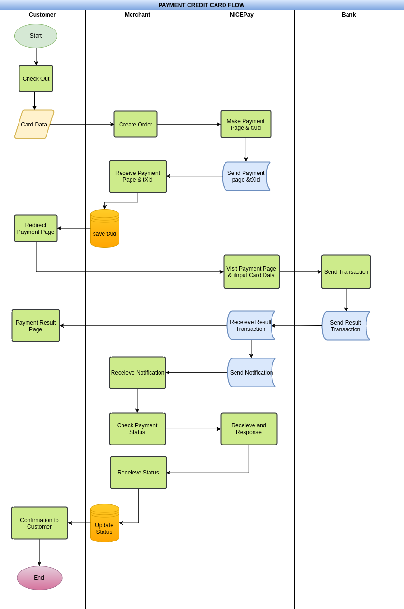
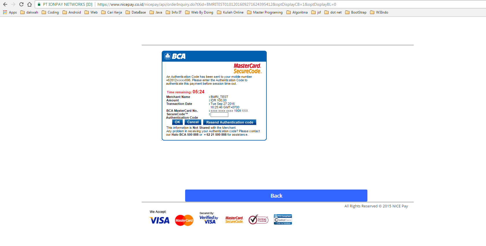
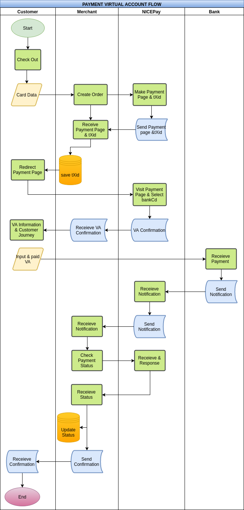

# Product Overview and Features

## Product Overview
NICEPAY Payment Solution is a product of PT IONPAY NETWORKS that provide various electronic payment over the Internet safely without separate security device. NICEPAY have integrated with Banks host to host connection for better and faster performance. Using latest technology, NICEPAY confidence to grow you business together.

## Integration Process
<ol type="1">
  <li>Understanding SDK, Parameters and Payment Flow
  <li>Explore API Operation Calls
  <li>Integration
  <li>Implementation Test (Development Environment)
  <li>Request Production MID and API Key
  <li>Go Live
</ol>

## Prerequisites
<ol type="1">
  <li>Test MID
  <li>Test API Key
  <li>NICEPAY Programming Language SDK (Java,PHP,and other)
</ol>

## API Environment
> Sandbox Base URI : https://dev.nicepay.co.id/

> Live Base URI : https://www.nicepay.co.id/

The NICEPAY REST API are supported in two environments. Use the <b>Sandbox</b> environment for testing purposes, then move to the <b>Live</b> environment for production processing. When testing, we will provide the <b>Test Mid</b> and <b>Merchant Key</b> for test credentials to make calls to the Sandbox URI. When you're set to go live, use the live credentials the <b>Production Mid</b> & <b>Merchant Key</b> with the live URI.

<aside class="notice">
Please use HTTPS Protocol, otherwise NICEPAY Engine will reject your request.
</aside>

## Preparation

To make a <b>valid API operation call</b>, you need a <b>Mid</b> and <b>Merchant Key</b>. Merchant Key is not only used for authentication but also to make sure that your data is not changed in the middle of sending data process.

## Inquiry
Have any inquiry? Please Contact us : it.support@ionpay.net

# NICEPAY Credit Card
## Operation Overview
Create a new transaction, produce NICEPAY Payment Page URL and Transaction ID. The Payment Page URI is used for redirecting user from merchant site (merchant checkout page) to NICEPAY Payment Page.

In Order to create a transaction you have to prepare the following mandatory data that collected from customer shopping cart.
<ol type="1">
  <li>Total Amount
  <li>Invoice Number
  <li>Order Informations, each Order Information consists of:
  <ul style="list-style-type:square">
    <li>Product Description
    <li>Product Quantity
    <li>Product Price
  </ul>
</ol>

## Payment Flow
This is diagram flow Payment Credit Card of NICEPAY.


## Resource Information
<b>RESOURCE URI</b>

Environment | URI | Method
--------- | ------- | -----------
Sandbox | https://dev.nicepay.co.id/nicepay/api/orderRegist.do | POST
Live | https://www.nicepay.co.id/nicepay/api/orderRegist.do | POST

## Mid and Merchant Key Testing
Please use this Mid and Merchant Key while development.

Type | Description
--------- | -------
Mid | IONPAYTEST
Merchant Key | 33F49GnCMS1mFYlGXisbUDzVf2ATWCl9k3R++d5hDd3Frmuos/XLx8XhXpe+LDYAbpGKZYSwtlyyLOtS/8aD7A==

## Parameters
>Example Cart Data

```json
"cartData": {
  "count": "2",
  "item": [
    {
      "img_url": "http://img.aa.com/ima1.jpg",
      "goods_name": "Item 1 Name",
      "goods_detail": "Item 1 Detail",
      "goods_amt": "700"
    },
    {
      "img_url": "http://img.aa.com/ima2.jpg",
      "goods_name": "Item 2 Name",
      "goods_detail": "Item 2 Detail",
      "goods_amt": "1000"
    }
  ]
}
```
NOTE:
<ol type="1">
  <li>`payMethod`:
    <ul style="list-style-type:circle">
      <li>`01` : `For Credit Card`
      <li>`02` : `For Virtual Account`
    </ul>
  <li>Data Type:
    <ul style="list-style-type:circle">
      <li>A  : Alphabet
      <li>AN : Alphabet & Numeric
      <li>N  : Numeric
    </ul>
</ol>

### Mandatory
Attribute | Data Type | Length |  Description
--------- | ------- | ----------- | ---------
iMid | AN | 10 | Merchant ID
`payMethod` | AN | 2 | Pay Method
currency | AN | 3 | Currency
amt | N | 12 | Goods Amount
instmntType | N | 2 | Installment Type
instmntMon | N | 2 | Installment Month
referenceNo | AN | 40 | Merchant Order No
goodsNm | AN | 100 | Goods Name
billingNm | A | 30 | Buyer Name
billingPhone | N | 15 | Buyer Phone Number
billingEmail | AN | 40 | Buyer Email
billingAddr | AN | 100 | Buyer Address
billingCity | A | 50 | Buyer City
billingState | A | 50 | Buyer State
billingPostCd | N | 10 | Buyer Post Number
billingCountry | A | 10 | Buyer Country
callBackUrl | AN | 255 | Payment Result Forward Url (On Browser)
dbProcessUrl | AN | 255 | Payment Result Receive Url (Server Side)
description | AN | 100 | Description
merchantToken | AN | 255 | Merchant Token
userIP | AN | 15 | User IP (Customer)
cartData | AN | 4000 | Cart Data

### Optional
Attribute | Data Type | Length |  Description
--------- | ------- | ----------- | ---------
deliveryNm | A | 30 | Delivery Name
deliveryPhone | N | 15 | Delivery Phone
deliveryEmail | AN | 40 | Delivery Email
deliveryAddr | AN | 100 | Delivery Address
deliveryCity | A | 50 | Delivery City
deliveryState | A | 50 | Delivery State
deliveryPostCd | N | 10 | Delivery Post Number
deliveryCountry | A | 10 | Delivery Country
vat | N | 12 | Vat
fee | N | 12 | Service Tax
notaxAmt | N | 12 | Tax Free Amount
reqDt | N | 8 | Request Date(YYYYMMDD)
reqTm | N | 6 | Request Time(HH24MISS)
reqDomain | AN | 100 | Request Domain
reqServerIP | AN | 15 | Request Server IP
reqClientServer | AN | 50 | Request Client Version
userSessionID | AN | 100 | User Session ID
userAgent | AN | 100 | User Agent Information
userLanguage | AN | 2 | User Language


## How To Generate Merchant Token
```php
<?php
  public function merchantToken() {
      return hash('sha256',   $this->get('iMid').
                              $this->get('referenceNo').
                              $this->get('amt').
                              $this->merchantKey
      );
  }
?>
```

```java
nicePay.setMerchantToken(nicePay.makeToken(nicePay.getAmt(), nicePay.getReferenceNo()));
```

```ruby
# Merchant Token
Nicepay.setRequestParam('merchantToken', Nicepay.merchantToken)
```

```csharp
static string merchantToken(Nicepay Nicepay, string RequestType)
{
    byte[] MerchantStr;
    if (RequestType == "cancelVA")
    {
        MerchantStr = Encoding.ASCII.GetBytes(NicepayConfig.NICEPAY_IMID + Nicepay.tXid + Nicepay.amt + NicepayConfig.NICEPAY_MERCHANT_KEY);
    }
    else
    {
        MerchantStr = Encoding.ASCII.GetBytes(NicepayConfig.NICEPAY_IMID + Nicepay.referenceNo + Nicepay.amt + NicepayConfig.NICEPAY_MERCHANT_KEY);
    }


    SHA256Managed hashString = new SHA256Managed();
    string hex = "";

    var hashValue = hashString.ComputeHash(MerchantStr);
    foreach (byte x in hashValue)
    {
        hex += String.Format("{0:x2}", x);
    }
    return hex.ToLower();

}
```

```python
def getMerchantToken():
    if not iMid:
        sys.exit("Cannot set Merchant Token, please set param iMid using requestVA.iMid = iMid values")
    elif not referenceNo:
        sys.exit("Cannot set Merchant Token, please set param referenceNo using requestVA.referenceNo = referenceNo values")
    elif not amt:
        sys.exit("Cannot set Merchant Token, please set param amt using requestVA.amt = amt values")
    elif not merchantKey:
        sys.exit("Cannot set Merchant Token, please set param merchantKey using requestVA.merchantKey = merchantKey values")
    else:
        mercToken = iMid + referenceNo + amt + merchantKey
        token = hashlib.sha256(mercToken.encode('ascii')).hexdigest()
        return token
```

To get Merchant Token, you need combine <b>Mid</b>+<b>referenceNo</b>+<b>amt</b>+<b>merchantKey</b>.
And then you need hash that using sha 256.

Note* : See the sample code.


## Example Source Code

```php
<?php
$nicepay = new NicepayLib();

//Ignore this function if you have invoice number.
function generateReference()
{
  $micro_date = microtime();
  $date_array = explode(" ",$microdate);
  $date = date("YmdHis",$date_array[1]);
  $date_array[0] = preg_replace('/[^\p{L}\p{N}\s]/u', '', $date_array[0]);
  return "Ref".$date.$date_array[0].rand(100,999);
}

if(isset($_POST['payMethod']) && $_POST['payMethod'] == '01'){
  //Populate Mandatory parameters to send
  $nicepay->set('payMethod', '01');
  $nicepay->set('currency', 'IDR');
  $nicepay->set('amt', 100); //Total Gross Amount
  $nicepay->set('referenceNo',generateReference()); //Invoice Number or Reference Number Generated by Merchant
  $nicepay->set('description', 'Payment of Invoice No '.$nicepay->get('referenceNo'));//Transaction Description

  $nicepay->set('billingNm', 'John Doe'); //Customer name
  $nicepay->set('billingPhone', '02112345678'); //Customer phone number
  $nicepay->set('billingEmail', 'john@example.com');
  $nicepay->set('billingAddr', 'Jl. Jendral Sudirman No.28');
  $nicepay->set('billingCity', 'Jakarta Pusat');
  $nicepay->set('billingState', 'DKI Jakarta');
  $nicepay->set('billingPostCd', '10210');
  $nicepay->set('billingCountry', 'Indonesia');

  $nicepay->set('deliveryNm', 'John Doe'); //Delivery name
  $nicepay->set('deliveryPhone', '02112345678');
  $nicepay->set('deliveryEmail', 'john@example.com');
  $nicepay->set('deliveryAddr', 'Jl. Jendral Sudirman No.28');
  $nicepay->set('deliveryCity', 'Jakarta Pusat');
  $nicepay->set('deliveryState', 'DKI Jakarta');
  $nicepay->set('deliveryPostCd', '10210');
  $nicepay->set('deliveryCountry', 'Indonesia');

  //Send Data
  $response = $nicepay->chargeCard();

  //Process response from NICEPAY
  if(isset($response->data->resultCd) && $response->data->resultCd == "0000"){
    header("Location: ".$response->data->requestURL."?tXid=".$response->tXid);
    //Please save your tXid in your database
  }elseif (isset($response->resultCd)) {
    // In this sample, we echo error message
    echo "<pre>";
    echo "result code    : ".$response->resultCd."\n";
    echo "result message : ".$response->resultMsg."\n";
    echo "</pre>";
  }else {
    // In this sample, we echo error message
    echo "<pre>Connection Timeout. Please Try Again.</pre>";
  }
}
?>
```

```ruby
=begin
    Nicepay Ruby Bindings
    Virtual Account Sample Code
    Have a Nicepay!
=end
require 'nicepay'

# Configuration

Nicepay.iMid=('IONPAYTEST')
Nicepay.merchantKey=('33F49GnCMS1mFYlGXisbUDzVf2ATWCl9k3R++d5hDd3Frmuos/XLx8XhXpe+LDYAbpGKZYSwtlyyLOtS/8aD7A==')
Nicepay.dbProcessUrl=('http://httpresponder.com/nicepay')
Nicepay.callBackUrl=('http://www.example.com/')

# API Operation
chargeCard  = Nicepay::Api::ChargeCard.new(Nicepay.requestParam)

# Set Request Parameter for Card Payment

# Merchant Id
Nicepay.setRequestParam('iMid', Nicepay.iMid)

# Card -> payMethod = 01
Nicepay.setRequestParam('payMethod', '01')

# No Installment - Do not use installment feature before get rights from bank
Nicepay.setRequestParam('instmntMon', '1')
Nicepay.setRequestParam('instmntType', '1')

# Reference Number / Order Number / Invoice Number, generated by merchant
Nicepay.setRequestParam('referenceNo','Invoice-7833')

# Transaction Description
Nicepay.setRequestParam('description','Payment of ' + Nicepay.param('referenceNo')) # Description
Nicepay.setRequestParam('goodsNm', Nicepay.param('description')) # goodsNm = Description

# Add cart information mandatory at least one cart data
# Nicepay.addCart('image_location','product_name','product_description', 'sub_total_amount')
Nicepay.addCart('https://www.nicepay.co.id/nicepay/images/cart.png', 'Glasses', 'Jumlah: 3', 1000)
Nicepay.addCart('https://www.nicepay.co.id/nicepay/images/cart.png', 'Glasses', 'Jumlah: 1', 2000)
Nicepay.addCart('https://www.nicepay.co.id/nicepay/images/cart.png', 'Discount', 'Jumlah: 50%', -1500)
# Set cartData as request parameter
Nicepay.setRequestParam('cartData', Nicepay.cartData)
# Total Amount -> auto count from cartData
Nicepay.setRequestParam('amt', Nicepay.autoCountTotal)

# Currency -> Indonesian Rupiah
Nicepay.setRequestParam('currency', 'IDR')

# Set customer information
Nicepay.setRequestParam('billingNm', 'John Doe')
Nicepay.setRequestParam('billingPhone', '02112341234')
Nicepay.setRequestParam('billingEmail', 'john.doe@example.com')
Nicepay.setRequestParam('billingAddr', 'Jl. Jend Sudirman')
Nicepay.setRequestParam('billingCity', 'Jakarta Pusat')
Nicepay.setRequestParam('billingState', 'DKI Jakarta')
Nicepay.setRequestParam('billingPostCd', '10210')
Nicepay.setRequestParam('billingCountry', 'Indonesia')

Nicepay.setRequestParam('deliveryNm', 'John Doe')
Nicepay.setRequestParam('deliveryPhone', '02112341234')
Nicepay.setRequestParam('deliveryEmail', 'john.doe@example.com')
Nicepay.setRequestParam('deliveryAddr', 'Jl. Jend Sudirman')
Nicepay.setRequestParam('deliveryCity', 'Jakarta Pusat')
Nicepay.setRequestParam('deliveryState', 'DKI Jakarta')
Nicepay.setRequestParam('deliveryPostCd', '10210')
Nicepay.setRequestParam('deliveryCountry', 'Indonesia')

# Set User Customer IP
Nicepay.setRequestParam('userIP', Nicepay.userIp)

# Set dbProcessUrl (Notification Handler / Web Hook URL)
Nicepay.setRequestParam('dbProcessUrl', Nicepay.dbProcessUrl)

# Set callbackUrl (Redirection page after payment URL)
Nicepay.setRequestParam('callBackUrl', Nicepay.callBackUrl)

# Set vat, fee & noTaxAmt -> reserved for future feature, only set 0 for now
Nicepay.setRequestParam('vat', 0)
Nicepay.setRequestParam('fee', 0)
Nicepay.setRequestParam('notaxAmt', 0)

# Merchant Token
Nicepay.setRequestParam('merchantToken', Nicepay.merchantToken)

# If you want to dump POST parameters and review it
# puts Nicepay.dumpParameters
# abort("Exit")

# Inspect Response
# puts chargeCard.response.inspect

response = chargeCard.response

# Inspect response
# puts response

# If success, redirect to payment page
if response["resultCd"].to_s == "0000"
    puts "\n"
    puts "-----------------------------------------------------------------------------------------------------"
    puts "Redirect Customer to   : " + response["requestURL"].to_s + "?tXid=" + response["tXid"].to_s
    puts "tXid                   : " + response["tXid"].to_s # Save tXid in your database
    puts "-----------------------------------------------------------------------------------------------------"

else
# If error, you can redirect back to checkout page
# In this sample, we only puts error message
    puts "\nOops! Payment Page failed to generate! We have recorded the event. \nPlease try again later.\n\n"
    puts "Result Code    : " + response["resultCd"]
    puts "Result Message : " + response["resultMsg"]
end


# Flush request parameter
Nicepay.flushParam
```

```java
// Payment Mandatory Field
nicePay.setPayMethod("01");
nicePay.setCurrency("IDR");
nicePay.setAmt("1000");
nicePay.setInstmntMon("1");
nicePay.setReferenceNo("MerchantReferenceNumber001");
nicePay.setGoodsNm("Merchant Goods 1");
nicePay.setBillingNm("Buyer Name");
nicePay.setBillingEmail("buyer@merchant.com");
nicePay.setBillingPhone("02112345678");
nicePay.setBillingAddr("Billing Address");
nicePay.setBillingCity("Jakarta");
nicePay.setBillingState("Jakarta");
nicePay.setBillingPostCd("12345");
nicePay.setBillingCountry("Indonesia");
nicePay.setDeliveryNm("Buyer Name");
nicePay.setDeliveryPhone("02112345678");
nicePay.setDeliveryAddr("Billing Address ");
nicePay.setDeliveryCity("Jakarta");
nicePay.setDeliveryState("Jakarta");
nicePay.setDeliveryPostCd("12345");
nicePay.setDeliveryCountry("Indonesia");
nicePay.setCallBackUrl("www.merchant.com/callback");
nicePay.setDbProcessUrl("www.merchant.com/dbprocess");
nicePay.setVat("0");
nicePay.setFee("0");
nicePay.setNotaxAmt("0");
nicePay.setDescription("Description");
nicePay.setUserIP("127.0.0.1");
nicePay.setMerchantToken(nicePay.makeToken(nicePay.getAmt(), nicePay.getReferenceNo()));
nicePay.setCartData("{}");
nicePay.setInstmntMon("1");
nicePay.setInstmntType("1");

// Payment Optional Field
nicePay.setReqDt("20160301");
nicePay.setReqTm("135959");
nicePay.setReqDomain("www.merchant.com");
nicePay.setReqServerIP("127.0.0.1");
nicePay.setReqClientVer("1.0");
nicePay.setUserSessionID("userSessionID");
nicePay.setUserAgent("Mozilla");
nicePay.setUserLanguage("en-US");
nicePay.setMerFixAcctId("9999000000000001");
nicePay.setVacctValidDt("20160303");
nicePay.setVacctValidTm("135959");
nicePay.setPaymentExpiryDt("20160303");
nicePay.setPaymentExpiryTm("135959");

// Payment Request
nicePay.payPage();

// Payment Response
System.out.println("Response String : " + nicePay.getResponseString()); // JSON in String format

String resultCd = nicePay.Get("resultCd");
String resultMsg = nicePay.Get("resultMsg");
String tXid= nicePay.Get("tXid");
String requestURL= nicePay.Get("requestURL");

// Direct to Url Process NICEPay
if (nicePay.Get("resultCd").equals("0000")) {
  String site = nicePay.Get("requestURL") + "?tXid=" + nicePay.Get("tXid");
  response.setStatus(response.SC_MOVED_TEMPORARILY);
  response.setHeader("Location", site);
}
```

```csharp
public JsonResult ChargeCard(Nicepay Nicepay)
{
    string RequestType = "CreditCard";
    Nicepay.iMid = NicepayConfig.NICEPAY_IMID;
    Nicepay.merchantToken = merchantToken(Nicepay, RequestType);
    Nicepay.dbProcessUrl = NicepayConfig.NICEPAY_DBPROCESS_URL;
    Nicepay.callBackUrl = NicepayConfig.NICEPAY_CALLBACK_URL;
    Nicepay.instmntMon = "1";
    Nicepay.instmntType = "1";
    Nicepay.userIP = GetUserIP();
    Nicepay.goodsNm = Nicepay.description;
    Nicepay.vat = "0";
    Nicepay.fee = "0";
    Nicepay.notaxAmt = "0";
    if (Nicepay.cartData == null)
    {
        Nicepay.cartData = "{}";
    }

    CheckParam(Nicepay.iMid, "01");
    CheckParam(Nicepay.PayMethod, "02");
    CheckParam(Nicepay.currency, "03");
    CheckParam(Nicepay.amt, "04");
    CheckParam(Nicepay.instmntMon, "05");
    CheckParam(Nicepay.referenceNo, "06");
    CheckParam(Nicepay.goodsNm, "07");
    CheckParam(Nicepay.billingNm, "08");
    CheckParam(Nicepay.billingPhone, "09");
    CheckParam(Nicepay.billingEmail, "10");
    CheckParam(Nicepay.billingAddr, "11");
    CheckParam(Nicepay.billingCity, "12");
    CheckParam(Nicepay.billingState, "13");
    CheckParam(Nicepay.billingCountry, "14");
    CheckParam(Nicepay.deliveryNm, "15");
    CheckParam(Nicepay.deliveryPhone, "16");
    CheckParam(Nicepay.deliveryAddr, "17");
    CheckParam(Nicepay.deliveryCity, "18");
    CheckParam(Nicepay.deliveryState, "19");
    CheckParam(Nicepay.deliveryPostCd, "20");
    CheckParam(Nicepay.deliveryCountry, "21");
    CheckParam(Nicepay.callBackUrl, "22");
    CheckParam(Nicepay.dbProcessUrl, "23");
    CheckParam(Nicepay.vat, "24");
    CheckParam(Nicepay.fee, "25");
    CheckParam(Nicepay.notaxAmt, "26");
    CheckParam(Nicepay.description, "27");
    CheckParam(Nicepay.merchantToken, "28");

    string API_Url = GetApiRequest(RequestType);

    string SingleString = BuildString(Nicepay);

    string ResultString = WebRequestPostHttp.Post_Http(SingleString, API_Url);
    ResultString = ResultString.Remove(0, 4);
    JavaScriptSerializer JsonSerializer = new JavaScriptSerializer();

    return JsonSerializer.Deserialize<JsonResult>(ResultString);
}

public string GetApiRequest(string Request)
{
    string API_req = null;
    if (Request == "RequestVA")
    {
        API_req = NicepayConfig.NICEPAY_REQ_VA_URL;
    }
    else if (Request == "CredirCard")
    {
        API_req =  NicepayConfig.NICEPAY_REQ_CC_URL;
    }
    else if (Request == "checkPaymentStatus")
    {
        API_req = NicepayConfig.NICEPAY_ORDER_STATUS_URL;
    }
    else if (Request == "cancelVA")
    {
        API_req = NicepayConfig.NICEPAY_CANCEL_VA_URL;
    }
    return API_req;
}

public string BuildString(Nicepay Nicepay)
{
    StringBuilder stringBuilder = new StringBuilder();

    Type t = Nicepay.GetType();
    string fieldName = null;
    object propertyValue = null;

    string resultStr = null;
    foreach (PropertyInfo pi in t.GetProperties(BindingFlags.Instance | BindingFlags.Public | BindingFlags.NonPublic))
    {
        fieldName = pi.Name;
        propertyValue = pi.GetValue(Nicepay, null);
        if (propertyValue != null)
        {
            stringBuilder.Append(fieldName + "=" + propertyValue + "&");
        }
    }

    string last = stringBuilder.ToString().Substring(stringBuilder.ToString().Length - 1);
    if (last == "&")
    {
        resultStr = stringBuilder.ToString().Remove(stringBuilder.ToString().Length - 1);
    }

    return resultStr;
}
```

```python
import json
import random

from nicepay import chargeCard

#Set Mandatory Value
chargeCard.iMid = "IONPAYTEST" #Set Merchant ID
chargeCard.merchantKey = "33F49GnCMS1mFYlGXisbUDzVf2ATWCl9k3R++d5hDd3Frmuos/XLx8XhXpe+LDYAbpGKZYSwtlyyLOtS/8aD7A==" #Set Merchant Key
chargeCard.amt = "100" #Total Gross Amount
chargeCard.instmntType = "1" #Installment Type
chargeCard.instmntMon = "1" #Installment Month
chargeCard.referenceNo = str(random.randrange(111111, 999999)) #Invoice Number By Merchant
chargeCard.goodsNm = chargeCard.referenceNo #Goods Name
chargeCard.billingNm = "John Doe"
chargeCard.billingPhone = "02112345678"
chargeCard.billingEmail = "john@example.com"
chargeCard.billingAddr = "Jl. Jend. Sudirman No. 28"
chargeCard.billingCity = "Jakarta Pusat"
chargeCard.billingState = "DKI Jakarta"
chargeCard.billingPostCd = "10210"
chargeCard.billingCountry = "Indonesia"
chargeCard.callBackUrl = "https://example.com/callbackUrl.php"
chargeCard.dbProcessUrl = "https://example.com/notification-handler.php"
chargeCard.description = "Payment Of Ref No." + chargeCard.referenceNo
chargeCard.merchantToken = chargeCard.getMerchantToken()
chargeCard.userIP = chargeCard.getUserIp()
chargeCard.cartData = "{}" #Json Array Value

resultData = chargeCard.apiRequest()
jsonResult = resultData[4:]
result = json.loads(jsonResult)

try:
    result['data']['resultCd']
except NameError:
    print "Connection Timeout. Please Try Again!"
else:
    if result['data']['resultCd'] == '0000':
        print("Location: "+result['data']['requestURL']+"?tXid="+result['tXid'])
    else:
        print result['data']['resultCd']
        print result['data']['resultMsg']
```

We give some example code to create a transaction NICEPAY Credit Card.

## API Response
```json
{
  "apiType": "M0",
  "tXid": "IONPAYTEST01201608291156552476",
  "requestDate": "20160829115655",
  "responseDate": "20160829115655",
  "data": {
    "tXid": "IONPAYTEST01201608291156552476",
    "resultCd": "0000",
    "resultMsg": "SUCCESS",
    "requestURL": "https://www.nicepay.co.id/nicepay/api/orderInquiry.do"
  }
}
```

Here is a response from our server.

## NICEPAY Payment Page
After process response NICEPAY in page Checkout, it will redirect to NICEPAY Payment Page.<br>


And then after customer input credit card data, Our system will automatically redirect to bank Page. (Only Live Environment)



## Callback URL Process
```php
<?php
$nicepay = new NicepayLib();

$resultCd    = $this->input->get('resultCd', TRUE);
$resultMsg   = $this->input->get('resultMsg',TRUE);
$authNo      = $this->input->get('authNo',TRUE);
$tXid        = $this->input->get('tXid',TRUE);
$referenceNo = $this->input->get('referenceNo',TRUE);
$transDt     = $this->input->get('transDt',TRUE);
$transTm     = $this->input->get('transTm',TRUE);
$amount      = $this->input->get('amount',TRUE);
$description = $this->input->get('description',TRUE);

//Checking to NICEPAY Last Status Transaction
$paymentStatus = $nicepay->checkPaymentStatus($tXid, $referenceNo, $amount);

if(isset($paymentStatus->status) && $paymentStatus->status == '0'){
  echo "<pre>Success</pre>";
}elseif (isset($paymentStatus->status) && $paymentStatus->status == '1') {
  echo "<pre>Void</pre>";
}elseif (isset($paymentStatus->status) && $paymentStatus->status == '2') {
  echo "<pre>Refund</pre>";
}elseif (isset($paymentStatus->status) && $paymentStatus->status == '9') {
  echo "<pre>Initialization or Unpaid</pre>";
}else {
  echo "<pre>Status Unknown</pre>";
}
?>
```

```ruby
### This is for Check Transaction Status using Ruby


=begin
    Nicepay Ruby Bindings
    Virtual Account Sample Code
    Have a Nicepay!
=end
require 'nicepay'

# Configuration

# MID
Nicepay.iMid=('IONPAYTEST')
# Merchant Key
Nicepay.merchantKey=('33F49GnCMS1mFYlGXisbUDzVf2ATWCl9k3R++d5hDd3Frmuos/XLx8XhXpe+LDYAbpGKZYSwtlyyLOtS/8aD7A==')
# Webhook/Notification Handler URL
Nicepay.dbProcessUrl=('http://httpresponder.com/nicepay')
# Redirection URL after customer made payment in Nicepay Payment Page
Nicepay.callBackUrl=('http://www.example.com/')

# API Operation
checkStatus = Nicepay::Api::CheckStatus.new(Nicepay.requestParam)

# Set Request Parameter for Check Status

# Merchant Id
Nicepay.setRequestParam('iMid', Nicepay.iMid)

# Reference Number / Order Number / Invoice Number, generated by merchant
Nicepay.setRequestParam('referenceNo','Invoice-7834')

# Total Amount
Nicepay.setRequestParam('amt', '3000')

# Set VA expiry date -> 2 days from now
Nicepay.setRequestParam('tXid', 'IONPAYTEST02201606061354204825')
# You can also set like this

# Merchant Token
Nicepay.setRequestParam('merchantToken', Nicepay.merchantTokenC)

# If you want to dump POST parameters and review it
# puts Nicepay.dumpParameters
# abort("Exit")

# Inspect Response
# puts requestVa.response.inspect

response = checkStatus.response

# Inspect response
# puts response.inspect

=begin
     **=========================================================================================================
     ** Credit Card
     **=========================================================================================================
     ** $paymentStatus->status == 0 // Success
     ** $paymentStatus->status == 1 // Void
     ** $paymentStatus->status == 2 // Refund
     ** $paymentStatus->status == 9 // Initialization or Unpaid
     **=========================================================================================================
=end
# If success, show VA information to customer
if response["resultCd"].to_s == "0000"
    puts "\n"
    puts "----------------------------------------------------------------------"
    puts "Transaction Status     : " + response["status"].to_s
    puts "Amount                 : " + response["amt"].to_s
    puts "Reference No           : " + response["referenceNo"].to_s
    puts "Transaction ID         : " + response["tXid"].to_s
    puts "----------------------------------------------------------------------"

else
# If error, you can redirect back to checkout page
# In this sample, we only puts error message
    puts "\nOops! Check Status failed to generate! We have recorded the event. \nPlease try again later.\n\n"
    puts "Result Code    : " + response["resultCd"]
    puts "Result Message : " + response["resultMsg"]
end


# Flush request parameter
Nicepay.flushParam
```

```java
// Order Status Mandatory Field
nicePay.setTrxId("IONPAYTEST02201603091207051498");
nicePay.setReferenceNo("MerchantReferenceNumber001");
nicePay.setAmt("1000");
nicePay.setMerchantToken(nicePay.makeToken(nicePay.getAmt(), nicePay.getReferenceNo()));
// Order Status Request
nicePay.orderStatus();
// Order Status Response
System.out.println("Response String : " + nicePay.getResponseString()); // JSON in String format
nicePay.getHtResponse(); // JSON in HashTable<String, String> format

String resultCd = nicePay.Get("resultCd");
String resultMsg = nicePay.Get("resultMsg");
String tXid= nicePay.Get("tXid ");
String iMid= nicePay.Get("iMid");
String currency= nicePay.Get("currency");
String amount= nicePay.Get("amount");
String instmntMon= nicePay.Get("instmntMon");
String instmntType= nicePay.Get("instmntType");
String referenceNo= nicePay.Get("referenceNo");
String goodsNm = nicePay.Get("goodsNm");
String payMethod = nicePay.Get("payMethod");
String billingNm= nicePay.Get("billingNm");
String merchantToken= nicePay.Get("merchantToken");
String reqDt= nicePay.Get("reqDt");
String reqTm = nicePay.Get("reqTm");
String status = nicePay.Get("status");
String bankCd= nicePay.Get("bankCd");
String vacctValidDt= nicePay.Get("vacctValidDt");
String vacctValidTm= nicePay.Get("vacctValidTm");
String vacctNo= nicePay.Get("vacctNo");
```

```csharp
public NotificationResult ChargcheckPaymentStatuseCard(string tXid, string referenceNo, string amt)
{
    string RequestType = "checkPaymentStatus";
    Nicepay Nicepay = new Nicepay();

    Nicepay.iMid = NicepayConfig.NICEPAY_IMID;
    Nicepay.tXid = tXid;
    Nicepay.referenceNo = referenceNo;
    Nicepay.amt = amt;
    Nicepay.merchantToken = merchantToken(Nicepay, RequestType);

    CheckParam(Nicepay.iMid, "01");
    CheckParam(Nicepay.amt, "04");
    CheckParam(Nicepay.referenceNo, "06");
    CheckParam(Nicepay.merchantToken, "28");
    CheckParam(Nicepay.tXid, "30");

    string API_Url = GetApiRequest(RequestType);
    string SingleString = BuildString(Nicepay);

    string ResultString = WebRequestPostHttp.Post_Http(SingleString, API_Url);
    JavaScriptSerializer JsonSerializer = new JavaScriptSerializer();

    return JsonSerializer.Deserialize<NotificationResult>(ResultString);

}
```

```python
from nicepay import checkStatus

checkStatus.iMid = "IONPAYTEST" #Set Merchant ID
checkStatus.merchantKey = "33F49GnCMS1mFYlGXisbUDzVf2ATWCl9k3R++d5hDd3Frmuos/XLx8XhXpe+LDYAbpGKZYSwtlyyLOtS/8aD7A==" #Set Merchant Key
checkStatus.amt = "100"
checkStatus.referenceNo = "379072"
checkStatus.merchantToken = checkStatus.getMerchantToken()
checkStatus.tXid = "IONPAYTEST02201609161449136760"

resultCheckStatus = checkStatus.apiRequest()
print resultCheckStatus
```

After customer pay in NICEPAY Payment Page, It will redirect to Merchant Page (Thank You Page).<br>
In Thank You Page need validation data to make sure the payment is success.<br>
Here we show some code to validation payment.

## Check Payment Status Format
```json
{
  "merchantToken": "fd8c40d35cf9a6d4d0f9d1f4d0fb145d13b928bd2ade215580b1501427bc597e",
  "reqTm": "140719",
  "goodsNm": "Payment of Invoice No Ref20160829090721020662800218",
  "resultCd": "0000",
  "referenceNo": "Ref20160829090721020662800218",
  "tXid": "IONPAYTEST01201608291407196228",
  "amt": "100",
  "instmntType": "0",
  "iMid": "IONPAYTEST",
  "billingNm": "John Doe",
  "resultMsg": "success",
  "vacctValidDt": null,
  "payMethod": "01",
  "reqDt": "20160829",
  "currency": "IDR",
  "instmntMon": "1",
  "vacctValidTm": null,
  "status": "0"
}
```
Here is example result of check payment status in callback URL.

## Payment Status Notification
```php
<?php
$nicepay = new NicepayLib();

//Listen for parameters passed
$pushParameters = array(
  'tXid',
  'referenceNo',
  'merchantToken',
  'amt',
  'customerId'
);

$nicepay->extractNotification($pushParameters);

$iMid         = $nicepay->iMid;
$tXid         = $nicepay->getNotification('tXid');
$referenceNo  = $nicepay->getNotification('referenceNo');
$amt          = $nicepay->getNotification('amt');
$pushedToken  = $nicepay->getNotification('merchantToken');

$nicepay->set('tXid',$tXid);
$nicepay->set('amt',$amt);
$nicepay->set('iMid',$iMid);

if(isset($referenceNo)){
  $nicepay->set('referenceNo',$referenceNo);
  $merchantToken = $nicepay->merchantTokenC();
  $nicepay->set('merchantToken',$merchantToken);

  $paymentStatus = $nicepay->checkPaymentStatus($tXid, $referenceNo, $amt);

  if($pushedToken == $merchantToken){
    if(isset($paymentStatus->status) && $paymentStatus->status == '0'){
      echo "<pre>Success</pre>";
    }elseif (isset($paymentStatus->status) && $paymentStatus->status == '1') {
      echo "<pre>Void</pre>";
    }elseif (isset($paymentStatus->status) && $paymentStatus->status == '2') {
      echo "<pre>Refund</pre>";
    }elseif (isset($paymentStatus->status) && $paymentStatus->status == '9') {
      echo "<pre>Initialization or Unpaid</pre>";
    }else {
      echo "<pre>Status Unknown</pre>";
    }
  }
}
?>
```

```ruby
=begin
    Nicepay Ruby Bindings
    Virtual Account Sample Code
    Have a Nicepay!
=end
require 'nicepay'

# Configuration

# MID
Nicepay.iMid=('IONPAYTEST')
# Merchant Key
Nicepay.merchantKey=('33F49GnCMS1mFYlGXisbUDzVf2ATWCl9k3R++d5hDd3Frmuos/XLx8XhXpe+LDYAbpGKZYSwtlyyLOtS/8aD7A==')
# Webhook/Notification Handler URL
Nicepay.dbProcessUrl=('http://httpresponder.com/nicepay')
# Redirection URL after customer made payment in Nicepay Payment Page
Nicepay.callBackUrl=('http://www.example.com/')

# API Operation
checkStatus = Nicepay::Api::CheckStatus.new(Nicepay.requestParam)

# Set Request Parameter for Check Status

# Merchant Id
Nicepay.setRequestParam('iMid', Nicepay.iMid)

# Reference Number / Order Number / Invoice Number, generated by merchant
Nicepay.setRequestParam('referenceNo','Invoice-7834')

# Total Amount
Nicepay.setRequestParam('amt', '3000')

# Set VA expiry date -> 2 days from now
Nicepay.setRequestParam('tXid', 'IONPAYTEST02201606061354204825')
# You can also set like this

# Merchant Token
Nicepay.setRequestParam('merchantToken', Nicepay.merchantTokenC)

# If you want to dump POST parameters and review it
# puts Nicepay.dumpParameters
# abort("Exit")

# Inspect Response
# puts requestVa.response.inspect

response = checkStatus.response

# Inspect response
# puts response.inspect

=begin
     **=========================================================================================================
     ** Credit Card
     **=========================================================================================================
     ** $paymentStatus->status == 0 // Success
     ** $paymentStatus->status == 1 // Void
     ** $paymentStatus->status == 2 // Refund
     ** $paymentStatus->status == 9 // Initialization or Unpaid
     **=========================================================================================================
=end
# If success, show VA information to customer
if response["resultCd"].to_s == "0000"
    puts "\n"
    puts "----------------------------------------------------------------------"
    puts "Transaction Status     : " + response["status"].to_s
    puts "Amount                 : " + response["amt"].to_s
    puts "Reference No           : " + response["referenceNo"].to_s
    puts "Transaction ID         : " + response["tXid"].to_s
    puts "----------------------------------------------------------------------"

else
# If error, you can redirect back to checkout page
# In this sample, we only puts error message
    puts "\nOops! Check Status failed to generate! We have recorded the event. \nPlease try again later.\n\n"
    puts "Result Code    : " + response["resultCd"]
    puts "Result Message : " + response["resultMsg"]
end


# Flush request parameter
Nicepay.flushParam
```

```java
tXid={tXid}
referenceNo={referenceNo}
amt={amt}
merchantToken={merchantToken}
matchCl={matchCl}
status={status}
bankCd={bankCd}
vacctNo={vacctNo}
authNo={authNo}

// Order Status Mandatory Field
nicePay.setTrxId("IONPAYTEST02201603091207051498");
nicePay.setReferenceNo("MerchantReferenceNumber001");
nicePay.setAmt("1000");
nicePay.setMerchantToken(nicePay.makeToken(nicePay.getAmt(), nicePay.getReferenceNo()));
// Order Status Request
nicePay.orderStatus();
// Order Status Response
System.out.println("Response String : " + nicePay.getResponseString()); // JSON in String format
nicePay.getHtResponse(); // JSON in HashTable<String, String> format

String resultCd = nicePay.Get("resultCd");
String resultMsg = nicePay.Get("resultMsg");
String tXid= nicePay.Get("tXid ");
String iMid= nicePay.Get("iMid");
String currency= nicePay.Get("currency");
String amount= nicePay.Get("amount");
String instmntMon= nicePay.Get("instmntMon");
String instmntType= nicePay.Get("instmntType");
String referenceNo= nicePay.Get("referenceNo");
String goodsNm = nicePay.Get("goodsNm");
String payMethod = nicePay.Get("payMethod");
String billingNm= nicePay.Get("billingNm");
String merchantToken= nicePay.Get("merchantToken");
String reqDt= nicePay.Get("reqDt");
String reqTm = nicePay.Get("reqTm");
String status = nicePay.Get("status");
String bankCd= nicePay.Get("bankCd");
String vacctValidDt= nicePay.Get("vacctValidDt");
String vacctValidTm= nicePay.Get("vacctValidTm");
String vacctNo= nicePay.Get("vacctNo");
```

```csharp
public NotificationResult CancelVA(string tXid, string amt)
{
    string RequestType = "cancelVA";
    Nicepay Nicepay = new Nicepay();

    Nicepay.iMid = NicepayConfig.NICEPAY_IMID;
    Nicepay.tXid = tXid;
    Nicepay.amt = amt;
    Nicepay.merchantToken = merchantToken(Nicepay, RequestType);
    Nicepay.PayMethod = "02";
    Nicepay.cancelType = "1";

    CheckParam(Nicepay.iMid, "01");
    CheckParam(Nicepay.amt, "04");
    CheckParam(Nicepay.merchantToken, "28");
    CheckParam(Nicepay.tXid, "30");

    string API_Url = GetApiRequest(RequestType);
    string SingleString = BuildString(Nicepay);

    string ResultString = WebRequestPostHttp.Post_Http(SingleString, API_Url);
    JavaScriptSerializer JsonSerializer = new JavaScriptSerializer();

    return JsonSerializer.Deserialize<NotificationResult>(ResultString);

}
```

```python
from nicepay import checkStatus

checkStatus.iMid = "IONPAYTEST" #Set Merchant ID
checkStatus.merchantKey = "33F49GnCMS1mFYlGXisbUDzVf2ATWCl9k3R++d5hDd3Frmuos/XLx8XhXpe+LDYAbpGKZYSwtlyyLOtS/8aD7A==" #Set Merchant Key
checkStatus.amt = "100"
checkStatus.referenceNo = "379072"
checkStatus.merchantToken = checkStatus.getMerchantToken()
checkStatus.tXid = "IONPAYTEST02201609161449136760"

resultCheckStatus = checkStatus.apiRequest()
print resultCheckStatus
```


Payment status notification is a NICEPAY feature to notify merchant when there is transaction status change for some reason.<br>
Here we show some code for Notification Handler.<br><br>
NOTE: We have some status for method credit card.

`Status` | Description
------ | -----------
0 | Success
1 | Void
2 | Refund
9 | Reversal

# NICEPAY Virtual Account
## Operation Overview VA
Create a new transaction and produce a new Virtual Account for customer transfer.

In Order to create a transaction you have to prepare the following mandatory data that collected from customer shopping cart.
<ol type="1">
  <li>Total Amount
  <li>Invoice Number
  <li>Order Informations, each Order Information consists of:
  <ul style="list-style-type:square">
    <li>Product Description
    <li>Product Quantity
    <li>Product Price
  </ul>
</ol>

## Payment Flow VA
This is diagram flow Payment Virtual Account of NICEPAY.


## Resource Information VA
<b>RESOURCE URI</b>

Environment | URI | Method
--------- | ------- | -----------
Sandbox | https://dev.nicepay.co.id/nicepay/api/onePass.do | POST
Live | https://www.nicepay.co.id/nicepay/api/onePass.do | POST

## Mid and Merchant Key Testing VA
Please use this Mid and Merchant Key while development.

Type | Description
--------- | -------
Mid | IONPAYTEST
Merchant Key | 33F49GnCMS1mFYlGXisbUDzVf2ATWCl9k3R++d5hDd3Frmuos/XLx8XhXpe+LDYAbpGKZYSwtlyyLOtS/8aD7A==

## Bank Code VA
Bank Name | BankCd
--------- | -------
BCA | CENA
Mandiri | BMRI
Hana Bank | HNBN
Permata | BBBA
Maybank | IBBK
CIMB | BNIA
BRI | BRIN

## Parameters VA
>Example Cart Data

```json
"cartData": {
  "count": "2",
  "item": [
    {
      "img_url": "http://img.aa.com/ima1.jpg",
      "goods_name": "Item 1 Name",
      "goods_detail": "Item 1 Detail",
      "goods_amt": "700"
    },
    {
      "img_url": "http://img.aa.com/ima2.jpg",
      "goods_name": "Item 2 Name",
      "goods_detail": "Item 2 Detail",
      "goods_amt": "1000"
    }
  ]
}
```

NOTE:
<ol type="1">
  <li>`payMethod`:
    <ul style="list-style-type:circle">
      <li>`01` : `For Credit Card`
      <li>`02` : `For Virtual Account`
    </ul>
  <li>Data Type:
    <ul style="list-style-type:circle">
      <li>A  : Alphabet
      <li>AN : Alphabet & Numeric
      <li>N  : Numeric
    </ul>
</ol>

### Mandatory VA

Attribute | Data Type | Length |  Description
--------- | ------- | ----------- | ---------
iMid | AN | 10 | Merchant ID
`payMethod` | AN | 2 | Pay Method
currency | AN | 3 | Currency
amt | N | 12 | Goods Amount
bankCd | A | 4 | Bank Code
referenceNo | AN | 40 | Merchant Order No
goodsNm | AN | 100 | Goods Name
billingNm | A | 30 | Buyer Name
billingPhone | N | 15 | Buyer Phone Number
billingEmail | AN | 40 | Buyer Email
billingAddr | AN | 100 | Buyer Address
billingCity | A | 50 | Buyer City
billingState | A | 50 | Buyer State
billingPostCd | N | 10 | Buyer Post Number
billingCountry | A | 10 | Buyer Country
callBackUrl | AN | 255 | Payment Result Forward Url (On Browser)
dbProcessUrl | AN | 255 | Payment Result Receive Url (Server Side)
description | AN | 100 | Description
merchantToken | AN | 255 | Merchant Token
userIP | AN | 15 | User IP (Customer)
cartData | AN | 4000 | Cart Data

### Optional VA
Attribute | Data Type | Length |  Description
--------- | ------- | ----------- | ---------
vacctValidDt | N | 8 | VA Expiry Date
vacctValidTm | N | 6 | VA Expiry Time
deliveryNm | A | 30 | Delivery Name
deliveryPhone | N | 15 | Delivery Phone
deliveryEmail | AN | 40 | Delivery Email
deliveryAddr | AN | 100 | Delivery Address
deliveryCity | A | 50 | Delivery City
deliveryState | A | 50 | Delivery State
deliveryPostCd | N | 10 | Delivery Post Number
deliveryCountry | A | 10 | Delivery Country
vat | N | 12 | Vat
fee | N | 12 | Service Tax
notaxAmt | N | 12 | Tax Free Amount
reqDt | N | 8 | Request Date(YYYYMMDD)
reqTm | N | 6 | Request Time(HH24MISS)
reqDomain | AN | 100 | Request Domain
reqServerIP | AN | 15 | Request Server IP
reqClientServer | AN | 50 | Request Client Version
userSessionID | AN | 100 | User Session ID
userAgent | AN | 100 | User Agent Information
userLanguage | AN | 2 | User Language

## How To Generate Merchant Token VA
```php
<?php
  public function merchantToken() {
      return hash('sha256',   $this->get('iMid').
                              $this->get('referenceNo').
                              $this->get('amt').
                              $this->merchantKey
      );
  }
?>
```

```python
def getMerchantToken():
    if not iMid:
        sys.exit("Cannot set Merchant Token, please set param iMid using requestVA.iMid = iMid values")
    elif not referenceNo:
        sys.exit("Cannot set Merchant Token, please set param referenceNo using requestVA.referenceNo = referenceNo values")
    elif not amt:
        sys.exit("Cannot set Merchant Token, please set param amt using requestVA.amt = amt values")
    elif not merchantKey:
        sys.exit("Cannot set Merchant Token, please set param merchantKey using requestVA.merchantKey = merchantKey values")
    else:
        mercToken = iMid + referenceNo + amt + merchantKey
        token = hashlib.sha256(mercToken.encode('ascii')).hexdigest()
        return token
```

To get Merchant Token, you need combine <b>Mid</b>+<b>referenceNo</b>+<b>amt</b>+<b>merchantKey</b>.
And then you need hash that using sha 256.

Note* : See the sample code.

## VacctValidDt and VacctValidTm
```php
<?php
public function create_vacctValidDt(){
  $date_now = date('Ymd');
  $vaExpiryDate = date('Ymd', strtotime($date_now . ' +1 day'));// Set VA expiry date +1 day
  return $vaExpiryDate;
}

$nicepay = new NicepayLib();
$nicepay->set('vacctValidDt', create_vacctValidDt());
$nicepay->set('vacctValidTm', date('His'));
?>
```
VacctValidDt and VacctValidTm is expiry date and time of virtual account number.<br>
If Customer late for transfer of expiry date and time, They can not do payment.

Here we show how to create vacctValidDt and vacctValidTm.

## Example Source Code Checkout VA
```php
<?php
$nicepay = new NicepayLib();

//Ignore this function if you have invoice number.
function generateReference()
{
  $micro_date = microtime();
  $date_array = explode(" ",$microdate);
  $date = date("YmdHis",$date_array[1]);
  $date_array[0] = preg_replace('/[^\p{L}\p{N}\s]/u', '', $date_array[0]);
  return "Ref".$date.$date_array[0].rand(100,999);
}

if(isset($_POST['payMethod']) && $_POST['payMethod'] == '02' && isset($_POST['bankCd']) && $_POST['bankCd'])
{
  $bankCd               = $_POST['bankCd']; //Get from form checkout.
  $nicepay->iMid        = "IONPAYTEST"; //Set MID
  $nicepay->merchantKey = "33F49GnCMS1mFYlGXisbUDzVf2ATWCl9k3R++d5hDd3Frmuos/XLx8XhXpe+LDYAbpGKZYSwtlyyLOtS/8aD7A=="; //Set Merchant Key
  $nicepay->set('payMethod','02');
  $nicepay->set('currency','IDR');
  $nicepay->set('amt',100); // Set Total Gross Amount
  $nicepay->set('referenceNo',generateReference()); //Invoice Number or Reference Number Generate by Merchant
  $nicepay->set('description', 'Payment of Invoice No '.$nicepay->get('referenceNo')); //Transaction Description
  $nicepay->set('bankCd', $bankCd);

  $nicepay->set('billingNm', 'John Doe'); // Customer name
  $nicepay->set('billingPhone', '02112345678'); // Customer phone number
  $nicepay->set('billingEmail', 'john@example.com'); //
  $nicepay->set('billingAddr', 'Jl. Jend. Sudirman No. 28');
  $nicepay->set('billingCity', 'Jakarta Pusat');
  $nicepay->set('billingState', 'DKI Jakarta');
  $nicepay->set('billingPostCd', '10210');
  $nicepay->set('billingCountry', 'Indonesia');

  $nicepay->set('deliveryNm', 'John Doe'); // Delivery name
  $nicepay->set('deliveryPhone', '02112345678');
  $nicepay->set('deliveryEmail', 'john@example.com');
  $nicepay->set('deliveryAddr', 'Jl. Jend. Sudirman No. 28');
  $nicepay->set('deliveryCity', 'Jakarta Pusat');
  $nicepay->set('deliveryState', 'DKI Jakarta');
  $nicepay->set('deliveryPostCd', '10210');
  $nicepay->set('deliveryCountry', 'Indonesia');

  $nicepay->set('vacctValidDt', create_vacctValidDt()); // Set VA expiry date example: +1 day
  $nicepay->set('vacctValidTm', date('His')); // Set VA Expiry Time

  //SEND DATA
  $response = $nicepay->requestVA();

  //Response from NICEPAY
  if(isset($response->resultCd) && $response->resultCd == "0000"){
    echo "<pre>";
    echo "tXid              : $response->tXid (Save to your database to check status) \n";
    echo "callbackUrl       : $response->callbackUrl\n";
    echo "description       : $response->description\n";
    echo "payment date      : $nicepay->get('vacctValidDt')\n"; // YYMMDD
    echo "payment time      : $nicepay->get('vacctValidTm')\n"; // HH24MISS
    echo "virtual account   : $response->bankVacctNo (For customer to transfer) \n";
    echo "result code       : $response->resultCd\n";
    echo "result message    : $response->resultMsg\n";
    echo "reference no      : $response->referenceNo\n";
    echo "payment method    : $response->payMethod";
    echo "</pre>";
  }elseif (isset($response->resultCd)) {
    // In this sample, we echo error message
    echo "<pre>";
    echo "result code       :".$response->resultCd."\n";
    echo "result message    :".$response->resultMsg."\n";
    echo "</pre>";
  }else {
    // In this sample, we echo error message
    echo "<pre>Connection Timeout. Please Try again.</pre>";
  }
}
?>
```

```ruby
=begin
    Nicepay Ruby Bindings
    Virtual Account Sample Code
    Have a Nicepay!
=end
require 'nicepay'
# require 'nicepay'
# Configuration

# MID
Nicepay.iMid=('IONPAYTEST')
# Merchant Key
Nicepay.merchantKey=('33F49GnCMS1mFYlGXisbUDzVf2ATWCl9k3R++d5hDd3Frmuos/XLx8XhXpe+LDYAbpGKZYSwtlyyLOtS/8aD7A==')
# Webhook/Notification Handler URL
Nicepay.dbProcessUrl=('http://httpresponder.com/nicepay')
Nicepay.callBackUrl=('http://www.example.com/')

# API Operation
requestVa   = Nicepay::Api::RequestVa.new(Nicepay.requestParam)

# Set Request Parameter for Virtual Account

# Merchant Id
Nicepay.setRequestParam('iMid', Nicepay.iMid)

# Bank Transfer -> payMethod = 02
Nicepay.setRequestParam('payMethod', '02')

# Set Bank
# BCA -> CENA
# BNI -> BNIN
# Mandiri -> BMRI
# Hana Bank -> HNBN
# Maybank -> IBBK
# Permata -> BBBA
Nicepay.setRequestParam('bankCd', 'CENA')

# Reference Number / Order Number / Invoice Number, generated by merchant
Nicepay.setRequestParam('referenceNo','Invoice-7834')

# Transaction Description
Nicepay.setRequestParam('description','Payment of ' + Nicepay.param('referenceNo')) # Description
Nicepay.setRequestParam('goodsNm', Nicepay.param('description')) # goodsNm = Description

# Add cart information mandatory at least one cart data
# Nicepay.addCart('image_location','product_name','product_description', 'sub_total_amount')
Nicepay.addCart('https://www.nicepay.co.id/nicepay/images/cart.png', 'Glasses', 'Jumlah: 3', 1000)
Nicepay.addCart('https://www.nicepay.co.id/nicepay/images/cart.png', 'Glasses', 'Jumlah: 1', 2000)

# Set cartData as request parameter
Nicepay.setRequestParam('cartData', Nicepay.cartData)

# Amount -> auto count from cartData
Nicepay.setRequestParam('amt', Nicepay.autoCountTotal)

# Currency -> Indonesian Rupiah
Nicepay.setRequestParam('currency', 'IDR')

# Set customer information
Nicepay.setRequestParam('billingNm', 'John Doe')
Nicepay.setRequestParam('billingPhone', '02112341234')
Nicepay.setRequestParam('billingEmail', 'john.doe@example.com')
Nicepay.setRequestParam('billingAddr', 'Jl. Jend Sudirman')
Nicepay.setRequestParam('billingCity', 'Jakarta Pusat')
Nicepay.setRequestParam('billingState', 'DKI Jakarta')
Nicepay.setRequestParam('billingPostCd', '10210')
Nicepay.setRequestParam('billingCountry', 'Indonesia')

Nicepay.setRequestParam('deliveryNm', 'John Doe')
Nicepay.setRequestParam('deliveryPhone', '02112341234')
Nicepay.setRequestParam('deliveryEmail', 'john.doe@example.com')
Nicepay.setRequestParam('deliveryAddr', 'Jl. Jend Sudirman')
Nicepay.setRequestParam('deliveryCity', 'Jakarta Pusat')
Nicepay.setRequestParam('deliveryState', 'DKI Jakarta')
Nicepay.setRequestParam('deliveryPostCd', '10210')
Nicepay.setRequestParam('deliveryCountry', 'Indonesia')

# Set User Customer IP
Nicepay.setRequestParam('userIP', Nicepay.userIp)

# Set dbProcessUrl (Notification Handler / Web Hook URL)
Nicepay.setRequestParam('dbProcessUrl', Nicepay.dbProcessUrl)

# Set callbackUrl (Redirection page after payment URL)
Nicepay.setRequestParam('callBackUrl', Nicepay.callBackUrl)

# Set vat, fee & noTaxAmt -> reserved for future feature, only set 0 for now
Nicepay.setRequestParam('vat', 0)
Nicepay.setRequestParam('fee', 0)
Nicepay.setRequestParam('notaxAmt', 0)

# Set VA expiry date -> 2 days from now
Nicepay.setRequestParam('vacctValidDt', Nicepay.vaExpiryDate(2)) # format: %Y%m%d
# You can also set like this
# Nicepay.setRequestParam('vacctValidDt', '20160608') # format: %Y%m%d

# Set VA expiry time -> time as now
Nicepay.setRequestParam('vacctValidTm', Nicepay.vaExpiryTime) # format: %H%M%S
# You can also set like this
# Nicepay.setRequestParam('vacctValidTm', '095519') # format: %H%M%S

# Merchant Token
Nicepay.setRequestParam('merchantToken', Nicepay.merchantToken)

# If you want to dump POST parameters and review it
# puts Nicepay.dumpParameters
# abort("Exit")

# Inspect Response
# puts requestVa.response.inspect

response = requestVa.response

# Inspect response
# puts response.inspect

# If success, show and email VA information including customer journey to customer

if response["resultCd"].to_s == "0000"
    puts "\n"
    puts "----------------------------------------------------------------------"
    puts "Virtual Account Number : " + response["bankVacctNo"].to_s
    puts "Description            : " + response["description"].to_s
    puts "Reference No           : " + response["referenceNo"].to_s
    puts "Transaction ID         : " + response["tXid"].to_s # Save tXid in your database
    puts "----------------------------------------------------------------------"

else response["resultCd"].to_s
# If error, you can redirect back to checkout page
# In this sample, we only puts error message
    puts "\nOops! Virtual Account failed to generate! We have recorded the event. \nPlease try again later.\n\n"
    puts "Result Code    : " + response["resultCd"]
    puts "Result Message : " + response["resultMsg"]
end


# Flush request parameter
Nicepay.flushParam
```

```python
import json
import random

from nicepay import checkStatus, requestVA

#Set Mandatory Value
requestVA.iMid = "IONPAYTEST" #Set Merchant ID
requestVA.merchantKey = "33F49GnCMS1mFYlGXisbUDzVf2ATWCl9k3R++d5hDd3Frmuos/XLx8XhXpe+LDYAbpGKZYSwtlyyLOtS/8aD7A==" #Set Merchant Key
requestVA.amt = "100" #Total Gross Amount
requestVA.bankCd = "CENA" #Bank Code VA
requestVA.referenceNo = str(random.randrange(111111, 999999)) #Invoice Number By Merchant
requestVA.goodsNm = requestVA.referenceNo #Goods Name
requestVA.billingNm = "John Doe"
requestVA.billingPhone = "02112345678"
requestVA.billingEmail = "john@example.com"
requestVA.billingAddr = "Jl. Jend. Sudirman No. 28"
requestVA.billingCity = "Jakarta Pusat"
requestVA.billingState = "DKI Jakarta"
requestVA.billingPostCd = "10210"
requestVA.billingCountry = "Indonesia"
requestVA.callBackUrl = "https://example.com/callbackUrl.php"
requestVA.dbProcessUrl = "https://example.com/notification-handler.php"
requestVA.description = "Payment Of Ref No." + requestVA.referenceNo
requestVA.merchantToken = requestVA.getMerchantToken()
requestVA.userIP = requestVA.getUserIp()
requestVA.cartData = "{}" #Json Array Value

resultData = requestVA.apiRequest()
result = json.loads(resultData)

try:
    result['resultCd']
except NameError:
    print "Connection Timeout. Please Try Again"
else:
    if result['resultCd'] == '0000':
        print resultData
    else:
        print result['resultCd']
        print result['resultMsg']
```

We give some example code to create a transaction NICEPAY Virtual Account.

## API Response VA
```json
{
  "resultCd": "0000",
  "amount": "100",
  "referenceNo": "Ref20160830053717087186600995",
  "transTm": "103713",
  "payMethod": "02",
  "tXid": "IONPAYTEST02201608301037134683",
  "description": "Payment of Invoice No Ref20160830053717087186600995",
  "callbackUrl": "http://localhost/Development/index.php/Result",
  "bankVacctNo": "4477800000000922",
  "transDt": "20160830",
  "resultMsg": "SUCCESS"
}
```

Here is a response from our server.
## Payment Status Notification VA
```php
<?php
$nicepay = new NicepayLib();

//Listen for parameters passed
$pushParameters = array(
  'tXid',
  'referenceNo',
  'merchantToken',
  'amt',
  'customerId'
);

$nicepay->extractNotification($pushParameters);

$iMid         = $nicepay->iMid;
$tXid         = $nicepay->getNotification('tXid');
$referenceNo  = $nicepay->getNotification('referenceNo');
$amt          = $nicepay->getNotification('amt');
$pushedToken  = $nicepay->getNotification('merchantToken');

$nicepay->set('tXid',$tXid);
$nicepay->set('amt',$amt);
$nicepay->set('iMid',$iMid);

if(isset($referenceNo)){
  $nicepay->set('referenceNo',$referenceNo);
  $merchantToken = $nicepay->merchantTokenC();
  $nicepay->set('merchantToken',$merchantToken);

  $paymentStatus = $nicepay->checkPaymentStatus($tXid, $referenceNo, $amt);

  if($pushedToken == $merchantToken){
    if(isset($paymentStatus->status) && $paymentStatus->status == '0'){
      echo "<pre>Paid</pre>";
    }elseif (isset($paymentStatus->status) && $paymentStatus->status == '1') {
      echo "<pre>Reversal</pre>";
    }elseif (isset($paymentStatus->status) && $paymentStatus->status == '3') {
      echo "<pre>Cancel</pre>";
    }elseif (isset($paymentStatus->status) && $paymentStatus->status == '4') {
      echo "<pre>Expired</pre>";
    }else {
      echo "<pre>Status Unknown</pre>";
    }
  }
}
?>
```

```ruby
### This is for Checking Payment Status using Ruby

=begin
    Nicepay Ruby Bindings
    Virtual Account Sample Code
    Have a Nicepay!
=end
require 'nicepay'

# Configuration

# MID
Nicepay.iMid=('IONPAYTEST')
# Merchant Key
Nicepay.merchantKey=('33F49GnCMS1mFYlGXisbUDzVf2ATWCl9k3R++d5hDd3Frmuos/XLx8XhXpe+LDYAbpGKZYSwtlyyLOtS/8aD7A==')
# Webhook/Notification Handler URL
Nicepay.dbProcessUrl=('http://httpresponder.com/nicepay')
# Redirection URL after customer made payment in Nicepay Payment Page
Nicepay.callBackUrl=('http://www.example.com/')

# API Operation
checkStatus = Nicepay::Api::CheckStatus.new(Nicepay.requestParam)

# Set Request Parameter for Check Status

# Merchant Id
Nicepay.setRequestParam('iMid', Nicepay.iMid)

# Reference Number / Order Number / Invoice Number, generated by merchant
Nicepay.setRequestParam('referenceNo','Invoice-7834')

# Total Amount
Nicepay.setRequestParam('amt', '3000')

# Set VA expiry date -> 2 days from now
Nicepay.setRequestParam('tXid', 'IONPAYTEST02201606061354204825')
# You can also set like this

# Merchant Token
Nicepay.setRequestParam('merchantToken', Nicepay.merchantTokenC)

# If you want to dump POST parameters and review it
# puts Nicepay.dumpParameters
# abort("Exit")

# Inspect Response
# puts requestVa.response.inspect

response = checkStatus.response

# Inspect response
# puts response.inspect

=begin
     **=========================================================================================================
     **=========================================================================================================
     ** Virtual Account
     **=========================================================================================================
     ** $paymentStatus->status == 0 // Paid
     ** $paymentStatus->status == 1 // Reversal
     ** $paymentStatus->status == 3 // Cancel
     ** $paymentStatus->status == 4 // Expired
     **=========================================================================================================
=end
# If success, show VA information to customer
if response["resultCd"].to_s == "0000"
    puts "\n"
    puts "----------------------------------------------------------------------"
    puts "Transaction Status     : " + response["status"].to_s
    puts "Amount                 : " + response["amt"].to_s
    puts "Reference No           : " + response["referenceNo"].to_s
    puts "Transaction ID         : " + response["tXid"].to_s
    puts "----------------------------------------------------------------------"

else
# If error, you can redirect back to checkout page
# In this sample, we only puts error message
    puts "\nOops! Check Status failed to generate! We have recorded the event. \nPlease try again later.\n\n"
    puts "Result Code    : " + response["resultCd"]
    puts "Result Message : " + response["resultMsg"]
end


# Flush request parameter
Nicepay.flushParam
```

```python
from nicepay import checkStatus

checkStatus.iMid = "IONPAYTEST" #Set Merchant ID
checkStatus.merchantKey = "33F49GnCMS1mFYlGXisbUDzVf2ATWCl9k3R++d5hDd3Frmuos/XLx8XhXpe+LDYAbpGKZYSwtlyyLOtS/8aD7A==" #Set Merchant Key
checkStatus.amt = "100"
checkStatus.referenceNo = "379072"
checkStatus.merchantToken = checkStatus.getMerchantToken()
checkStatus.tXid = "IONPAYTEST02201609161449136760"

resultCheckStatus = checkStatus.apiRequest()
print resultCheckStatus
```

Payment Status notification is a NICEPAY feature to notify merchant when there is transaction status change for some reason.<br>
Here we show some code for Notification Handler.<br><br>
NOTE: We have some status for method virtual account.

`Status` | Description
------ | -----------
0 | Paid
1 | Reversal
2 | Refund
3 | Unpaid / Expired
4 | Canceled

# F.A.Q
Type | Content
--------- | ---------------
1. | What is the callback URL?
Answer | Callback URL is an URL that is proccesses and validating from result of the transaction data.
2. | What is the dbprocess URL?
Answer | DbProcess URL is an URL that is provided to receive and process the payment notification.
3. | Does the merchant can perform a check payment status?
Answer | Yes, NICEPAY provided features to check the status which in already available in libraries that have been provided.
4. | Does the merchant can use the Mid & Merchant Key testing in Live Environment?
Answer | Yes, for Mid & Merchant Key testing can be used in Live Environment.
5. | What merchant must do if customer payment has rejected?
Answer | First, merchant can check Virtual Account Number, Expiry payment, and payment amount is match with invoice. If it is correct, and the payment was rejected, please use another payment channel, for example, initially customer make a payment at ATM and the result was rejected, please make payments with another channel options, such as; Mobile Banking. In case of rejection after changing a channel of payment, please contact NICEPAY Customer Service.
6. | How if customer is successful pay the transaction, but they not receive confirmation email?
Answer | Normally, customer will receive a confirmation email within a maximum of 5 minutes. If customer do not receive a payment confirmation email within 5 minutes, please send an email to customer service along with proof of payment.
